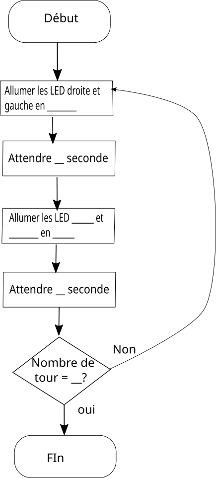
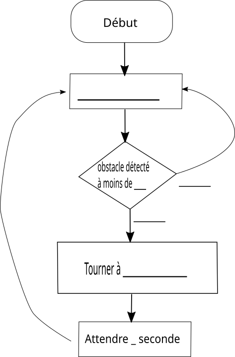
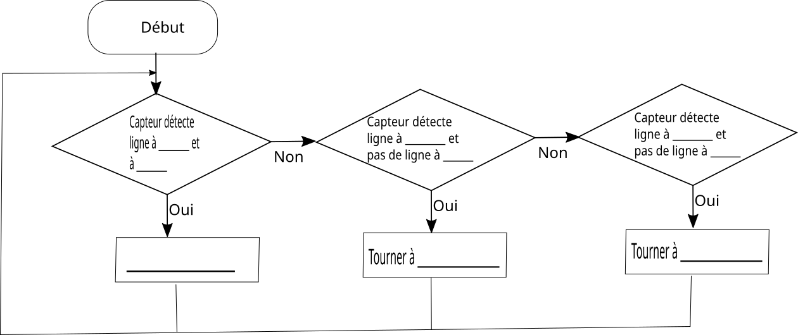

# Activité : Programmer un robot

!!! note "Compétences"

    Passer d'un langage à un autre
    Utiliser l'outil numérique 

!!! warning "Consignes"

    Pour chaque défi du document 3 compléter l’algorigramme correspondant et programmer le robot pour qu’il réalise le défi.
    
??? bug "Critères de réussite"
    - 

**Document 1 Le rover Curiosity**

{: style="width:300px;"}

Le rover Curiosity est un vrai laboratoire d’analyse : 900 kg dont 80 uniquement en instruments scientifiques, 3 m de long, 2,7 m de large et 2,1m de haut soit environ les proportions d’une petite voiture.
Il peut se déplacer grâce à six roues (à une vitesse moyenne de l’ordre de quelques dizaines de centimètres par heure) et un générateur d’énergie nucléaire au plutonium. 

**Document 2 Les éléments présents sur le mBot**

1. Écran LED
2. interface programmable avec LED
3. Bouton 
4. Moteur et Roues
5. Capteur ultrasons pour évaluer les distances devant le robot
6. Module suiveur de ligne qui détecte les couleurs
-  Batterie

{: style="width:600px;"}

**Document 3 liste des défis**

1. Au démarrage du robot, faire clignoter 5 fois en rouge puis vert les LED RGB du robot à gauche et à droite. (laisser chaque lumière allumée une seconde)
2. Faire avancer un robot à 50% de sa vitesse
3. Faire avancer un robot et s'arrêter devant un obstacle, lorsque la distance est plus petite que 10 cm.
4. Créer un programme infini qui fait avancer un robot  puis tourner à droite quand il rencontre un obstacle (attention il faudra le laisser tourner pendant 1 seconde, donc attendre une seconde avant de faire autre chose)
5. Créer un programme infini qui fait suivre une ligne au robot.

{: style="width:300px;"}

{: style="width:300px;"}

{: style="width:300px;"}

{: style="width:300px;"}

{: style="width:800px;"}

**Document 4 Fiche méthode utilisation du logiciel mBlock**

<ol markdown>
<li>Ouvrir le logiciel mBlock</li> 

{: style="width:600px;"}

<li>Paramétrer le programme pour le robot</li> 

{: style="width:600px;"}

<li>Connecter le robot, brancher le câble USB au robot et au PC, puis allumer le robot (s’il se met à rouler retourner le)</li> 
<li>Dans la zone de programmation, insérer un bloc « Lorsque le mBot(mcore) démarre »  et un bloc « attendre jusqu’à » avec un bloc « sur appui du bouton Carte pressé ? ». Tous les blocs que vous rajouterez devront se situer sous ce bloc.</li>

{: style="width:400px;"}

Exemple : 

{: style="width:400px;"}

<li>Téléverser (= envoyer le programme au robot), cliquer sur Téléverser dans la zone 4, puis attendre.</li> 

<li>Débrancher le robot et pour lancer le programme téléversé, appuyer sur le bouton situé au-dessus</li> 
</ol>