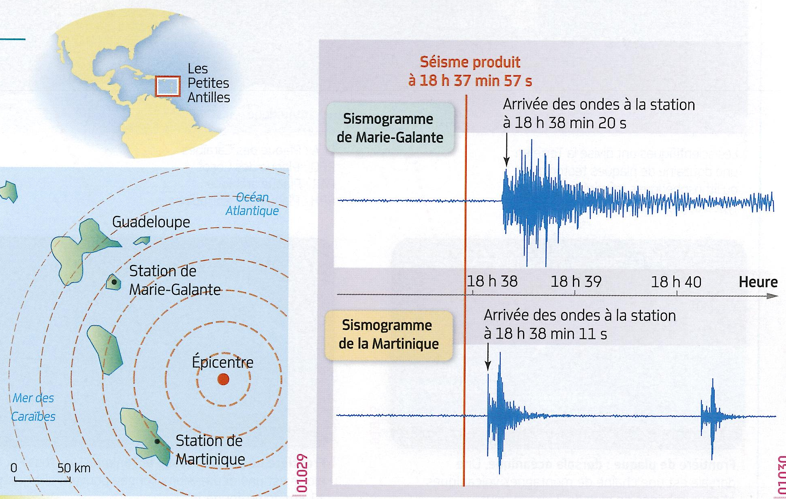

# Activité : Gestion d'un risque sismique

!!! note "Compétences"

    - Utiliser l'outil mathématique 

!!! warning "Consignes"
    Calculer la vitesse des ondes sismiques en km/s
    

    
??? bug "Critères de réussite"

**Document 1 Sismogrammes du séisme du 6 février 2008 enregistrés à Marie-Galante et en Martinique**

A 18h37min57s, se produit un séisme dont l’épicentre est situé dans l’océan Atlantique. Ce séisme a été enregistré par deux stations situées sur les îles de Marie-Galente et de la Martinique.

