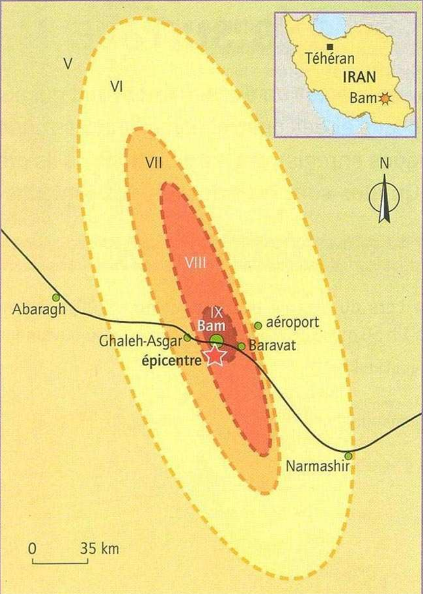
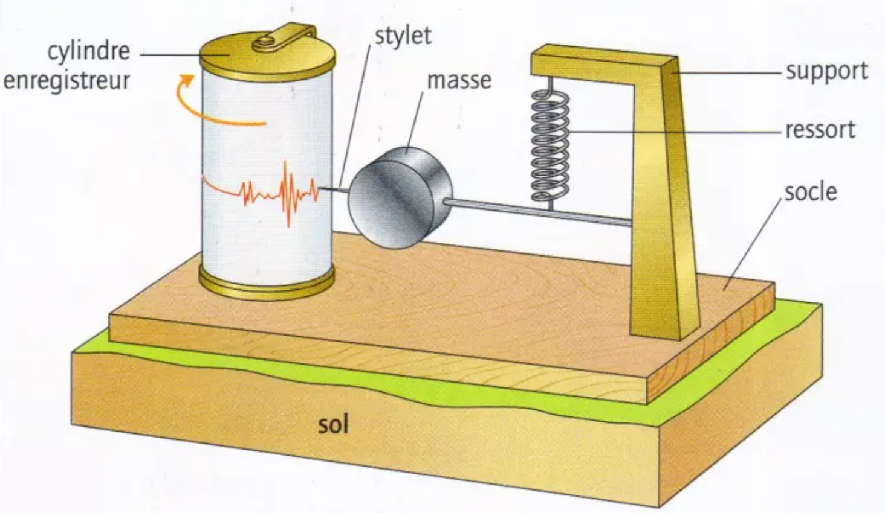
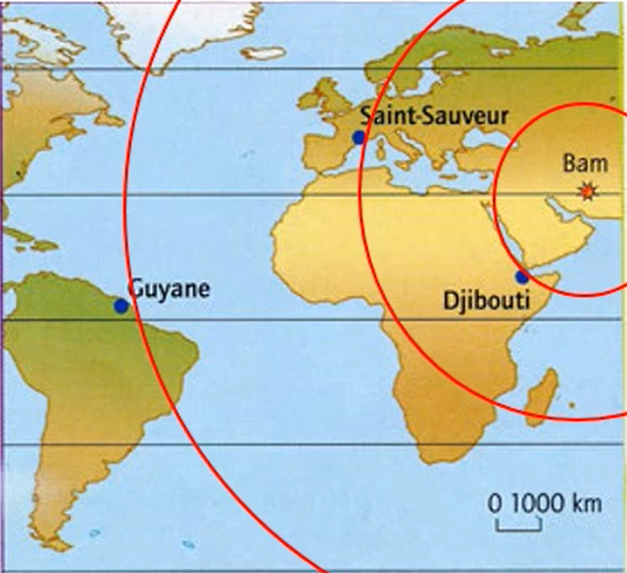
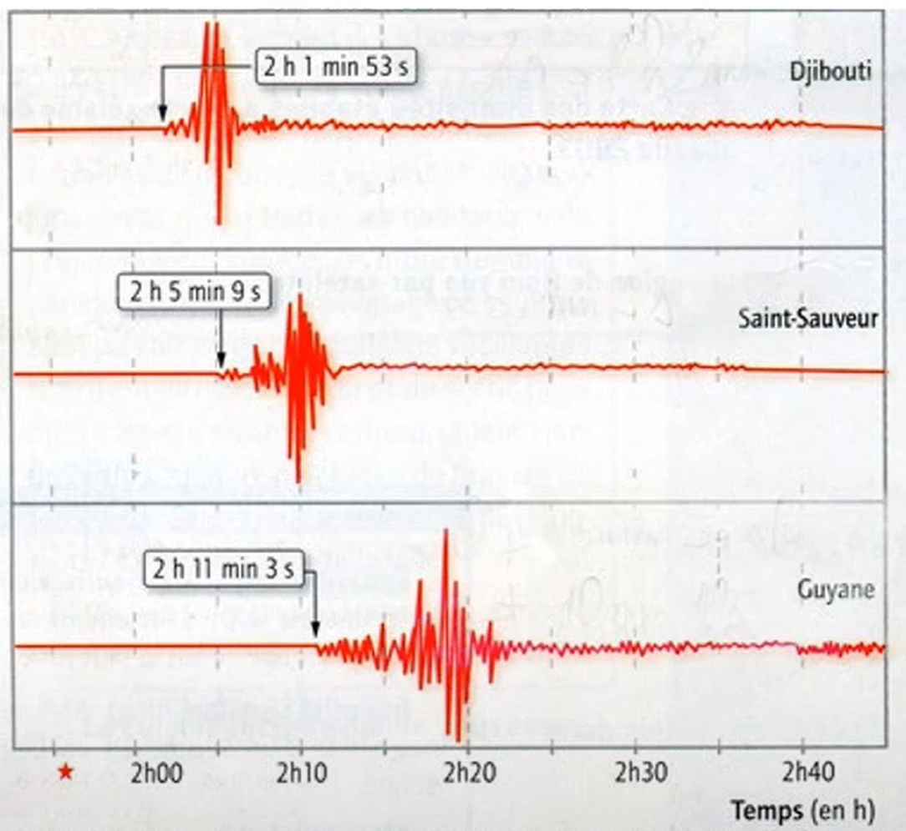

# Activité : Propagation des ondes sismiques et intensité

!!! note "Compétences"

    - Trouver et utiliser des informations 
    - utiliser l'outil mathématique

!!! warning "Consignes"
    
    1. D'après les documents 2 et 3 , quel mot permet de qualifier la ville de Bam ? Qu’est-ce que cela signifie ?
    2. Décrire l'intensité du séisme dans la région de Bam. (document 2)
    3. Calculer la vitesse des ondes sismiques à partir des documents 1 et 5
    4. Compléter et légender le schéma du document 6 avec
        - Le foyer (par un point vert), la faille et l’épicentre (point rouge)
        - La propagation des ondes sismiques (cercle en pointillés)
        - Les contraintes exercées sur les roches (flèches épaisses rouges) et le mouvement des roches (flèches fines bleues)
        - L’état des maisons situées aux emplacements 1, 2 et 3.

    
??? bug "Critères de réussite"
    - description intensité :
      - comparer intensité autour de la ville de Bam
      - Formuler une conclusion
        - compléter la phrase suivante : Plus on s’éloigne  de _ _ _ _ _ _ _ _ _ _ _ _ _  plus l’intensité du séisme  _ _ _ _ _ _ _ _ _ _ _ _
    - calculer vitesse
      - rappeler formule
      - trouver le temps entre le séisme et un enregistrement
      - trouver la distance entre le séisme et la station

**Document 1 Un séisme à Bam.**

Le 26 décembre 2003 en Iran à 1h56min52s, de fortes secousses ont détruit la ville de Bam en 13 secondes. 35 000 morts ont été déplorés. Après avoir observé les dégâts et interrogé les témoins, les géologues déterminent, à partir d’une échelle de I à XII l’intensité du séisme en différents lieux. Les valeurs obtenues sont reportées sur une carte et les points de même intensité sont reliés pour délimiter des zones d’égale intensité. On localise ensuite l’épicentre du séisme. Le foyer sismique était situé à 10 km de profondeur

**Document 2 Échelle d’intensité et carte des intensités établies après le séisme de Bam.**

<table>
<thead>
  <tr>
    <th> Intensité du séisme</th>
    <th> Effet du séisme</th>
  </tr>
</thead>
<tbody>
  <tr>
    <td> I à IV</td>
    <td> Faibles : quelques vibrations ressenties. Balancement des objets suspendus</td>
  </tr>
  <tr>
    <td> V à VI</td>
    <td> Forts : secousses ressenties par les habitants, légers dommages aux constructions</td>
  </tr>
  <tr>
    <td> VII à VIII</td>
    <td> Très forts : gros dégâts aux constructions, fissures dans le sol</td>
  </tr>
  <tr>
    <td> IX à X</td>
    <td> Destructeurs : effondrement de bâtiments, crevasses dans le sol</td>
  </tr>
  <tr>
    <td> XI à XII</td>
    <td> Dévastateurs : effondrement des constructions les plus solides, bouleversements important du paysage</td>
  </tr>
</tbody>
</table>

{:style="width:400px;"}

**Document 3 Quelques définitions**

- Épicentre : Lieu en surface où le séisme est le plus fort.  
- Foyer : Point de rupture de la roche d’où partent les ondes sismiques.    
- Intensité sismique : mesure des effets d’un séisme en un lieu donné.  
- Faille : fracture dans la croûte terrestre. Un bloc de roche peut s’y déplacer. 

**Document 4 Principe de fonctionnement du sismographe**

Les vibrations provoquées par un séisme sont dues à des ondes sismiques qui se propagent dans toutes les directions. Les ondes sont enregistrées par un sismographe : le socle de l’appareil et le cylindre enregistreur (fixé au sol) vibrent, la masse suspendue tend à rester immobile. Les mouvements du sol enregistrés sont verticaux ou horizontaux. Aujourd’hui, des sismomètres réalisent des mesures électroniques.

**Document 5 Sismogrammes enregistrés après le séisme de Bam dans 3 stations d’un réseau d’enregistrement.**

{:style="width:400px;"}
{:style="width:400px;"}

**Document 6 Schema des effets d'un séisme**

