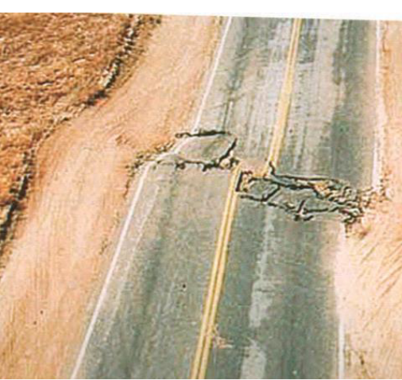
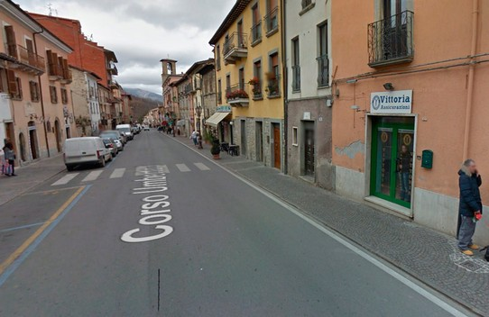

# Activité : Décrire un séisme

!!! note "Compétences"

    trouver et utiliser des informations 

!!! warning "Consignes"

    1. Quelles sont les conséquences d’un séisme ?
    2. Quels paramètres permettent de décrire les séismes ?
    3. Combien y a-t-il eu de séismes en France depuis hier ? Quelle est la magnitude maximale enregistrée ?
    4. Combien y a-t-il eu de séismes dans le monde depuis hier ? Quelle est la magnitude maximale enregistrée ?

??? bug "Critères de réussite"
    - 

**Document 1 : Les séismes.**

Les séismes ou tremblements de terre sont des vibrations soudaines et fréquentes à la surface du globe, souvent imperceptibles pour des humains, il y a plus de 1000 secousses par jour, mais parfois intenses et dévastatrices (de 10 à 100 par an). Les vibrations du sol sont appelées ondes sismiques.

**Document 1 Extrait du journal de 20H, France 2**

**Document 2 Paramètres d’un séisme**

Lorsque l’on décrit un séisme, on parle soit de magnitude, soit d’intensité.

• La magnitude  est donnée par l’échelle de Richter. 
C'est une mesure de la “force”, de l’énergie libérée lors d’un séisme. Elle va de 1 à 9.
• L’intensité sismique est une estimation des effets en surface du séisme. Elle est basée sur les dégâts observés. Elle va de I à XII.

Sur le croquis ci-dessous, on voit qu’un séisme de forte magnitude (à gauche) peut commettre moins de dégâts qu’un séisme de magnitude plus faible (à droite).

**Document 3 : Effets des séismes observables sur le sol.**

{:style="width:400px; flex-shrink: 0;  " }

{:style="width:400px; flex-shrink: 0;  " }

**Document 4 : Effets des séismes dans les villes**

{:style="width:400px; flex-shrink: 0;  " }
{:style="width:400px; flex-shrink: 0;  " }

Même rue de la ville d’Amatrice (Italie) avant et après le séisme d’août 2016. (Magnitude : 6,6)

**Document 5 : Origine et conséquence d’un tsunami.**

{:style="width:400px; flex-shrink: 0;  " }

Un tsunami est constitué d’une série de vagues qui se propage à la surface de l’eau. Un tsunami est souvent déclenché par des séismes sous-marins. Ces vagues peuvent devenir très grandes en arrivant sur les côtes. Le séisme du 11 mars 2011 (Magnitude : 8,5) qui s’est produit au large du Japon a produit un tsunami avec des vagues qui ont été jusqu’à 15 m de hauteur. La majorité des victimes du séisme du 11 mars sont dues au tsunami. C’est ce tsunami qui est à l’origine de l’accident nucléaire de la centrale nucléaire de Fukushima.

**Document 6 : Carte de l’intensité du séisme de Châtelaillon-Plage du 28 avril 2016 (magnitude : 4,9).**

{:style="width:400px; flex-shrink: 0;  " }
{:style="width:400px; flex-shrink: 0;  " }
 Épicentre (endroit à la surface au dessus du foyer)

**Document 7 : Témoignages d’habitants ayant ressenti le séisme de Châtelaillon-Plage**

Monsieur C : «  Les secousses étaient très fortes, courtes et très bruyantes. Le village de Villeneuse-les-Salines, près de la Rochelle, où nous habitons est proche de l’épicentre. Pas de gros dégâts apparents, sauf une fissure visible en façade. »
A Dolus d’Oléron Madame G. : « J’ai été très impressionné. Je venais de me réveiller et quand j’ai voulu me lever, c’était comme si j’avais le vertige : j’ai réalisé que la terre tremblait car cela « balançait ». Les fenêtres et la vaisselle vibraient et cela grondait comme si un énorme engin vrombissait autour de chez moi. »
Madame F : « J’habite [près de Niort], et j’ai également senti les secousses. J’étais en train de dormir quand soudainement j’ai été réveillée par de légers claquements de portes et tremblement des murs de ma maison. J’ai cru pendant quelques instants que j’étais en train de rêver. C’est une sensation bizarre. »

**Document 3 Site national d’information sur la sismicité**

??? note-prof "correction"
    Correction de l’activité 26
    Consigne 1 :

    Un séisme peut causer des déformations du sol, des destructions et des tsunamis. 
    Lors d’un séisme, on peut mesurer l’énergie du séisme, c’est-à-dire sa magnitude.

    Consigne 2 :
    L’effet d’un séisme dépend de sa magnitude, plus la magnitude d’un séisme est élevée, plus les dégâts peuvent être importants. 

    L’effet d’un séisme dépend de la distance à l’épicentre, plus on est loin de l’épicentre, plus les effets ressentis seront faibles.
