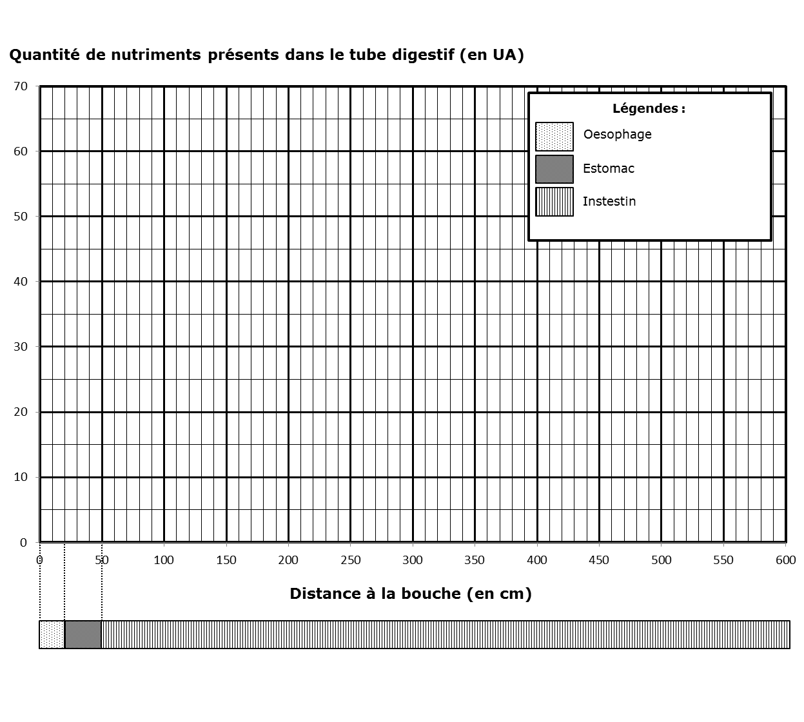

# Activité : Importance du tri des déchets

!!! note "Compétences"

    Interpréter 

!!! warning "Consignes"

    1. À partir du document 3, trace un graphique de la quantité de nutriments présents dans le tube digestif en fonction de la distance à la bouche.

    2. À partir des informations, indique ce que deviennent les nutriments présents dans le tube digestif.

    
??? bug "Critères de réussite"
    - 

**Document 1 Mesure de la quantité de nutriments dans le tube digestif.**

On donne à un individu un plat de pâtes à manger. Puis l’on suit la quantité de nutriments (glucose) tout au long de son tube digestif.	 

**Document 2 Mesure de la quantité de nutriments dans le sang au niveau de l’intestin grêle (en g par litre de sang)**
On donne à un individu un plat de pâtes à manger. Puis l’on suit la quantité de nutriments (glucose) tout au long de son tube digestif.	 	 	 	

| Sang arrivant | Sang sortant |
|---|---|
| 1,2 | 3,7 |

**Document 3 Résultats des mesures**
<table>
<thead>
  <tr>
    <th> Distance à la bouche (cm) </th>
    <td> 0 </td>
    <td> 20 </td>
    <td> 30 </td>
    <td> 50 </td>
    <td> 100 </td>
    <td> 200 </td>
    <td> 300 </td>
    <td> 400 </td>
    <td> 500 </td>
    <td> 600 </td>
  </tr>
</thead>
<tbody>
  <tr>
    <th> Quantité de nutriments présents dans le tube digestif (en UA : unité arbitraires) </th>
    <td> 0 </td>
    <td> 0 </td>
    <td> 60 </td>
    <td> 55 </td>
    <td> 40 </td>
    <td> 25 </td>
    <td> 12 </td>
    <td> 8 </td>
    <td> 5 </td>
    <td> 2 </td>
  </tr>
</tbody>
</table>

**Document 4 Détail de la paroi de l’intestin grêle**

**Document 5 :**

