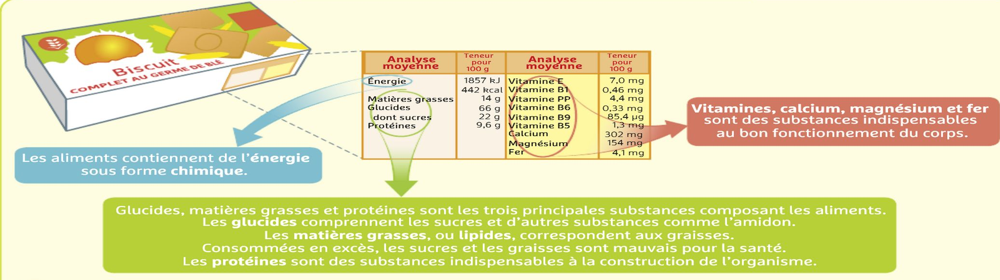
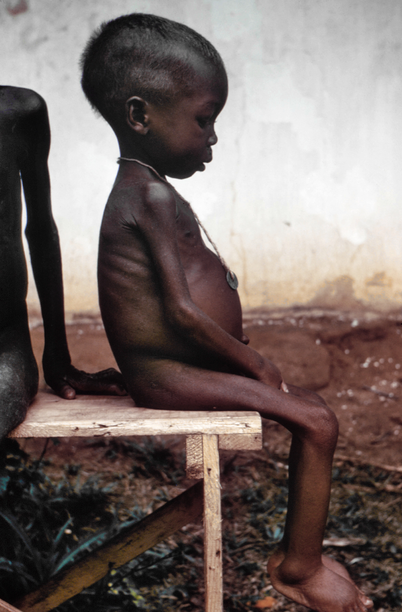

# Activité : Action Contre la Faim

!!! note "Compétences"

    Interpréter 

!!! warning "Consignes"

    1. À partir des documents, expliquer quels types de constituants alimentaires il est nécessaire d’apporter  pour lutter contre le kwashiorkor. 
    2. Parmi les aliments proposés, lesquel faut-il apporter en priorité, justifier.

    
??? bug "Critères de réussite"
    - 

**Document 1 Les principaux composants des aliments**

Les étiquettes des produits alimentaires donnent la composition des aliments. Il existe 7 grandes familles de constituants alimentaires:

<table>
<thead>
<tr>
<th>glucides
</th>
<th>lipides
</th>
<th>protéines
</th>
<th>fibres
</th>
<th>vitamines
</th>
<th>minéraux
</th>
<th>eau
</th>

</tr>
</thead>
</table>

**Document 2 Un exemple de maladie due à la malnutrition, le kwashiorkor.**

Le kwashiorkor est une maladie qui touche chaque année des millions d’enfants en Afrique. 

Cette maladie provoque : 
    • un rougissement de la peau
    • une diminution de la masse musculaire
    • un gonflement des membres inférieurs et de l’abdomen
    • une augmentation du volume du foie.

Le kwashiorkor est une maladie causée par une carence* en protéines (l’alimentation n’apportant pas les 60 grammes recommandés par jour).

*Carence : absence ou apport insuffisant d’une substance nécessaire à l’organisme.

**Document 3 Composition de quelques aliments (pour 100 g)**

<table>
<thead>
  <tr>
    <th> Aliments </th>
    <th> Energie </th>
    <th> Glucides </th>
    <th> Protéines </th>
    <th> Lipides </th>
  </tr>
</thead>
<tbody>
  <tr>
    <td> Pommes </td>
    <td> 343 kJ </td>
    <td> 18 g </td>
    <td> 0,3 g </td>
    <td> 0,6 g </td>
  </tr>
  <tr>
    <td>Pâtes </td>
    <td>641 kJ </td>
    <td>29,7 g </td>
    <td>4,85 g </td>
    <td> 0,7 g </td>

  </tr>
  <tr>
    <td> Lentilles </td>
    <td> 356 kJ </td>
    <td> 12 g </td>
    <td> 6 g </td>
    <td> 0,4 g </td>

  </tr>
  <tr>
    <td> Petits Pois </td>
    <td> 297 kJ </td>
    <td> 8,8 g </td>
    <td> 5,1 g </td>
    <td> 0,6 g </td>

  </tr>
  <tr>
    <td> Poulet </td>
    <td> 448 kJ </td>
    <td> 0,2 g </td>
    <td> 24 g </td>
    <td> 1 g </td>

  </tr>
</tbody>
</table>