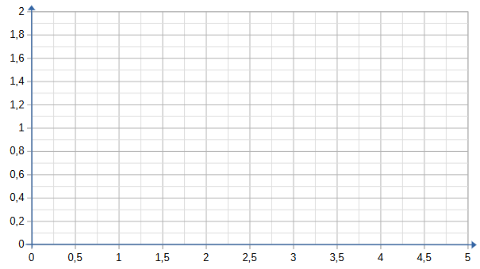

# Activité : La digestion chimique des aliments

!!! note "Compétences"

    Interpréter 

!!! warning "Consignes"

    Consigne 1 : 
    
??? bug "Critères de réussite"
    - 

Document n°1 : Composition des sucs digestifs

| Glandes digestives |   Suc digestif   |                        Composition du suc                        |
|:------------------:|:----------------:|:----------------------------------------------------------------:|
| Glandes salivaires |      Salive      | Eau (98%) + Ions + Enzymes + Produits antibactériens + Protéines |
|       Estomac      |   Suc gastrique  |                   Enzymes + Acide chlorhydrique                  |
|      Pancréas      | Suc pancréatique |                       Eau + Ions + Enzymes                       |
|      Intestin      |  Suc intestinal  |                       Eau + mucus + Enzymes                      |

Document n°2 : Composition des pâtes

Les pâtes sont composées d’amidon. Il est considéré comme un sucre complexe car il est composé d’une série de glucose reliés les uns aux autres. 
Lors de la digestion, l’amidon est découpé en glucose.

Document n°3 : Matériels à disposition
- Des pâtes
- Des bandelettes (détectant le glucose = nutriment)
- Deux tubes en verre
- De l’amylase (enzyme présente dans la salive)
- Un bain-marie à 37 °C
- De l’eau
