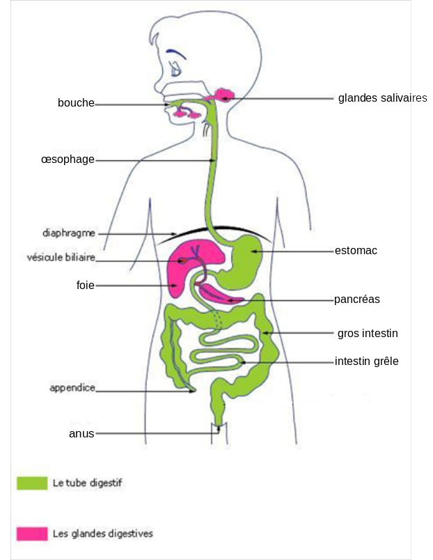
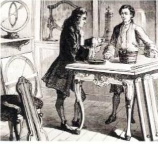

# Activité : La digestion vue au XVIIIe siècle

!!! note "Compétences"

    Interpréter 

!!! warning "Consignes"

    Expliquer ce que Réaumur a pu apprendre avec son expérience.
    
??? bug "Critères de réussite"
    - avoir fait l'analyse d'expérience
        - hypothèse
        - protocole
        - résultats attendus
        - résultats observés
        - conclusion

**Document 1 L’appareil digestif**

**Document 2 Expérience historique de Réaumur sur la digestion**

{: style="float:left;"}

Au XVIIIe siècle, les scientifiques s’interrogent sur le mécanisme de la digestion. Une des théories de l’époque est celle de Giovanni Borelli (1608-1672) pour qui la digestion serait un phénomène purement mécanique : les aliments seraient simplement broyés dans le tube digestif. 

Le scientifique français René-Antoine Ferchault de Réaumur (1683-1757) ne croit pas à cette théorie. Il étudie la digestion sur des rapaces qui sont des oiseaux dont la particularité est de rejeter sous forme de pelote les parties de leurs proies qu’ils ne digèrent pas (plumes, os, poils, etc.) 

Voici le récit d’une de ses expériences : 

« Je plaçai dans un gros tube en fer blanc ouvert aux deux bouts un morceau de viande. Le tube ainsi garni fut donné à une buse pour son premier déjeuner.
Ce ne fut que le lendemain que je trouvai le tube qu’elle venait de rendre : il avait toute sa rondeur, on ne découvrait sur sa surface extérieure aucune trace de frottements. Le morceau de viande avait été réduit peut-être au quart de son premier volume ; ce qui en restait était couvert par une espèce de bouillie venue probablement de celles de ses parties qui avaient été dissoutes. » 

Extrait de  Observations sur la digestion des oiseaux , René Antoine Ferchault de Réaumur (1752).

**Document 3 : Observation sur les rapaces**

Lorsque l'on donne de la viande à un oiseau, elle est totalement digérée, on ne la retrouve pas dans la pelote.

