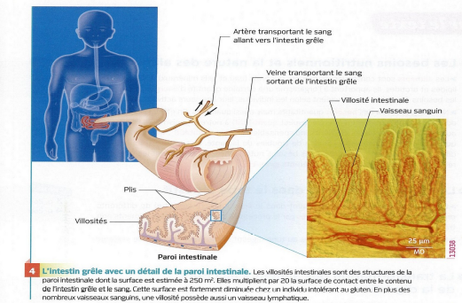

# Activité : Exercices sur la digestion

## Exercice 1
!!! note "Compétences"
    - Réaliser un graphique

!!! warning "Consignes"

    1. À partir du document 1, trace un graphique de la quantité de glucose dans le sang en fonction du temps après l'ingestion

    
??? bug "Critères de réussite"
    - 

**Document 1 Mesure de la quantité de nutriments dans le tube digestif.**

On donne à un individu un plat de pâtes à manger. Puis l’on suit la quantité de nutriments (glucose) tout au long de son tube digestif.	 

| Temps après ingestion (h) | 0 | 0,5 | 1| 1,5 | 2 |  3 | 4 |
|--|--|--|--|----|--|----|--|
| Quantité glucide par litre de sang (g/l)| 0,9 |  1,1 |  1,2  |  1,15  |1.1 | 0.8 |  0.9 |

## Exercice 2 

!!! note "Compétences"
    - Interpréter

!!! warning "Consignes"
    1. Rappeler les étapes de l'analyse d'expérience
    2. L'expérience de Beaumont est incomplète, faire l'analyse de l'expérience de Beaumont en compéltant les éléments manquants

??? bug "Critères de réussite"
    - avoir fait l'analyse d'expérience
        - hypothèse
        - protocole
        - résultats attendus
        - résultats observés
        - conclusion

En 1822, un trappeur canadien est accidentellement blessé par une balle qui perfore son estomac, laissant échapper de la nourriture par l'orifice. Le médecin, William Beaumont, prend directement le suc de l'estomac dans cette blessure pour réaliser son expérience, pour répondre à la problématique quel liquide permet la digestion ?

Voici un descriptif de son expérience :

À 11 heures, après avoir fait jeûner le garçon pendant 17 h, j'introduisis [...] un tube de caoutchouc et soutirai du suc gastrique pur non mêlé à d'autres matières excepté une petite quantité de mucus [..] Je pris un morceau de bœuf et le mis dans le suc gastrique. Je bouchai le tube hermétiquement et le plaçai dans une casserole contenant de l'eau maintenue à 37°C. En 40 minutes, la digestion était distinctement commencée sur toute la surface de la viande. Au bout de 60 minutes le liquide devient entièrement opaque et trouble, une pellicule externe commença à se séparer du reste de la viande. À 13 heures, la structure semblait complètement détruite, laissant les fibres musculaires détachées, flottant parmi des fins lambeaux.
