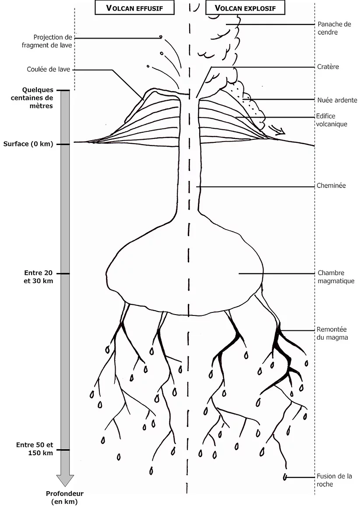
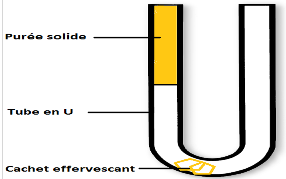

# Activité : Modélisation de l'éruption volcanique

!!! note "Compétences"

    - trouver et utiliser des informations (consignes 1 et 5)
    - Modéliser un phénomène (consignes 2, 3 et 4)

!!! warning "Consignes"
    
    1. À l’aide des documents, explique à quoi pourrait correspondre chaque élément du modèle dans la réalité en complétant le document 5. 
    2. En utilisant les informations du document 4 et modifiant le modèle, proposer une expérience avec 2 montages, qui permet de montrer que les gaz sont le moteur des éruptions comme le propose le document 2, faire l’expérience et expliquer en justifiant si l’hypothèse est vraie. 
    3. En utilisant les informations du document 4 et modifiant le modèle, proposer une expérience avec 2 montages, qui permet de montrer la viscosité du magma permet d’expliquer les différents types d’éruptions comme le propose le document 3, faire l’expérience et expliquer en justifiant si l’hypothèse est vraie.
    4. Faire valider par le professeur le rangement et le nettoyage de la paillasse.
    5. bonus : Expliquer l’intérêt du modèle dans cette activité et donner une ou deux critiques qui pourrait être faite.
    
??? bug "Critères de réussite"
    - 

**Document 1 : Schéma d’un volcan**

{: style="height:400px;"}

**Document 2 : Le moteur des éruptions volcaniques.**

Le magma provient de la fusion d’une roche entre 50 et 150 km de profondeur. Le magma est un mélange de liquide et de gaz provenant de la fusion des roches. Le magma s’accumule dans le réservoir magmatique où Il va se refroidir très lentement, pendant plusieurs siècles.
En se refroidissant, une partie du magma se solidifie, ce qui enrichit la partie liquide restante en gaz : les gaz mettent le magma sous pression, des bulles de gaz se forment, le volume du magma augmente et il pousse fortement sur les roches qui l’environnent. Ces roches finissent par se briser, et le magma s’insinue dans les fissures ainsi créées, il se dirige vers la surface. C’est la présence de ces gaz qui va causer son ascension finale vers la surface.

**Document 3 : Une explication historique de la différence des deux types d’éruption.**

« Comme le comprit très bien l’abbé Spallanzani (1729-1799) à la fin du XVIIIe siècle, deux cas doivent être distingués selon la viscosité du magma. Si le gaz s’échappe assez facilement (magma peu visqueux), l’éruption prend un caractère effusif : des émissions de lave fluide[…] se produisent en début d’éruption et forment des fontaines de lave […]. Si les gaz s’échappent difficilement du magma (magma très visqueux), les bulles s’accumulent, provoquant de violentes explosions lorsqu’elles éclatent brutalement près de la surface. La lave émise est alors visqueuse. »
Tiré de : Pascal Richet, Guide des volcans de France, Belin-BRGM, 2003.

Définition Viscosité : la viscosité est un paramètre physique qui décrit la résistance d’un matériau à l’écoulement. Les matériaux s’écoulant rapidement ont une viscosité faible. Les matériaux ne s’écoulant pas ou peu ont une viscosité forte.

**Document 4 : Un modèle d’éruption volcanique**

Un modèle en sciences est une représentation simplifiée de la réalité d’un phénomène pour expliquer ce phénomène ou faire une expérience pour tester une hypothèse concernant le phénomène.
Le modèle réduit la complexité du réel, afin de le comprendre ou le faire comprendre. Il est différent de la réalité. Construit autour d’hypothèses, il doit être testé par confrontation au réel.

Pour réaliser un modèle de volcan, on peut utiliser :

- un tube en U (attention le tube est en verre et donc très fragile),
- de la purée, la quantité d’eau utilisée pour faire la purée fera varier la viscosité de celle-ci, avec 40 ml d’eau la purée sera peu visqueuse alors qu’avec 20 ml d’eau la purée sera très visqueuse.
- Un demi cachet effervescent et de l’eau, le cachet en se dissolvant dans l’eau va libérer du gaz.
- Une cuvette en plastique au-dessus de laquelle, les expériences seront faites pour éviter de salir la paillasse.

**Attention ne pas mettre sa tête au-dessus du tube.**

Protocole :

- Préparer la purée dans un récipient en mélangeant la poudre avec la quantité d’eau désirée
- Préparer le tube en U en le remplissant de purée sur au moins la moitié de la hauteur.
- Puis ajouter un peu d’eau par le côté sans purée, puis le demi cachet effervescent et fermer rapidement cette extrémité avec le doigt.

**Document 5 : Présentation du modèle.**

| Élément du modèle  |  Élément·s dans la réalité |
|--|--|
| Tube en U | |
| Purée |   |
| Cachet effervescent et eau  |   |

