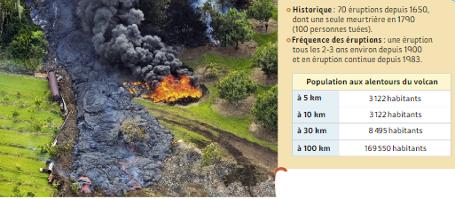
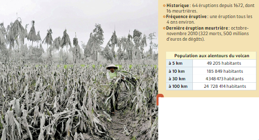
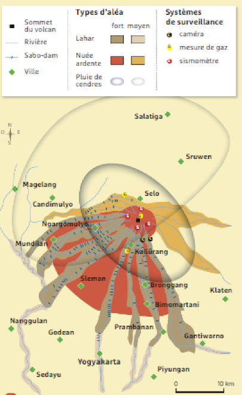
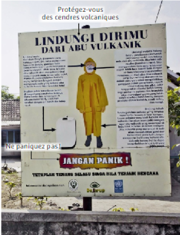

# Activité : Le risque volcanique

!!! note "Compétences"

    Construire un tableau 

!!! warning "Consignes"

    1. Comparer les enjeux et les aléas pour le Kilauea et le Merapi. En déduire la différence de niveau de risque entre  les deux volcans. (doc 1 et 2)
    2. Expliquer ce qui peut pousser les humains à habiter près des volcans. (doc 2)
    3. Lister les mesures de prévention, de protection et d'atténuation qui ont été mises en place dans la région du Merapi. (doc 3 à 5) 
    
??? bug "Critères de réussite"
    - 

**Document 1 Coulée de lave du Kilauea (Hawaï) en 1983**

**Document 2 Récolte de maïs détruite lors de la dernière éruption du Merapi (Indonésie)**

Les cultures sont nombreuses aux abords du Merapi: les terres y sont peu chères à cause du danger, et fertiles, grâce aux cendres volcaniques qui s'y déposent

**Document 3 Carte des aléas volcaniques et des systèmes de surveillances et de protection autour du Merapi**

Les sabodams sont des barrages qui permettent d'atténuer l'effet d'éventuelles coulées de boues (lahars)
Les systèmes de surveillance permettent de prévoir les éruptions quelques jours avant leur déclenchement.

**Document 4 La gestion du risque au Merapi**

| Avant la crise : prévention | Pendant la crise : adaptation | Après la crise |
|--|--|--|
| Surveillance du volcan | Organisation des déplacements | Réparation / entretien des infrastructures|
| Mise au point de plans d'évacuation | Organisation des camps de déplacés | |
| Éducation aux risques | | |

**Document 5 Conseils aux habitants de Yogyakarta en cas d'éruption**

