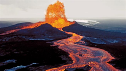
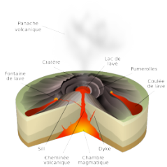
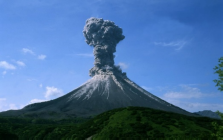

# Activité : Les volcans

!!! note "Compétences"

    Construire un tableau 

!!! warning "Consignes"

    À partir des différents documents, construire un tableau comparant les volcans Kilauea et Karymski du point de vue du type de volcanisme, de la formation de l’édifice volcanique, des produits émis, du diamètre du volcan (large ou étroit) et de la hauteur du volcan (grand ou petit). C'est un tableau a 3 colonnes et 6 lignes.
    
??? bug "Critères de réussite"
    - 

**Document 1 : éruption du volcan Kilauea (Hawaï)**

{: style="height:300px;"}

**Document 2 : schéma du fonctionnement du volcan Kilauea**

{: style="height:300px;"}

**Document 3 : éruption du volcan Karymski (Russie)**

{: style="height:300px;"}

**Document 4 : schéma du fonctionnement du volcan Karymski**

{: style="height:300px;"}

**Document 5 les différents types de volcanisme**

Lors de l’éruption de volcan effusif, une petite quantité de gaz est libérée dans l’atmosphère et une quantité importante de laves fluides s’écoule facilement sur les côtés et sur des surfaces importantes. L’édifice volcanique est alors constitué d’un empilement des coulées de lave émises à chaque éruption, il est large et sa hauteur est faible.

Lors de l’éruption de volcan explosif, la grande quantité de gaz contenue dans le magma exerce une pression importante sur la roche. Cette pression est à l’origine d’explosions lors desquelles une grande quantité de gaz, de poussières (cendres, nuées ardentes…) et de morceaux de roches sont projetés (bombes volcaniques). L’édifice volcanique est alors constitué d’un empilement de roches et de poussières émises à chaque éruption, il est étroit et sa hauteur est élevée.

**Document 6 : Vidéos d’éruptions**

Éruption du mont Shinmoedake qui a des éruptions identiques à celles du volcan Karymski :

<iframe title="Eruption Mont Shinmoedake au Japon 19.01.2011" width="560" height="315" src="https://tube-sciences-technologies.apps.education.fr/videos/embed/d025231f-6b24-4129-a18e-682795258214" frameborder="0" allowfullscreen="" sandbox="allow-same-origin allow-scripts allow-popups"></iframe>

Éruption du volcan Kilauea :

<iframe title="Kilauea volcan en éruption" width="560" height="315" src="https://tube-sciences-technologies.apps.education.fr/videos/embed/60e86a34-91e6-44f3-9698-3b42455debef" frameborder="0" allowfullscreen="" sandbox="allow-same-origin allow-scripts allow-popups"></iframe>