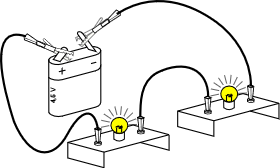
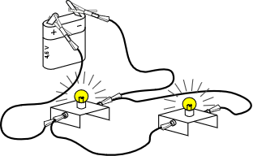
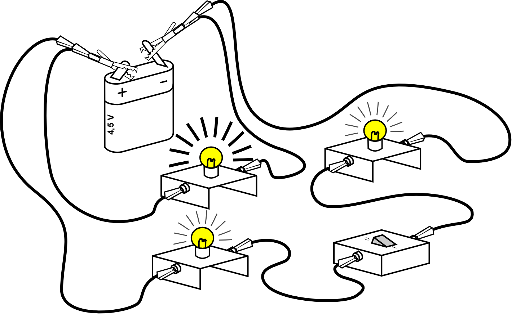
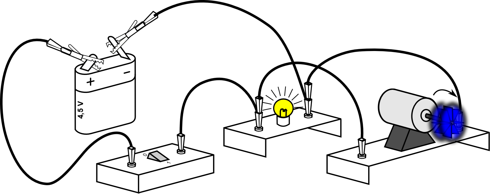
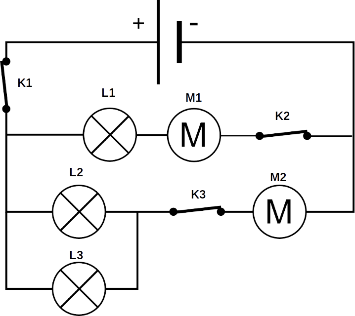

# Activité : Exercices d’entraînement

!!! note Compétences
    - Trouver et utiliser des informations
    - Faire un schéma électrique
    
**Exercice 1** 
!!! warning Consignes
	1. Schématiser les circuits électriques suivants. 
	2. Ajouter le sens de parcours du courant sur les schémas ci-dessus

 

{: style="width:300px"}</td>

{: style="width:300px"}

 

{: style="width:300px"}

{: style="width:300px"}

**Exercice 2**

 

!!! warning Consignes
	Reproduire le circuit ci-contre en ajoutant un ampèremètre mesurant l’intensité du courant électrique. (Préciser les bornes de branchement)

{: style="width:400px"}

**Exercice 3 Répondre aux questions suivantes.** 

 

!!! warning Consignes
	1. Indiquer si le circuit est en série ou en dérivation. Justifier. 

	2. Sur le circuit ci-contre, entourer les nœuds.
	3. Sur le circuit ci-contre, faire apparaître de deux couleurs différentes les deux boucles.

{: style="width:300px"}

**Exercice 4** 

 

!!! warning Consignes
	Dans le tableau ci-contre, indiquer d’une croix lorsque le dipôle est en fonctionnement.

{: style="width:400px"}

<table>
<thead>
  <tr>
    <th>Position interrupteur</th>
    <th> L1 		</th>
    <th> L2 		</th>
    <th>L3 		</th>
    <th> M1 		</th>
    <th>M2 	</th>
  </tr>
</thead>
<tbody>
  <tr>
    <td> K1 			ouvert K2 			fermé  K3 			fermé  </td>
    <td> 			 &nbsp;&nbsp;			 		</td>
    <td> 			 &nbsp;&nbsp;			 		</td>
    <td> 			   			</td>
    <td> 			 &nbsp;&nbsp;			 		</td>
    <td> 			 &nbsp;&nbsp;			 		</td>
  </tr>
  <tr>
    <td> K1 			fermé K2 			ouvert  K3 			fermé</td>
    <td> 			 &nbsp;&nbsp;			 		</td>
    <td> 			 &nbsp;&nbsp;			 		</td>
    <td> 			 &nbsp;&nbsp;			 		</td>
    <td> 			 &nbsp;&nbsp;			 		</td>
    <td> 			 &nbsp;&nbsp;			 		</td>
  </tr>
  <tr>
    <td> K1 			fermé K2 			fermé K3 			ouvert </td>
    <td> 			 &nbsp;&nbsp;			 		</td>
    <td> 			 &nbsp;&nbsp;			 		</td>
    <td> 			 &nbsp;&nbsp;			 		</td>
    <td> 			 &nbsp;&nbsp;			 		</td>
    <td> 			 &nbsp;&nbsp;			 		</td>
  </tr>
</tbody>
</table>

**Exercice 5**

!!! warning Consignes
	Indiquer si les phrases suivantes sont vraies ou fausses.

<table>
<tbody>
  <tr>
    <td>Il peut y avoir un courant électrique dans un circuit sans générateur. </td>
    <td>□ Vrai  □ Faux</td>
  </tr>
  <tr>
    <td>Le courant électrique circule dans un circuit lorsque l’interrupteur est ouvert et ne circule pas dans le circuit lorsque l’interrupteur est fermé.</td>
    <td>□   Vrai  			 □   Faux</td>
  </tr>
  <tr>
    <td>Un dipôle est un appareil qui possède trois bornes.</td>
    <td>□   Vrai  			 □   Faux</td>
  </tr>
  <tr>
    <td> L’intensité du courant électrique se mesure en ampère de symbole « A ». 	</td>
    <td>□   Vrai  			 □   Faux</td>
  </tr>
  <tr>
    <td>L’interrupteur, la lampe et le moteur sont des récepteurs.  </td>
    <td> □   Vrai  			 □   Faux </td>
  </tr>
</tbody>
</table>
