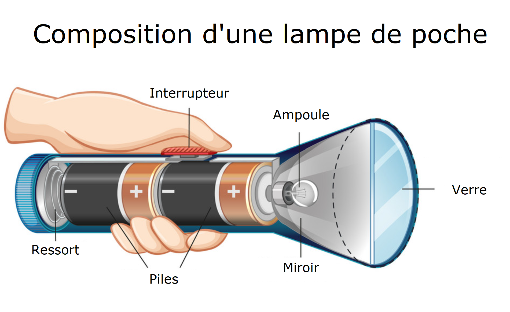
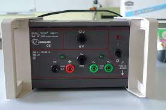
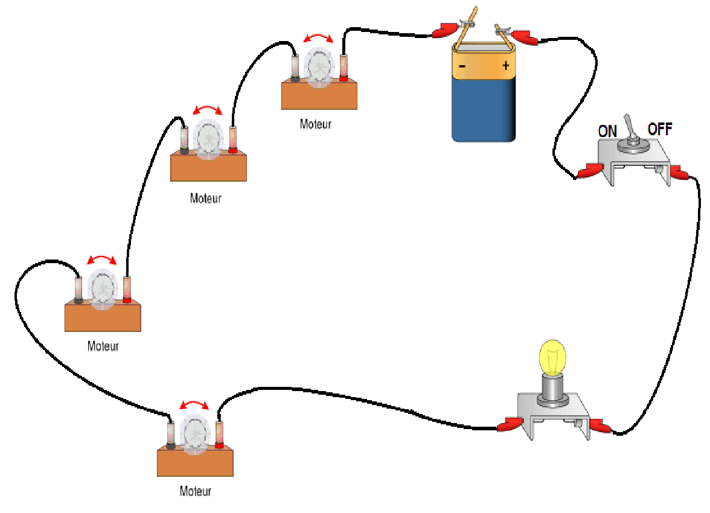

# Activité : Modélisation d'une lampe de poche

!!! note "Compétences"
    - Trouver et utiliser des informations

!!! warning "Consignes"
    1. Indiquer une utilité pour chaque composant de la lampe du document 1 

    2. Dans la liste suivante, indiquer pour chaque composants s'il s'agit de récepteurs, de générateurs ou d'aucun des deux:
    Interrupteur, ampoule, verre, miroir, piles, ressort.

    3. À partir des réponses précédentes, quels sont les éléments électriques de la lampe de poche qui sont indispensables pour fabriquer une lampe-torche fontionnelle ? 

    4. À l’aide du matériel sur la paillasse, modéliser une lampe de poche en n’utilisant que les éléments  essentiels à son fonctionnement.

    5. Réaliser le schéma d'une lampe de poche en respectant les documents 5 et 6.

    6. Complète le tableau du document 8 en fonction de ce qu’il manque

??? bug Critères de réussite
    - avoir répondu aux questions
    - connaître les règles pour faire un schéma de circuit électrique
    - avoir représenté correctement les symboles pour représenter les éléments dans un schéma électrique

## I. Composants et fonctions

**Document n°1 Vue en coupe d’une lampe de poche**

  {: style="width:300px" }

## II. Récepteur et générateur

**Document 2 Définitions**  
Générateur : objet fournisseur d’énergie électrique.  
Récepteur : objet receveur d’énergie électrique.

## III. Le circuit électrique, manipulation

**Document 3 Définitions**
Circuit électrique : chaîne d’objet électrique composé de générateur et de récepteurs

## IV. Le circuit électrique, modélisation

**Document 4 Les dipôles**  
di… = deux
…pôle = extrémité		
Élément d’un circuit électrique qui possède deux extrémités pour être branché.

**Document 5 Méthode de schématisation électrique**  
1. Représenter un grand rectangle (il symbolise le circuit, les traits symbolisent les fils)  
2. Gommer, sur les traits du rectangle, l’emplacement des dipôles  
3. Ajouter dans les espaces gommés, le symbole des dipôles du circuit en respectant l’ordre

**Attention !**
Utiliser une règle et un crayon à papier
Ne pas représenter de dipôle dans les angles du rectangle

**Document 6 Symboles normalisés des dipôles.**

<table markdown class="tg">
<thead>
<tr>
<th colspan="2">Nom</th>
<th >Photographie</th>
<th >Symbole</th>
</tr>
</thead>
<tbody markdown>
<tr markdown>
<td colspan="2">Pile</td>
<td markdown >
 {: style="width:100px" }
</td>
<td markdown > {: style="width:100px" }</td>
  </tr>
<tr markdown>
<td colspan="2">Générateur</td>
<td markdown >
 {: style="width:100px" }
</td>
<td markdown > {: style="width:100px" }</td>
  </tr>
<tr markdown>
<td colspan="2">Ampoule</td>
<td markdown >
 {: style="width:100px" }
</td>
<td markdown > {: style="width:100px" }</td>
  </tr>
<tr markdown>
<td rowspan="2">Interrupteur</td>
<td >ouvert</td>
<td markdown rowspan="2"></td>
<td markdown > {: style="width:100px" }</td>
  </tr>
<tr markdown>
<td >fermé</td>
<td markdown > {: style="width:100px" }</td>
  </tr>
<tr markdown>
<td  colspan="2">Moteur</td>
<td markdown >
 {: style="width:100pcx" }
</td>
<td markdown > {: style="width:100px" }</td>
  </tr>
<tr markdown>
<td  colspan="2">Fil électrique</td>
<td markdown >
 {: style="width:100px" }
</td>
<td markdown > {: style="width:100px" }</td>
  </tr>
</tbody>
</table>

**Document 7 Schéma d'une lampe de poche**

<th>Circuit électrique</th>
<th>Schéma électrique du circuit</th>
<th>Eléments du circuit</th>
</tr>
</thead>
<tbody markdown>
<tr markdown>
<td markdown>
{: style="width:200px" }
</td>
<td ></td>c
</tr>
<tr markdown>
<td markdown>{: style="width:200px" }</td>
<td ></td>
<td markdown>Interrupteur fermé  
Moteur</td>
</tr>
<tr markdown>
<td markdown>{: style="width:200px" }</td>
<td ></td>
<td ></td>
</tr>
<tr markdown >
<td ></td>
<td markdown>{: style="width:200px" }</td>
<td ></td></tr>
</tbody>
</table>

