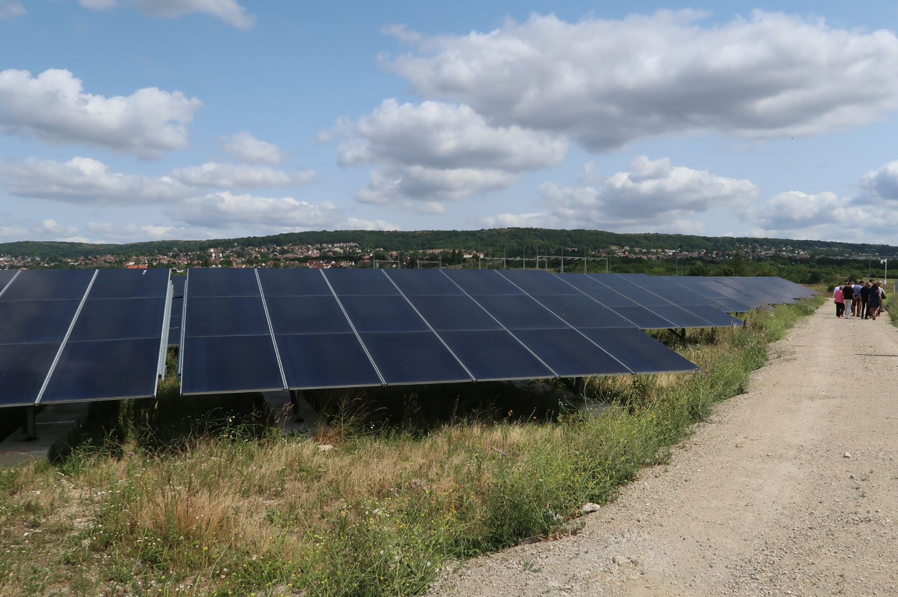
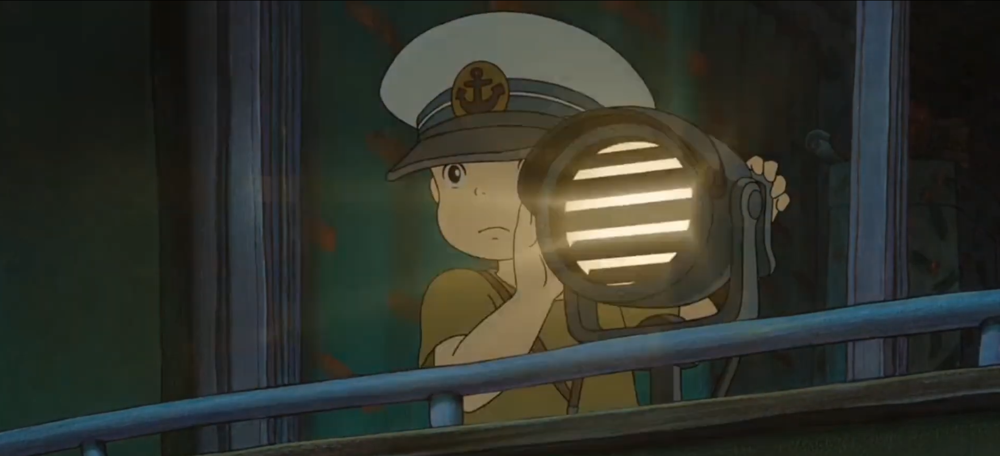
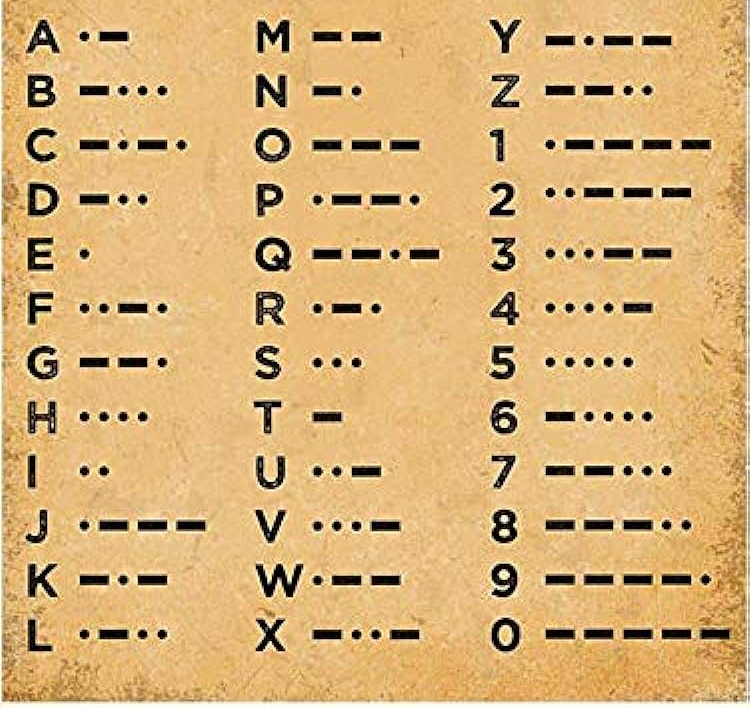

# Séquence : La lumière

!!! note-prof
    si besoin d'infos

!!! question Problématique
    Comment se propage la lumière ?

    
### Document d’appel :

## Séance 1 : Les sources de lumière

!!! question Problématique
    Comment peut-on voir un objet ?

[Activité sources lumineuses](../sourcesLumineuses)

??? abstract Bilan
    Il existe deux types d’objets : 

    - Les sources lumineuses (ou sources primaires de lumière) qui produisent la lumière (Soleil, flammes, lasers, ampoule…)
    - Les objets diffusants qui renvoient une partie de la lumière qu’ils ont reçue d’une source lumineuse (Lune, livre, tableau…)

## Séance 2 : Propagation de la lumière.

!!! question Problématique
    Comment la lumière se propage-t-elle ?
    
[Activité Propagation de la lumière](../propagLumiere)

??? abstract Bilan

    La lumière se propage en ligne droite dans les milieux transparents. On parle de propagation rectiligne. 

    Le rayon lumineux se modélise par une droite sur laquelle on ajoute une flèche indiquant le sens de propagation : 
    
    

    La lumière se propage à une vitesse de 300 000 km/s.

## Séance 3 : Éclipses

!!! question Problématique

    Comment une éclipse peut-elle se produire ?

[Activité Éclipses](../eclipse)

??? abstract Bilan

    Une éclipse correspond à la disparition totale ou partielle d'un astre.
    Cela est dû à la présence d'un autre astre entre l'astre caché et l'observateur.
    
    Dans le cas d'une éclipse lunaire, la Lune devient moins visible car le Soleil, la Terre et la Lune sont alignés et l'ombre de la Terre est projeté sur la Lune.
    
    Dans le cas d'une éclipse solaire, le Soleil devient moins visible car le Soleil, la Lune et la Terre sont alignés et l'ombre de la Lune est projeté sur la Terre.

## Séance 4 : L’énergie et ses conversions 

Le 26 juin 2023 à Triel-sur-Seine a été inaugurée la centrale solaire.

Afin de revaloriser un terrain de stockage de déchets jusque dans les années 90, de nombreux travaux ont été réalisés pour permettre l’installation de 44 424 panneaux solaires qui a une production équivalente à la consommation annuelle de 4 500 foyers soit 83% de la consommation des habitants de Triel-sur-Seine. (Source : site de la communauté Urbaine Grand Paris)

{:style="width:500px;"}

!!! question Problématique

    Comment représenter l'énergie  servant à allumer une ampoule grâce à l’énergie lumineuse émise par le Soleil  ?

[Activité Conversion d’énergie et unité](../chaineEnergetique)

??? abstract Bilan

    Les centrales solaires captent l'énergie du Soleil et la coinvertissent en énergie électrique qui est transférée des centrales jusqu’à nos habitations, les usines, les écoles en temps réel car on ne peut pas la stocker. 
    Les appareils électriques convertissent alors l’énergie électrique en une autre forme : 
    
    - énergie lumineuse, 
    - énergie thermique, 
    - énergie chimique 
    - ou énergie de mouvement. 
    
    Une chaîne énergétique est  la modélisation des transferts d’énergie et des conversions d’énergie : 

      - Les rectangles symbolisent les réservoirs d’énergie ;
      - Les ovales symbolisent les convertisseurs ;
      - Les flèches symbolisent les transferts d’énergie.

    Exemple :
    Un écran convertit l’énergie électrique en énergie lumineuse. Malheureusement, une partie de l’énergie électrique sera perdue sous forme d’énergie thermique (perte). 

    L'énergie lumineuse et thermique seront captées par l'environnement.

    [Représenter cette conversion d’énergie sous forme d’une chaîne d’énergie]
    

   

## Séance 5 : Exercices

[Activité Exercices sur l'optique](../exercicesOptique)

## Séance 6 : Activité BONUS : Communication avec de la lumière.

Dans le film Ponyo sur la falaise des studios Ghibli, Sosuke utilise une lampe pour communiquer avec son père Koichi, un marin en mission, passant devant sa maison. Ils utilisent le code Morse. 
Créé dans les années 1840 par Samuel F.B. Morse, le code Morse est un mode de communication qui remplace les lettres de l’alphabet par des points et des tirets, sonores ou lumineux. Les marins peuvent s’en servir pour communiquer à distance d’un navire à un autre ou d’un navire à la terre. Le message en morse peut être transmis au moyen de faisceaux lumineux ou d’un télégraphe, ou d’un émetteur radio.

{:style="width:250px;"}

!!! question Problématique
    Comment communiquer en Morse ?

{:style="width:300px;"}

[Activité Communiquer en morse](../morse)