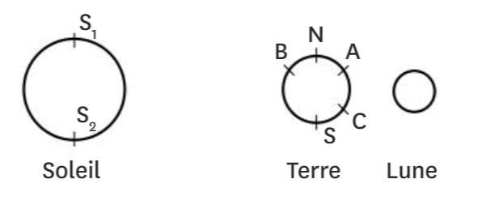

# Activité : Eclipse

!!! note "Compétences"

    - manipuler
    - Schématiser

!!! warning "Consignes"
    1. Compléter le schéma en traçant deux rayons de lumineux émis par le Soleil. Un rayon issu de S1 et passant par N ; et un autre issu de S2 et passant par S. 
    2. Indiquer à quoi correspond chaque élément du modèle dans la réalité. 
    3. Placer les éléments du modèle de façon à modéliser une éclipse de Lune.
    4. Expliquer pourquoi la luminosité de la Lune diminue.
    5. En s’inspirant de l'éclipse de Lune, réaliser un modèle permettant d’expliquer la situation décrite en introduction de l’activité (cercle de feu à Al-Hufuf). Attention à respecter la distance dans le modèle. On considérera que Al-Hufuf est proche de l'équateur dans notre schéma.
    6. En s’inspirant de l'éclipse de Lune, réaliser un schéma permettant d’expliquer la situation décrite en introduction de l’activité (cercle de feu à Al-Hufuf). Attention à respecter les tailles et distance du schéma. On considérera que Al-Hufuf est proche de l'équateur dans notre schéma
    7. Expliquer pourquoi, l'éclipse n'a pas été vu en France
    
??? bug "Critères de réussite"
    - 

Le 26 décembre 2019 en Asie s’est produit un phénomène rare que l’on appelle “cercle de feu”. Dans l’est de l’Arabie saoudite, à Al-Hufuf, on a pu observer ceci :

{: style="width:400px; flex-shrink: 0;  " }

!!! question "Problématique"
    Comment peut-on en obtenir une telle photographie ?

**Document 1 modélisation d'une éclipse de Lune**

On veut modéliser ce qui se passe dans une éclipse de Lune. La lune est un objet diffusant, lors d'une éclipse de Lune, celle-ci devient moins lumineuse pendant quelques heures. 
Un modèle est une représentation simplifiée de la réalité dans le but d'expliquer un phénomène ou de tester des hypothèses.

Dans notre modèle, nous aurons le matériel suivant.

- Une source lumineuse
- une grosse boule 
- une petite boule
- le banc d'optique

L'espace entre la grosse boule et la lampe doit être environ de 15 cm.
L'espace entre la petite boule et la grosse boule de 5 cm.

**Document 2 Représentation d'une éclipse de Lune**

Lors d’une éclipse de Lune, cette dernière passe dans une zone que la lumière du Soleil ne peut pas atteindre, la Terre faisant obstacle.

