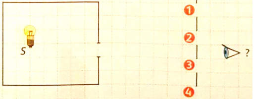
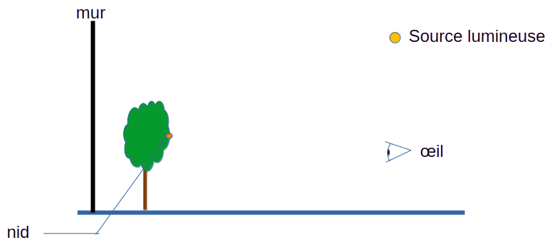
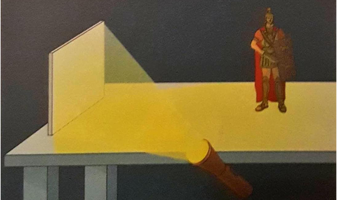
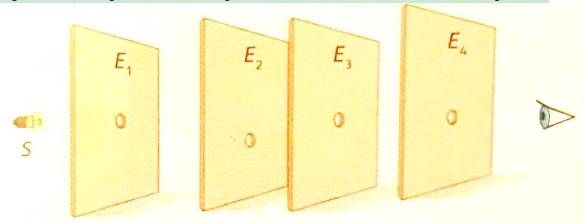
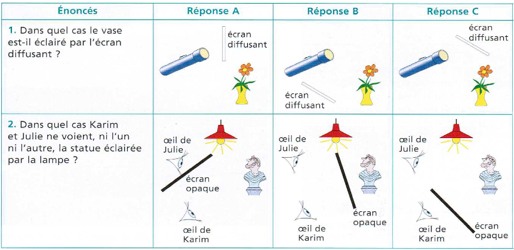
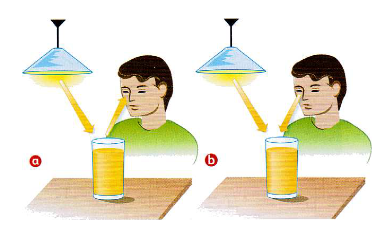
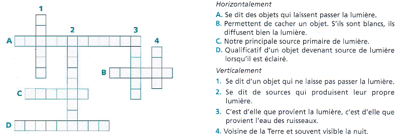
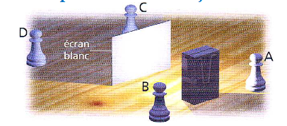
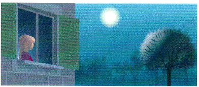

# Activité : Exercices sur l'optique

!!! note "Compétences"

    - Trouver et utiliser des informations
    - Schématiser 

    
??? bug "Critères de réussite"
    - 

## Exercice 1 Retrouver la vitesse de la lumière

La lumière provenant de Soleil met environ 8 min et 20 secondes pour nous parvenir. Cette étoile se trouve à une distance moyenne de 150 millions de km de la Terre. 

!!! warning "Consignes"

    A l’aide d’un calcul, retrouver la valeur de la vitesse de la lumière. 

## Exercice 2 

!!! warning "Consignes"

    Après avoir reproduit le schéma ci-dessous, indiquer où l’on doit placer (position 1, 2, 3 ou 4) l’œil pour voir la source lumineuse S. Justifier en complétant le schéma.

## Exercice 3 

!!! warning "Consignes"

    1. Donner la définition de source primaire de lumière et relever les noms correspondant dans la liste ci-dessous.
    2. Donner la définition d’objet diffusant et relever les noms correspondant dans la liste ci-dessous.

Voici une liste d’objets : Flamme, écran de télévision, écran de cinéma, éclair d’orage, filament d’une lampe, étoile, Vénus, Soleil, bougie, tableau blanc, mur.

## Exercice 4

!!! warning "Consignes"
    1. Trace les rayons lumineux permettant à l'œil de voir le nid ?
    2. Trace l'ombre de l'arbre sur le mur ?

## Exercice 5

Une voiture thermique possède un moteur à explosion qui va convertir l'énergie chimique stockée dans le pétrole en énergie mécanique. Le moteur n'est pas parfait et a donc des pertes sous la forme d'énergie thermique.

!!! warning "Consigne"
    Faire le schéma de la chaine énergétique de la situation décrite ci-dessus

## Exercice 6

!!! warning "Consignes"
    1. Expliquer pourquoi la figurine est visible alors qu’elle n’est pas éclairée (située dans le faisceau de la lumière émise par la lampe).
    2. Compléter l’image avec des segments fléchés pour justifier ta réponse à la question 1.

## Exercice 7

!!! warning "Consignes"
    Indiquer si l’œil peut voir le point lumineux S. Justifier sa réponse.
 

## Exercice 8

!!! warning "Consignes"

    Choisir la ou les  bonnes réponses.

## Exercice 9

!!! warning "Consignes"
    Citer deux sources de lumière primaire sur cette photo

## Exercice 10

!!! warning "Consignes"
    compléter la grille de mots croisés

## Exercice 11

Deux pièces d’échec A et B sont placées d’un côté d’un écran en carton blanc. Deux autres C et D de l’autre côté. Une lampe de poche est placée devant l’écran.

!!! warning "Consignes"
    1. Quelles sont les pièces éclairées ? Pourquoi ?
    2. On remplace maintenant l’écran en carton blanc par une vitre. Quelles sont les pièces éclairées ? Pourquoi ?

## Exercice 12
Une nuit de pleine lune, Charlotte remarque qu’elle peut voir un arbre planté au fond du jardin même si toutes les lumières sont éteintes.

!!! warning "Consignes"
    1. De quelle source primaire provient la lumière qui éclaire le paysage la nuit ?
    2. Trouver le chemin de la lumière qui permet à Charlotte de voir l’arbre la nuit.

