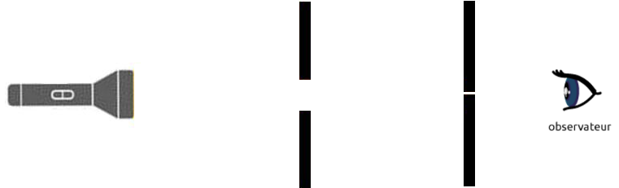
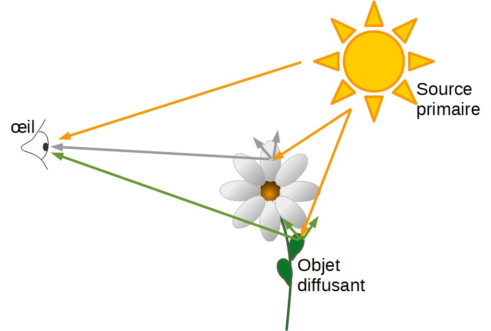

# Activité : Propagation de la lumière 

!!! note Compétences

    - manipuler
    - Schématiser

    
??? bug Critères de réussite
    - 

## Partie 1 : Chemin suivi par la lumière

!!! warning Consignes

    1. Mettre en place le protocole du document 1.
    2. Schématiser la situation
    3. Déduire le trajet de la lumière. Préciser le point de départ, le chemin suivi ainsi que le point d'arrivée. 

**Document 1 Protocole**

- Installer l'écran blanc E3 à 25 cm 
- Placer un  premier écran E1 percé (petit trou au milieu) sur un support à 8 cm devant la source primaire de lumière.
- Placer un  second écran E2 percé (petit trou au milieu) sur un support à 18 cm devant la source primaire de lumière.
- Placer la lampe à 0cm en la tenant 
- Ajuster de la lampe de manière à observer la source primaire de lumière au travers de E1 et E2 et de voir la lumière sur E3
- Insérer un spaghetti dans les trous des deux écrans.

## Partie 2 : Modélisation de la propagation

!!! warning Consignes

    Représenter des rayons lumineux pour les 3 situations (doc 3,4 et 6). 

**Document 2 Modélisation des rayons lumineux**

Un rayon lumineux est la modélisation (représentation) du trajet de la lumière lors de sa propagation. 
On le représente par une droite, et on précise le sens de propagation par une flèche.
La quasi-totalité des sources de lumière n’ont pas qu’un seul rayon, mais une multitude de rayons lumineux. C’est ce qu’on appelle un faisceau de lumière. 

**Document 3 Situation 1**

Dans cette situation, représenter un des rayons lumineux permettant à l'œil de voir la source de lumière.

**Document 4 Situation 2**

Dans cette situation, représenter un des rayons lumineux permettant à l'œil de voir la source de lumière en rouge, et d’autre que l'œil ne peut pas voir en vert.

**Document 5 Rayons lumineux et objets diffusants**

Les objets diffusants reçoivent la lumière d’une source et nous renvoient une partie des rayons lumineux qu’ils ont reçus. 
Dans cette situation, la source primaire envoie des rayons à la fois à l'œil (qui nous permet de le voir) et à la fleur. Celle-ci va ensuite diffuser une partie des rayons que la fleur aura reçus et notre œil pourra les capter. 

**Document 6 Situation 3**

Les photographes utilisent parfois des parapluies blancs pour obtenir un éclairage uniforme et plus naturel lors d’une séance photo. 
Dans cette situation, tracer un rayon de lumière modélisant la propagation de la lumière du flash de l’appareil photo à l’objectif pour prendre en photo la pomme.  

 

## Partie 3 : Les ombres

!!! warning Consignes
    1. Pour chacun des objets du document 8, indiquer s'il est éclairé ou non en justifiant votre réponse.
    2. Tracer sur le mur 2 l'ombre des objets 

**Document 7 Milieux transparents et opaques**

La lumière ne se propage que dans les milieux transparents. Autrement dit, la lumière ne traverse pas les objets opaques. 
Ici, la lumière traverse le verre de la fenêtre, mais ne traverse pas les murs. On observe alors des zones d’ombre.

**Document 8 Ombre et dessin**

Pour connaître la position de l’ombre du cube par rapport à la source de lumière, on trace les rayons lumineux partant de la source jusqu’aux extrémités (sommets) du cube jusque sur le sol puis on les relie à la base du cube. 

**Document 9 Des objets éclairés ou non**

