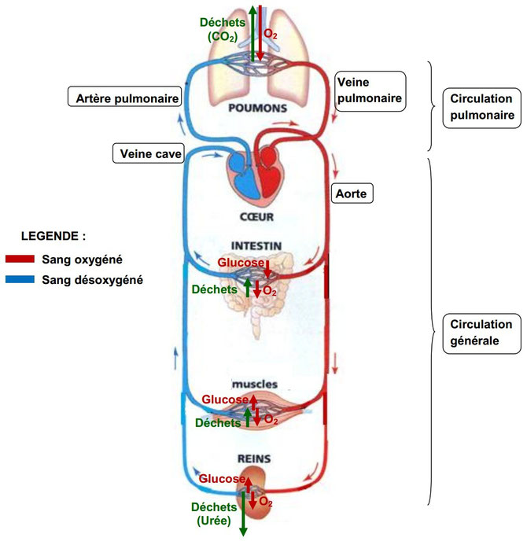

# Séquence : Les besoins de nos organes

!!! note-prof
    si besoin d’infos

!!! question “Problématique”
    Comment nos organes sont-ils approvisionnés ? 

    

## Séance 1 : Les modifications de l’organisme lors d’un effort

Lors des compétitions de sprint, certains sportifs parviennent à parcourir 100m en 10 sec. Après ces 10 secondes, les athlètes sont épuisés et s’allongent sur le sol.

!!! question “Problématique”
    Quelles sont les modifications de l’organisme lors d’un effort ?

[Activité Notre corps lors d’un effort](../effortsPhysiques)

??? abstract “Bilan”

    <a markdown id="bilan1">

    === "Bilan à trous"
    
        Lors d’un effort physique, les besoins des muscles en nutriments et en dioxygène ....................

        Pour cela :

        - La ................... augmente, permettant d’enrichir le sang en dioxygène.
        - La ................... augmente, afin de faire davantage circuler ce sang oxygéné dans le corps
        - Les modifications du ................... permettent d’orienter davantage ce sang vers les muscles qui en ont besoin en plus grande quantité.
  
        Lors d'un effort, le corps chauffe. pour se refroidir, il va transpirer ce qui nous fait perdre de l'eau.

    === "Bilan"

        

        Lors d’un effort physique, les besoins des muscles en nutriments et en dioxygène augmentent.

        Pour cela :

        - La fréquence respiratoire augmente, permettant d’enrichir le sang en dioxygène.
        - La fréquence cardiaque augmente, afin de faire davantage circuler ce sang oxygéné dans le corps
        - Les modifications du débit sanguin permettent d’orienter davantage ce sang vers les muscles qui en ont besoin en plus grande quantité.
        
        Lors d'un effort, le corps chauffe. pour se refroidir, il va transpirer ce qui nous fait perdre de l'eau.

    </a>

## Séance 2 : Les échanges gazeux des animaux.

!!! question “Problématique”
    Quels sont les échanges de matière réalisés lorsqu’un animal respire ?
    
[Activité Les échanges gazeux lors de la respiration](../echangesGazAni)

??? abstract “Bilan”

    <a markdown id="bilan2">

    === "Bilan à trous"
        La ................... est un échange gazeux avec le milieu.
        Les organismes prélèvent du ................... dans leur milieu (aérien ou aquatique) et rejettent du ....................

        Des organes sont spécialisés dans les échanges gazeux.
        La respiration est possible dans l'eau grâce à des .................... Les animaux respirent dans l'air grâce à des ................... ou à des ....................
        Les trachées amènent directement l'air jusqu'aux organes, tandis que les poumons et les branchies sont des surfaces d'échange des gaz entre l'extérieur et le sang.

    === "Bilan"

        La respiration est un échange gazeux avec le milieu.
        Les organismes prélèvent du dioxygène dans leur milieu (aérien ou aquatique) et rejettent du dioxyde de carbone.

        Des organes sont spécialisés dans les échanges gazeux.
        La respiration est possible dans l'eau grâce à des branchies. Les animaux respirent dans l'air grâce à des poumons ou à des trachées.
        Les trachées amènent directement l'air jusqu'aux organes, tandis que les poumons et les branchies sont des surfaces d'échange des gaz entre l'extérieur et le sang.

    </a>

## Séance 3 : L’approvisionnement des organes des animaux.

!!! question “Problématique”
    Comment les nutriments et les gaz sont-ils transportés jusqu’aux organes ?
    
[Activité système circulatoire des animaux](../systCircu)

??? abstract “Bilan”

    <a markdown id="bilan3">

    === "Bilan à trous"
        Les nutriments, les déchets et les gaz (dioxygène et dioxyde de carbone) sont transportés dans un liquide appelé ............... ou ...................
        Ce liquide circule dans un système circulatoire qui peut être ............... ou ..................... sur l'intérieur du corps de l'animal.

        Le sang circule dans un système fermé, des vaisseaux sanguins. Il y en a 3 types différents :
        
        - les ............... qui amènent le sang du cœur vers les organes,
        - les ................... qui amènent le sang des organes au cœur
        - les ........................... qui sont des vaisseaux sanguins fins dans les organes qui permettent les échanges.

        Le liquide circulant est mis en mouvement par un muscle creux : le ...................
        En se relâchant, le cœur se remplit de liquide. En se contractant, le cœur propulse le liquide dans les artères.

    === "Bilan"

        Les nutriments, les déchets et les gaz (dioxygène et dioxyde de carbone) sont transportés dans un liquide appelé sang ou hémolymphe.
        Ce liquide circule dans un système circulatoire qui peut être fermé ou ouvert sur l'intérieur du corps de l'animal.

        Le sang circule dans un système fermé, des vaisseaux sanguins. Il y en a 3 types différents :
        
        - les artères qui amènent le sang du cœur vers les organes,
        - les veines qui amènent le sang des organes au cœur
        - les capillaires qui sont des vaisseaux sanguins fins dans les organes qui permettent les échanges.

        Le liquide circulant est mis en mouvement par un muscle creux : le cœur.
        En se relâchant, le cœur se remplit de liquide. En se contractant, le cœur propulse le liquide dans les artères.

    </a>

    **Document 5 : Représentation schématique de la circulation sanguine**
    

## Séance 4 : Améliorer ses capacités physiques

Le cross du collège se déroulera bientôt. Pour vous préparer, les enseignants d’EPS vous font calculer votre VMA. (Vitesse Maximale Aerobie)
À quoi correspond cette vitesse et comment l’améliorer pour l’année prochaine.

!!! question “Problématique”
    Comment augmenter sa VMA ?
    Quelles sont les attitudes à suivre pour améliorer ses performances ?

[Activité Les performances sportives](../perfSport)

??? abstract “Bilan”

    <a markdown id="bilan4">

    Le corps humain des limites. L'activité cardio-repsiratoires ne peut pas augmenter indéfiniment. 
    
    Les capacités cardiaques et respiratoires peuvent être augmentées en suivant un entrainement. Ce qui est bénéfique pour la santé sur le long terme.

    Mais un surentrainement peut causer de graves dommages au corps.

    Le dopage peut lui aussi avoir des conséquences néfastes sur la santé.

    
    

    </a>

    
## Séance 5 : Exercices sur l’effort

[Activité exercices](../exercices)
