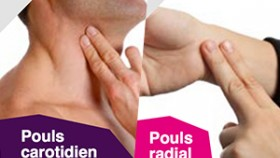
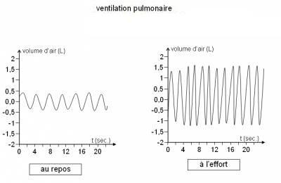
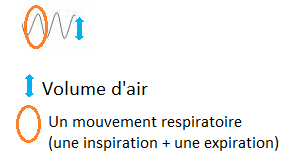
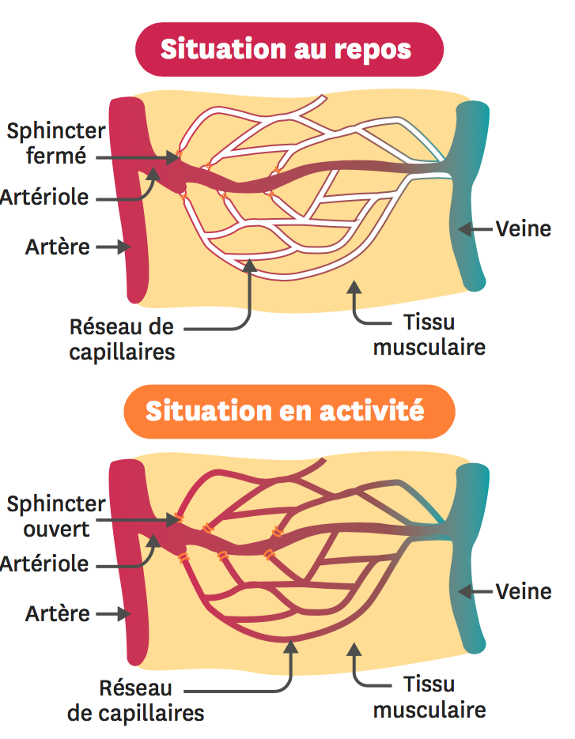
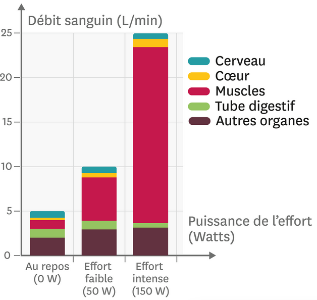

# Activité : Notre corps lors d'un effort

!!! note "Compétences"

    Interpréter 

!!! warning "Consignes"

    1. Compléter le document 2, expliquer ce que l'on peut observer pour la fréquence cardiaque pendant un effort et après un effort.
    2. A l'aide du document 3, expliquer comment varie la fréquence respiratoire lors d'un effort.
    3. A l'aide du document 3, expliquer comment varie le volume d'air utilisé lors d'un effort.
    4. A l'aide des document 4 et 5, expliquer comment varie le débit sanguin lors d'un effort.
    
??? bug "Critères de réussite"

    1. Aide : Vos résultats précédents correspondent au nombre de battements en 20 sec. Il faut donc multiplier vos résultats par  .... pour obtenir le nombre de battements en 60 sec (= 1 minute).

    2.1. Compte le nombre de mouvements respiratoires réalisés en 20 sec au repos.  
    2.2. Calcule la fréquence respiratoire au REPOS en multipliant le résultat précédent par 3 pour obtenir le nombre de mouvements respiratoires réalisés en 60 sec.  
    2.3. Compte le nombre de mouvements respiratoires réalisés en 20 sec à l’effort.  
    2.4. Calcule la fréquence respiratoire à l’effort en multipliant le résultat précédent par 3 pour obtenir le nombre de mouvements respiratoires réalisés en 60 sec.  
    2.5. Conclusion: Comment varie la fréquence respiratoire au cours d’un effort ? (augmente/diminue/est stable) ?

    3.1. Quel est le volume d’air inspiré et expiré au repos ?  
    3.2. Quel est le volume d’air inspiré et expiré à l’effort ?  
    3.3. Conclusion: Comment varie le volume d’air utilisé au cours d’un effort ? (augmente/diminue/est stable)?

**Document 1 Étude de la variation de la fréquence cardiaque**

La fréquence cardiaque est le nombre de battements du cœur par minute.
Il est possible d’estimer sa fréquence cardiaque en comptant le nombre de battements que fait son cœur en une minute. Pour cela il faut : savoir prendre son pouls et utiliser un chronomètre.
Avant de faire l’expérience, il faut bien vous entraîner à prendre le pouls rapidement pour que cela puisse être représentatif.

Protocole expérimental pour l'étude de l'impact de l'activité physique sur la fréquence cardiaque :

- Prendre le pouls au niveau du poignet ou du cou : compter le nombre de battements de cœur pendant 20 secondes précisément
- Faire 15 flexions-extensions des jambes en 30 secondes (= une flexion en 2 sec).
- Dès la fin des flexions, reprendre le pouls pendant 20 secondes
- Attendre 2 minutes et prendre de nouveau le pouls pendant 20 secondes.

**Document 2 Mesure des la fréquence cardiaque**

| | Élève 1 | Élève 2 |
|--|--|--|
| Nombre de battements au repos en 20 secondes | | |
| Fréquence cardiaque au repos | | |
| Nombre de battements en 20 sec en fin d’activité physique | | |
| Fréquence cardiaque en fin d’activité physique | | |
| Nombre de battements en 20 sec après 2 minutes de repos | | |
| Fréquence cardiaque après 2 minutes de repos | | |

**Document 3 Étude de la variation de la fréquence respiratoire**

La fréquence respiratoire est le nombre de mouvements respiratoires par minute.
Un mouvement respiratoire est constitué par une inspiration (air entrant) suivie d’une expiration (air sortant).

{: style="width: 600px;"}

**Document 4 Le débit sanguin dans un muscle.**

Plus il y a de sang en contact avec les muscles dans les vaisseaux sanguins, plus les échanges entre le sang et le muscle sont favorisés.

**Document 5 L’apport de sang aux organes selon l’intensité de l’effort.**

Le débit sanguin correspond à la quantité de sang qui arrive à un organe par minute. Il dépend notamment de l’activité du cœur.

