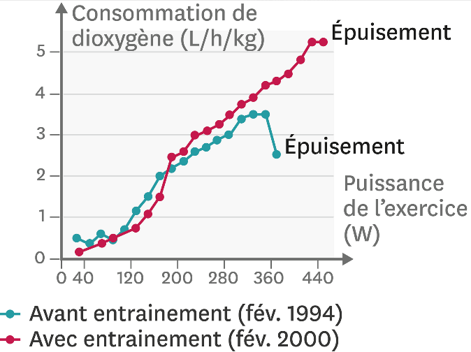

# Activité : Les perfomances sportives.

!!! note "Compétences"

    Extraire et mettre en relation 

!!! warning "Consignes"

    1. Identifier puis expliquer les paramètres pouvant limiter les performances sportives.
    2. Identifier les méthodes permettant d’augmenter ses performances sportives en indiquant les problèmes possibles de ces méthodes.
    
??? bug "Critères de réussite"
    - identifier les échanges gazeux
    - représenter ces échanges sous une forme compréhensible par tous
    - communiquer mes conclusions en les argumentant

**Document 1 La consommation de dioxygène lors d’un effort.**

Tout individu a une consommation maximale de dioxygène à l’effort, ou VO2max. Un effort ne peut durer plus de quelques minutes à cette valeur et cesse rapidement si l’intensité de l’exercice augmente. Cette valeur est mesurée lors d’un test réalisé sous contrôle médical.

**Document 2 La fréquence cardiaque lors d’un test d’effort d’intensité croissante. Le test s’arrête quand l’individu ne peut plus continuer.**

La fréquence cardiaque maximale peut être estimée en soustrayant l’âge de l’individu à la valeur 220.
L’activité cardiaque est l’élément qui limite l’apport de dioxygène aux muscles.

**Document 3 L’effet de six années d’entrainement sur la consommation de dioxygène d’un individu.**

Une VO2max élevée améliore les performances, en augmentant la quantité de dioxygène fournie aux muscles.

**Document 4 Les effets de l’entrainement sur les capacités musculaires.**

Avec ou sans entraînement, le cœur est un muscle « infatigable » : il fonctionne en permanence et chaque contraction est suivie par un relâchement permettant sa récupération (et son remplissage).
• Les muscles squelettiques (biceps par exemple) permettent les mouvements. Ils se fatiguent.
• Mais si tu t’entraînes régulièrement à faire un même exercice physique, tu constateras que cet exercice devient de plus en plus facile. Avec l’entraînement, les muscles gagnent en force (et en masse), ainsi qu’en endurance.

**Document 5 Les effets de deux semaines de surentrainement chez des cyclistes.**

| Paramètre mesuré | Entrainement normal | Après 2 semaines de surentrainement |
|---|---|---|
| Fréquence cardiaque maximale (battements/min) | 185| 178 |
| Vitesse moyenne après course de 8,5 km (km/h) | 36,9|  35,2|
| Fréquence cardiaque pendant le sommeil  (battements/min) | 49,5|  54,3| 

L’entrainement au-delà des limites de l’organisme, le surentrainement, est très surveillé par les entraineurs. Il cause de la fatigue et une baisse de performance, un risque de blessure plus élevé, et des signes psychologiques comme une irritabilité.

**Document 7 Des fréquences cardiaques différentes selon les indvidus**

| Fréquence cardiaque (battements/min) | Non sportif | Sportif amateur | Sportif|
|-|-|-|--|
| Homme | 72| 64| 50|
|Femme  | 74 | 68 | 55|

Une diminution de la féquence cardiaque unduit une rédution considérable du travail quotidien du muscle cardiaque

Il a été montré qu'un fréquence cardique bassediminue de six fois le risque demourir d'une maladie cardio-vaculaire comme l'infarctus du myocarde.

**Document 6 Le dopage avec l’EPO**

L’EPO (érythropoïétine) est une substance naturellement présente dans l’organisme. On sait aussi fabriquer de l’EPO artificielle. Dans les années 2000, l’EPO artificielle a été utilisée comme molécule dopante par certains sportifs.
L’EPO est responsable de la viscosité (plus un liquide est visqueux moins il s’écoule) du sang. Cette viscosité peut conduire à l’obstruction des vaisseaux sanguins, et dans certains cas à des arrêts cardiaques.
L’EPO a un effet sur les globules qui sont les cellules qui transportent le dioxygène dans le sang.
L’utilisation de produits dopants est interdite et peut entrainer une suspension dans les compétitions.

|  |  Sans EPO artificielle | Avec EPO artificielle | 
|---|---|---|
| Nombre de globules rouges dans 1L de sang | 4900 milliards| 6500 milliards|

Les globules rouges permettent de transporter le dioxygène dans le sang, plus il y a de dioxygène, plus on peut prendre de dioxygène.

??? note-prof  Correction de l’activité 36 : Améliorer ses performances

    Consigne 1 : Identifier puis expliquer les paramètres pouvant limiter les performances sportives.
    Les paramètres limitant les efforts sont la consommation de dioxygène et la fréquence cardiaque.
    La consommation de dioxygène augmente lors que l’effort augmente, mais à partir d’un moment nos poumons ne peuvent pas apporter plus de dioxygène. Et donc, nous ne pouvons pas augmenter l’intensité de l’effort physique.
    La fréquence cardiaque augmente aussi avec l’intensité de l’effort, pour augmenter le débit cardiaque qui permet d’apporter plus de dioxygène et de nutriments à nos muscles, mais cette fréquence ne peut pas aller au-delà d’une certaine limite.

    Consigne 2 : Identifier les méthodes permettant d’augmenter ses performances sportives en indiquant les problèmes possibles de ces méthodes.
    Pour augmenter les performances, il est possible de s’entrainer, cela permet d’augmenter la consommation de dioxygène et donc de faire des efforts plus intenses. De plus, l’entraînement permet aux muscles d’avoir une meilleure endurance et plus de force.
    Mais il faut faire attention, car un surentrainement peut conduire à des blessures.
    Certains produits peuvent aussi augmenter les performances en augmentant la consommation de dioxygène. Mais ces produits sont dangereux pour la santé et sont interdits.