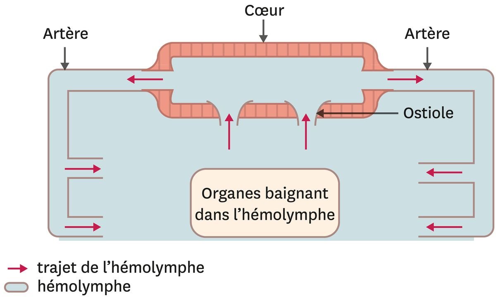

# Activité : Le système circulatoire

!!! note "Compétences"

    Trouver et utiliser des informations

!!! warning "Consignes"

    1. Compléter le tableau  du document 1, en indiquant pour chaque rôle les différents composants du système circulatoire des différents êtres vivants.
    2. En une phrase, indiquer la différence principale entre le système circulatoire des humains et des crevettes.

    
??? bug "Critères de réussite"
    - 

**Document 1 Tableau comparant le système circulatoire d'un vertébré et d'un arthropode**

<table style="width:800px">
<thead>
<tr>
<th style="width:20%"></th>
<th style="width:40%">Humain</th>
<th style="width:40%">crevettes</th>
</tr>
</thead>
<tbody>
<tr>
<td>Nom du liquide  circulant dans le corps</td>
<td></td>
<td></td>
</tr>
<tr>
<td>Organe servant au transport du liquide du coeur aux organes</td>
<td></td>
<td></td>
</tr>
<tr>
<td>Organe servant au transport du liquide des organes aux coeur</td>
<td></td>
<td></td>
</tr>
<tr>
<td>Phénomène permettant la mise en mouvement du liquide</td>
<td></td>
<td></td>
</tr>
<tr>
<td>Organe servant aux échanges entre le liquide et les organes</td>
<td></td>
<td></td>
</tr>

<tr>
<td>Type de système circulatoire (ouvert ou fermé)</td>
<td></td>
<td></td>
</tr>
</tbody>
</table>

**Document 2 Le système circulatoire d'un organisme arthropode, comme la crevette**

La carapace transparente de cette crevette permet de voir l'hémolymphe bleue chez les arthropodes. L'hémolymphe est un liquide circulant dans le corps des arthropodes, ce liquide transporte les nutriments, les gaz et les déchets.
Le système circulatoire est composé d’un vaisseau dorsal constitué de plusieurs cœurs. Le liquide circulant est envoyé dans la cavité de l’insecte et baigne directement les cellules des organes.
Il revient au vaisseau dorsal par des perforations au niveau des cœurs.

{: style="width: 300px;"}

{: style="width: 400px;"}

**Document 3 L'appareil circulatoire simplifié d'un organisme vertébré, comme l'humain**

Un appareil circulatoire clos est composé d'un cœur, d'artères, de capillaires et de veines. Le liquide circulant est envoyé dans les vaisseaux sanguins. Ce liquide transporte les nutriments, les gaz et les déchets. Chez les vertébrés, le liquide est du sang. 

{: style="width: 400px;"}

**Document 4 Schéma du cœur des vertébrés en face ventrale.**

Le cœur est une pompe qui expulse le sang des oreillettes vers les ventricules, puis des ventricules vers les artères. En se relâchant, il se remplit de sang provenant des veines. Le coeur se contracte environ 70 fois par minute au repos, en une journée, il propulse près de 8 000 litres de sang en se contractant plus de 100 000 fois.

{: style="width: 400px;"}

