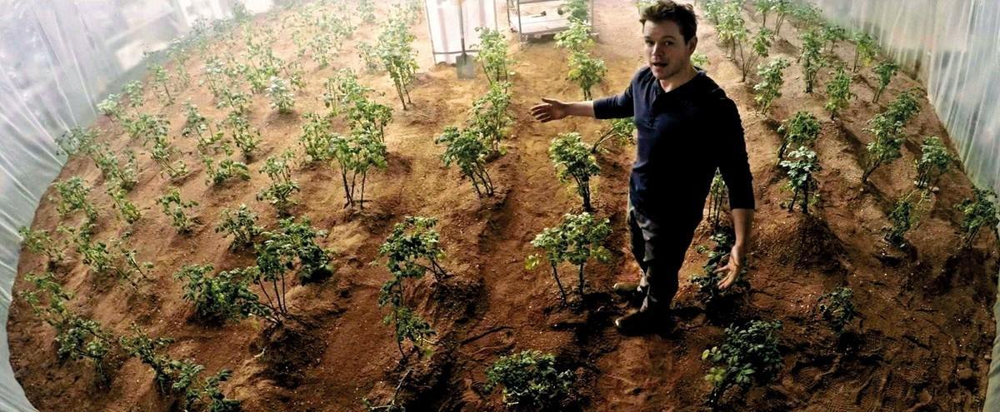

# Activité : Les échanges des végétaux avec leur milieu.

!!! note Compétences

    Extraire et mettre en relation 

!!! warning Consignes

    En décrivant les échanges d'un organisme végétal, expliquez l'origine de l'explosion de la serre de Mark.

??? bug Critères de réussite
    - identifier les gaz échangés par les feuilles à la lumière
    - identifier les gaz échangés par les feuilles à l'obscurité
    - identifier les gaz échangés par les autres organes
    - indiquer la caractéristique du dioxygène
    - que fabrique une plante à la lumière 
    - Indiquer comment sont absorbés les gaz
    - Indiquer comment est absorbée l'eau

**Document 1 La serre de Mark Watney dans le film Seul sur Mars (2015)**

L'astronaute Mark Watney cultive des pommes de terre pour survivre sur Mars. Très vite, l'atmosphère confinée de sa serre est modifiée par les plantes. Ainsi, une simple étincelle dans les réseaux électriques va suffire pour provoquer une violente explosion détruisant toute la serre.

**Document 2 Une observation d'une racine de chou commun**

Si on enlève les poils absorbants d'un végétal, celui-ci prélève très mal l'eau et les sels minéraux présents dans le sol et meurt.

**Document " Un épiderme de feuille observé au microscope optique**

Les stomates permettent de réaliser des échanges gazeux avec l'atmosphère et d'y rejeter de la vapeur d'eau. Ils peuvent se refermer en cas de forte chaleur et de sécheresse.

**Document 4 Des mesures des échanges gazeux de différents organes végétaux à la lumière ou à l'obscurité**

Le dioxygène est un gaz pouvant provoquer des explosions ou incendies en présence d'un combustible.

**Document 5 Des résultats d'une expérience sur la production de matière à la lumière et à l'obscurité**

L'eau iodée est un liquide brun orangé qui permet de détecter une substance organique : l'amidon. En présence d'amidon, une coloration bleu sombre apparaît.

**Document 6 Qu'est-ce que la photosynthèse ?**

Contrairement aux animaux qui se nourrissent directement de matière organique, les végétaux ne prélèvent que de la matière minérale pour vivre. Une transformation se déroule au niveau des feuilles : c'est la photosynthèse. L'eau puisée dans le sol et le dioxyde de carbone de l'atmosphère sont transformés sous l'action de la lumière et forment des sucres (matière organique). Cette réaction produit un déchet que les plantes évacuent dans l'atmosphère : le dioxygène.

**Document 7 Vocabulaire**

- L'amidon : matière organique de la catégorie des glucides. 
- La photosynthèse : fabrication de matière organique par une feuille verte éclairée.