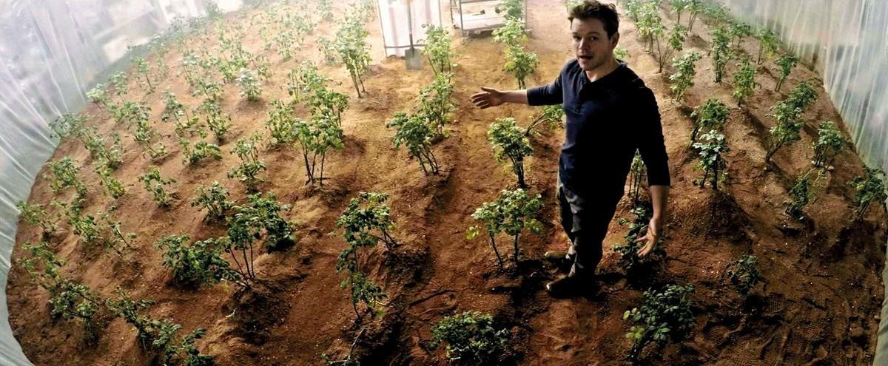
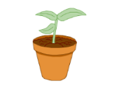
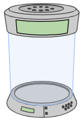
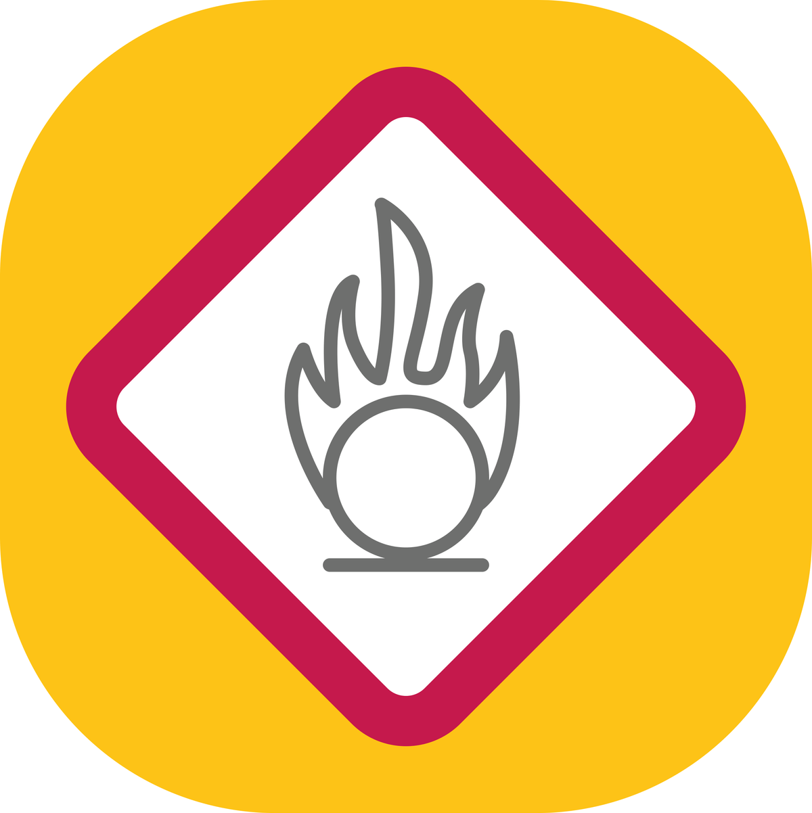

# Activité : Les échanges des végétaux avec leur milieu.

!!! note Compétences

    Extraire et mettre en relation 

!!! warning Consignes
    1. À l'aide du site [THYP](https://thyp.netlify.app/), identifier les gaz échangés par les plantes à la lumière.
    2. À l'aide du site [THYP](https://thyp.netlify.app/), identifier les gaz échangés par les plantes à l'obscurité.
    3. En comparant les sèves produites par la plante à la lumière et à l'obscurité, indiquer ce que fabrique une plante à la lumière.
    4. Expliquez l'origine de l'explosion de la serre de Mark.
    

??? bug Critères de réussite

**Document 1 La serre de Mark Watney dans le film Seul sur Mars (2015)**

L'astronaute Mark Watney cultive des pommes de terre pour survivre sur Mars. Très vite, l'atmosphère confinée de sa serre est modifiée par les plantes. Ainsi, une simple étincelle dans les réseaux électriques va suffire pour provoquer une violente explosion détruisant toute la serre.

**Document 2 THYP**
Le site [THYP](https://thyp.netlify.app/) permet de simuler différentes expériences.

Pour travailler sur les plantes plantes et par exemple analyser la sève des plantes, on trouve un jeune plant de tomate. 

{: style="width:50px; flex-shrink: 0;  " }

Pour travailler sur les gaz échangés par les êtres vivants, on trouve une enceinte dans laquelle on peut mettre différents êtres vivants et différentes sondes de mesures. 

{: style="width:50px; flex-shrink: 0;  " }

**Document 3 Sécurité incendie**

{: style="width:50px; flex-shrink: 0;  " }

Lors d'un incendie, il est conseillé de fermer les portes et les fenêtres si on a le temps, pour éviter l'entrée de dioxygène qui est un comburant.
 Un comburant permet la combustion des objets. Une combustion vive forme une flamme ou une explosion.

**Document 4 Qu'est-ce que la photosynthèse ?**

Contrairement aux animaux qui se nourrissent directement de matière organique, les végétaux ne prélèvent que de la matière minérale pour vivre. Une transformation se déroule au niveau des feuilles : c'est la photosynthèse. L'eau puisée dans le sol et le dioxyde de carbone de l'atmosphère sont transformés sous l'action de la lumière et forment des sucres (matière organique). Cette transformation produit un déchet que les plantes évacuent dans l'atmosphère : le dioxygène.
