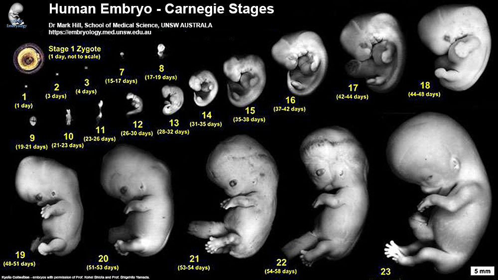
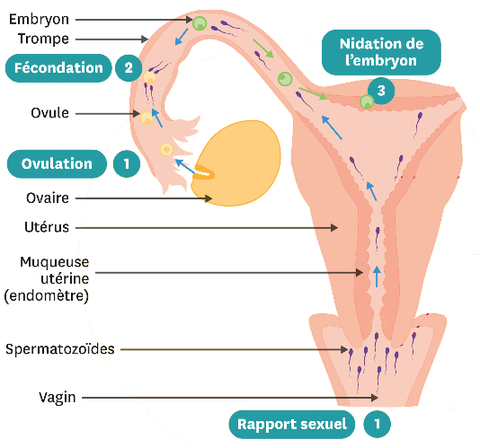

# Séquence : Fonctionnement des appareils sexuels

!!! note-prof
    si besoin d'infos

!!! question "Problématique"

    Comment fonctionnent les appareils sexuels ?
    

## Rappel les différences anatomiques

!!! question "Problématique"

    Quelles sont les différences anatomiques qui se mettent en place au cours du développement d’un individu ?

[Activité Les différences anatomiques entre un homme et une femme](../diffFemmeHomme)

??? abstract "Bilan"
    Lors du développement embryonnaire, les appareils reproducteurs internes et externes deviennent différents chez l’homme et chez la femme, ce sont les caractères sexuels primaires.

    À la puberté, d’autres différences apparaissent entre l’homme et la femme, ce sont les caractères sexuels secondaires (par exemple : développement des seins, développement du pénis…)

    L’appareil reproducteur interne de la femme est constitué des ovaires, des trompes, de l’utérus et du vagin. Et son appareil reproducteur externe, appelé vulve, est constitué de l’orifice du vagin, des petites lèvres, des grandes lèvres et du clitoris.

    L’appareil reproducteur interne de l’homme est constitué des testicules, du canal déférent et de l’urètre. Et son appareil reproducteur externe est constitué des bourses et du pénis.

## Séance 1 : Les cellules sexuelles

!!! question "Problématique"

    Comment sont produites les cellules sexuelles?

[Activité Les cellules sexuelles des femmes et des hommes](../diffCellRepro)

??? abstract "Bilan"

    <a markdown id="bilan1">
    
    Les cellules sexuelles sont produites par les gonades.

    Chez les hommes, les spermatozoïdes sont produits par les testicules, en continu, à partir de la puberté. Le sperme contient du liquide séminal et des spermatozoïdes. Avec l'âge lma qualité du sperme diminue.

    Chez les femmes, les ovules sont émis par les ovaires, de façon cyclique (1 par mois environ), à partir de la puberté jusqu’à la ménopause.

    </a>

## Séance 2 : Le cycle de la femme

!!! question "Problématique"

     A quoi correspond le cycle de la femme ?

[Activité Le cycle de la femme](../cycleFemme)

??? abstract "Bilan"
    
    <a markdown id="bilan2">
    
    Un cycle débute le premier jour des règles, il peut durer de 20 à 40 jours en fonction des femmes et du cycle.
    On donne généralement une durée moyenne de 28 jours.

    À chaque cycle, un ovule est libéré dans une des trompes, c’est l’ovulation. 
    L'ovulation à lieu 14 jours avant les règles.
    À chaque cycle, la paroi de l'utérus s'épaissit puis se détache, ce qui constitue les règles.

    Ces cycles cessent au moment de la ménopause vers 50 ans. 

    </a>

## Séance 3 : La fécondation

!!! question "Problématique"

    Quelles conditions doivent être réunies pour qu’une cellule-oeuf se forme ?

[Activité La fécondation](../fecondation)

??? abstract "Détails"

    

    

    Lors d’un rapport sexuel, des millions de spermatozoïdes sont déposés dans le vagin de la femme. Ces spermatozoïdes survivront 72 h environ.
    Cet ovule survit de 24 à 48 h.

    Cependant, seule une centaine de spermatozoïdes arrivent à traverser le col de l’utérus (situé entre le vagin et la cavité de l’utérus). Ils remontent dans l’utérus et se dirigent vers les deux trompes.

    Lorsque le rapport sexuel a lieu quelques jours avant ou après l’ovulation, un spermatozoïde peut s’unir avec l’ovule : c’est la fécondation.

    

    
    Seul un spermatozoïde pourra pénétrer dans l’ovule  (= ovocyte) : c’est la fécondation. Les deux noyaux des gamètes (= cellules reproductrices : spermatozoïde et ovule) fusionnent pour former une nouvelle cellule : la cellule-œuf.

    La cellule-œuf se divise ensuite en 2 cellules, puis 4 cellules et ainsi de suite, pour former un embryon de plusieurs cellules .

??? abstract "Bilan"

    <a markdown id="bilan3">
    
    Lorsque le rapport sexuel a lieu quelques jours avant ou après l’ovulation, un spermatozoïde peut s’unir avec l’ovule : c’est la fécondation.

    Cette union permet la formation de la *cellule-œuf*. Cette cellule-œuf se divise de nombreuses fois pour former un *embryon*.

    </a>
