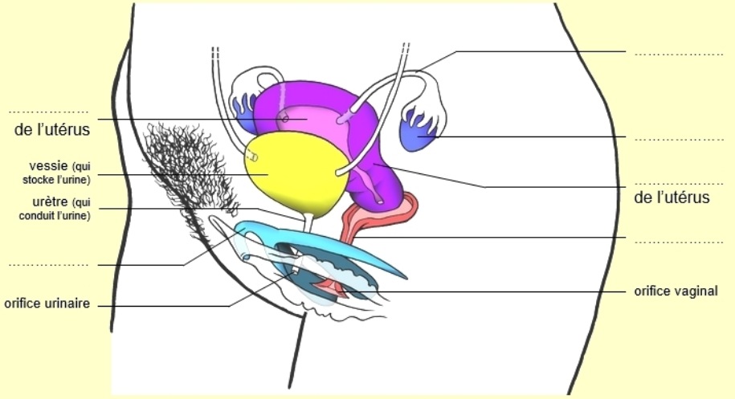
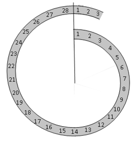
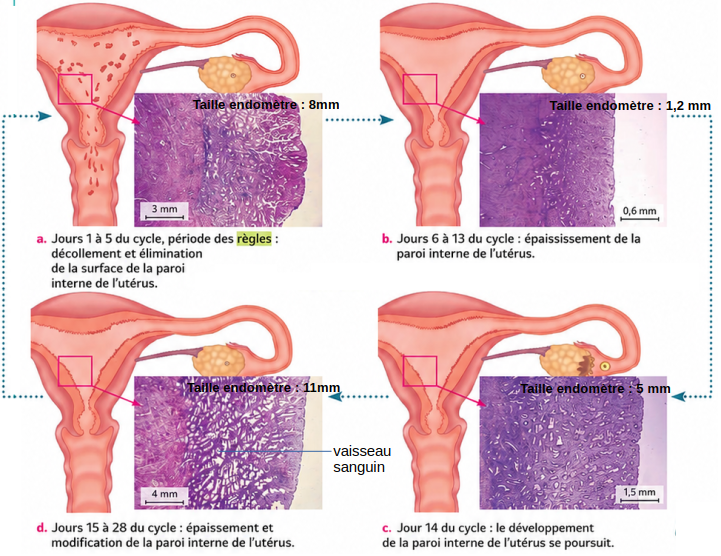
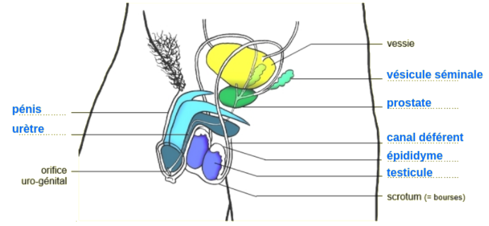

# Activité : Le cycle de la femme

!!! note "Compétences"

    Trouver et utiliser des informations 

!!! warning "Consignes"

    1. A l'aide du site web, compléter le schéma de l'appareil sexuel de la femme.
    2. Représenter sur le cycle du document 2, les règles et l'ovulation d'après les informations du document 3.
    3. Expliquer d'où provient le sang des règles.

    
??? bug "Critères de réussite"
    - 

**Document 1 Appareil sexuel de la femme.**

**Document 2 Le cycle féminin théorique.**

**Document 3 Le cycle féminin théorique.**

Le cycle d'une femme dure en moyenne 28 jours. Cette durée est variable pour chaque femme (de 20 à 40 jours) et même d'un cycle à l'autre.
Le début du cycle est défini comme le premier jour des règles.
Les règles sont un écoulement de sang provenant de l'utérus qui s'écoule vers le vagin. Ces règles ont une durée variable et peuvent durer en moyenne 5 jours.

14  jours avant les règles, un ovule est libéré, c'est l'ovulation.

D’une femme à une autre et d’un cycle à un autre, le jour de l’ovulation n’est pas forcément identique. Il peut varier pour de nombreuses raisons.
 

Ces cycles cessent au moment de la ménopause qui survient naturellement entre 45 et 55 ans, avec un âge moyen de 51 ans.

**Document 4 Le cycle de l'utérus.**

L'endomètre correspond à la paroi interne de l'utérus

