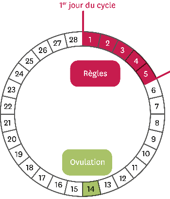
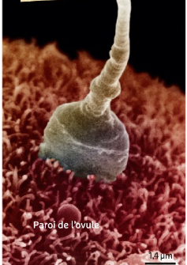
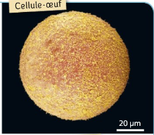
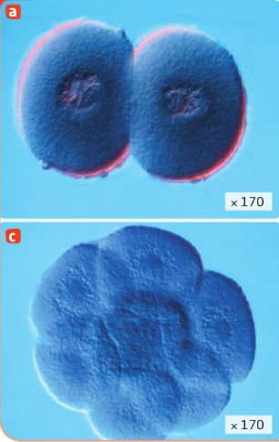
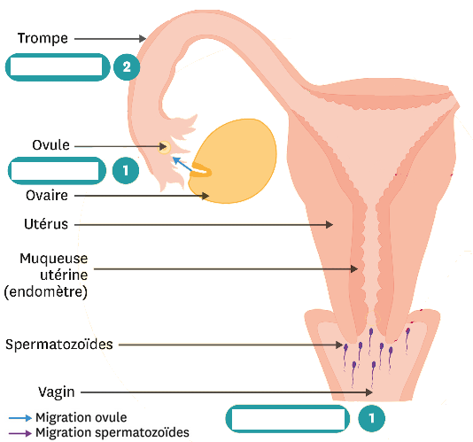

# Activité : La fécondation

!!! note "Compétences"

    Trouver et utiliser des informations 

!!! warning "Consignes"

    1. Expliquer et placer sur le schéma du document 5, les différentes étapes qui vont former une cellule-oeuf lors d'un rapport sexuel.
    2. À partir des documents 1 et 2, indiquer les jours du cycle où un rapport sexuel entraîne une plus grande probabilité de grossesse, en justifiant votre réponse.

    
??? bug "Critères de réussite"  
    1. Tracer sur le schéma du document 5, le trajet des cellules sexuelles.
    2. Nommer la fusion entre spermatozoide et un ovule.
    3. Comment se forme la cellule-oeuf 

**Document 1 Le cycle féminin théorique.**

**Document 2 La durée de vie moyenne des cellules reproductrices dans l’appareil génital féminin.**

|                         | Ovule | Spermatozoïde |
|-------------------------|-------|---------------|
| Durée de vie (en jours) | 1     | 4             |

**Document 3 Trajet des cellules sexuelles**

Lors d'un rapport sexuel, 100 à 400 millions de spermatozoïdes sont déposés dans le vagin. Quelques centaines seulement vont traverser l'utérus pour atteindre la trompe. En parallèle, l'ovule libéré par un ovaire, c'est l'ovulation. Il est acheminé jusque dans la trompe grâce aux cils. 

**Document 4 De la fécondation à l’embryon**

La fécondation est l’entrée d’un spermatozoïde dans l’ovule, cet événement forme une cellule-œuf. La fécondation se fait dans les trompes
Cette cellule va ensuite se diviser à de nombreuses reprises ce qui forme l’embryon. 

 

**Document 5 Schéma du trajet des cellules sexuelles**

