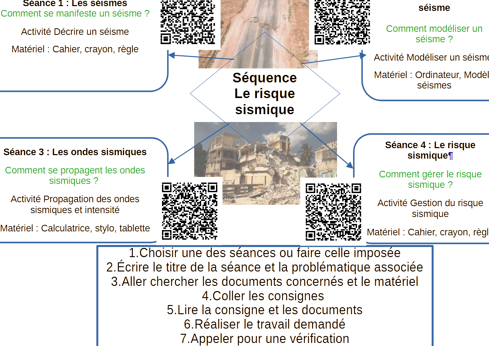

# Séquence : Le risque sismique

!!! note-prof
    si besoin d'infos

!!! question "Problématique"

    À quoi sont dus les séismes ? 
    Comment s’en protéger ?

{:style="width:1000px;"}

## Séance 1 : Les séismes

!!! question "Problématique"

    Comment se manifeste un séisme ?

[Activité Décrire un séisme](../seismes)

??? abstract "Bilan"

    <a markdown id="bilan1">

    === "Bilan à trous"
    
        Un séisme ou tremblement de terre se manifeste par des __________________ brèves (courtes) et brutales. Les séismes peuvent être à l’origine de déformation du paysage, de ______________________ plus ou moins importants et de ____________________.
        Un séisme peut être décrit par sa __________________ et son ______________.

    === "Bilan"

        Un séisme ou tremblement de terre se manifeste par des vibrations brèves (courtes) et brutales. Les séismes peuvent être à l’origine de déformation du paysage, de dégâts plus ou moins importants et de morts.
        Un séisme peut être décrit par sa magnitude et son intensité.

    </a>

## Séance 2 : Modéliser un séisme

!!! question "Problématique"

    Comment modéliser un séisme ?

[Activité Modéliser une rupture de roche](../modelRuptureRoches)
[Activité Modéliser une rupture de roche Eléa](https://mureaux.elea.ac-versailles.fr/course/view.php?id=1419)

??? abstract "Bilan"

    <a markdown id="bilan2">

    === "Bilan à trous"

        Les roches subissent des __________. Les roches se déforment et peuvent ____________________ (=__________), des failles se forment et séparent des blocs de roches.
        Le déplacement de ces blocs, le long de la faille, libère des ______________________ qui se propagent dans le sol. Ces ondes provoquent des secousses appelées ______________________________.

    === "Bilan"

        Les roches subissent des forces. Les roches se déforment et peuvent casser (=rupture), des failles se forment et séparent des blocs de roches.
        Le déplacement de ces blocs, le long de la faille, libère des ondes qui se propagent dans le sol. Ces ondes provoquent des secousses appelées tremblement de terre ou séisme.

    </a>

## Séance 3 : Les ondes sismiques

!!! question "Problématique"

    Comment se propagent les ondes sismiques ? 

[Activité Propagation des ondes sismiques et intensité](../propagOndes)
[Activité Propagation des ondes sismiques et intensité Eléa](https://mureaux.elea.ac-versailles.fr/course/view.php?id=1399)

??? abstract "Bilan"

    <a markdown id="bilan3">

    === "Bilan à trous"

        Le ______________ est le point d’origine des ondes sismiques.
        Ces ondes sismiques se propagent dans toutes les directions.
        Le point où l’on constate la force du séisme  la plus importante en surface est appelé ____________. Il est situé au-dessus du foyer sismique.

        Plus on s’éloigne de l’épicentre, plus la force du séisme sera ____________________.

        Les sismomètres et les ________________ sont des appareils qui permettent d’enregistrer les vibrations du sol. Ils permettent donc de détecter et d’enregistrer les séismes. De nombreux sismomètres sont disposés à la surface du globe. 

    === "Bilan"

        Le foyer sismique est le point d’origine des ondes sismiques.
        Ces ondes sismiques se propagent dans toutes les directions.
        Le point où l’on constate la force du séisme  la plus importante en surface est appelé l’épicentre. Il est situé au-dessus du foyer sismique.

        Plus on s’éloigne de l’épicentre, plus la force du séisme sera faible.

        Les sismomètres et les sismographes sont des appareils qui permettent d’enregistrer les vibrations du sol. Ils permettent donc de détecter et d’enregistrer les séismes.De nombreux sismomètres sont disposés à la surface du globe. 

    </a>

## Séance 4 : Le risque sismique

!!! question "Problématique"

    Comment gérer le risque sismique ?

[Activité Gestion d'un risque sismique](../risquesSismiques)

??? abstract "Bilan"

    <a markdown id="bilan4">

    === "Bilan à trous"

        Les phénomènes sismiques peuvent exposer les populations humaines à un ___________.

        Un risque est évalué en tenant compte de son ______________________ (sa probabilité de survenir) et de la v____________________________(sensibilité au risque des biens et des humains).

        Pour réduire le risque, on peut utiliser des mesures de ____________________, de __________________________ et de __________________________.

    === "Bilan"
    
        Les phénomènes sismiques peuvent exposer les populations humaines à un risque.

        Un risque est évalué en tenant compte de son aléa (sa probabilité de survenir) et de la vulnérabilité des enjeux (sensibilité au risque des biens et des humains).

        Pour réduire le risque, on peut utiliser des mesures de prévision, de prévention et de protection.

    </a>

## Séance 5 : Schéma Bilan de la séquence

[Activité Schéma Bilan sur les séismes](../bilan)

## Séance 6 : Exercices

[Activité Exercices sur les séismes](../exoSeismes)
