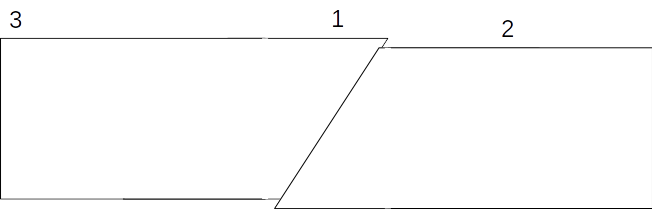

# Activité : Schéma bilan sur les séismes

!!! note "Compétences"

    - Faire un schéma

!!! warning "Consignes"
    
    1. Compléter et légender le schéma du document avec
        - Le foyer (par un point vert), la faille et l’épicentre (point rouge)
        - La propagation des ondes sismiques (cercle en pointillés)
        - Les forces exercées sur les roches (flèches épaisses rouges) et le mouvement des roches (flèches fines bleues)
        - L’état des maisons situées aux emplacements 1, 2 et 3.

    
??? bug "Critères de réussite"
    - 

**Document 1 Schéma des effets d'un séisme**

