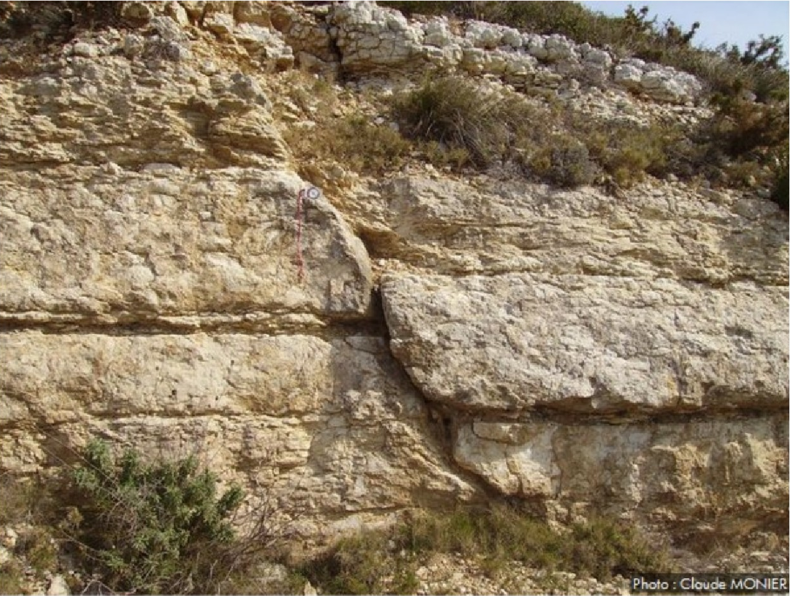
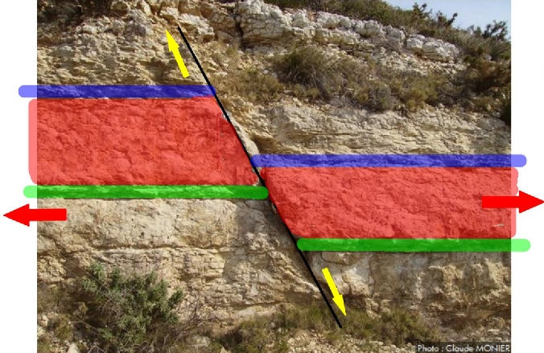
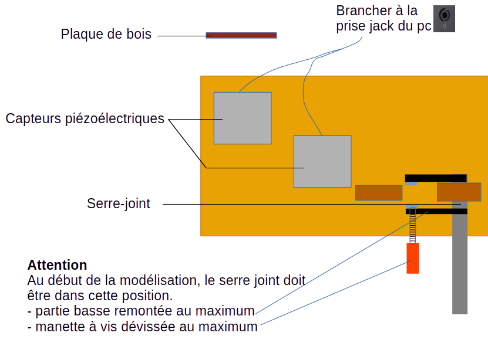

# Activité : Modéliser un séisme

!!! note "Compétences"

    - trouver et utiliser des informations 
    - Modéliser un phénomène

!!! warning "Consignes"

    1. À partir de l’analyse des documents 1, 2 et 3, construire un schéma fonctionnel expliquant ce qui provoque un séisme.
    2. Rédiger un protocole expérimental d'un modèle qui permettrait d'enregistrer des ondes sismiques, en vous aidant du document 4. Appeler l'enseignant.
    3. Réaliser la modélisation.
    4. Expliquer l’intérêt du modèle dans cette activité et donner une ou deux critiques qui pourrait être faite.

??? bug "Critères de réussite"

    Pour chacun des documents 1, 2 et 3 : relever les différents événements ayant lieu dans le déclenchement d'un séisme.

    Avoir placé les différents événements :

    - Déplacement des blocs de roches
    - Rupture des roches
    - Contraintes (ou tensions) sur les roches
    - Secousses (=séismes)
    - Déformation des roches
    - Ondes libérées

**Document 1 Un séisme.**

Un séisme est une secousse du sol provoquée par des ondes se propageant dans le sol à la surface comme des « vagues » parcourant les roches.

**Document 2 Mouvements le long d’une faille**

Une faille est une fracture dans la croûte terrestre. Un bloc de roche peut s’y déplacer. Le long d’une faille, les aspérités des roches empêchent le glissement de deux blocs rocheux l’un par rapport à l’autre.
Lorsque les roches cassent brutalement, la libération d’énergie accumulée permet le déplacement des blocs rocheux. 
C'est lors du déplacement des blocs, au niveau du foyer, en profondeur, que prennent naissance les vibrations ou ondes sismiques.

**Document 3 Comportements des roches soumis à des contraintes.**

Des forces (ou contraintes) s’exercent en permanence sur les roches du sous-sol, qui accumulent ainsi de l’énergie.
Lorsque l’on applique des forces sur un bloc solide, une tension, et donc de l’énergie, s’accumule au sein du bloc. Cette tension provoque la déformation du bloc, celui-ci commence à plier.
Au-delà d’une certaine force, le bloc se casse, c’est la rupture, en un point profond appelé foyer.

**Document 4 Modélisation d’un séisme**

Un modèle en sciences est une représentation simplifiée de la réalité d’un phénomène pour expliquer ce phénomène ou faire une expérience pour tester une hypothèse concernant le phénomène.
Le modèle réduit la complexité du réel, afin de le comprendre ou le faire comprendre. Il est différent de la réalité. Construit autour d’hypothèses, il doit être testé par confrontation au réel.

Dans notre modèle, on utilisera :

- une plaque de bois pour modéliser les roches
- un système de serre-joint qui créera une force lorsque l'on visera (voir schéma)
- des capteurs piézoelectriques détectant les vibrations, avec l'application [sismopiezo](https://cosentinophilippe.forge.apps.education.fr/sismopiezo/index.htm).
- 
