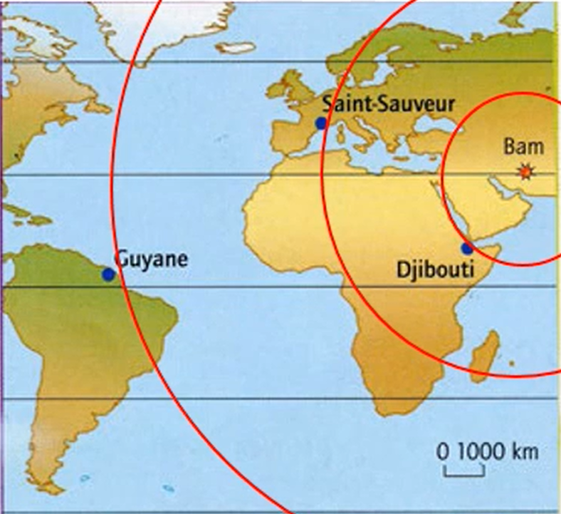

# Activité : Propagation des ondes sismiques et intensité

!!! note "Compétences"

    - Trouver et utiliser des informations 
    - utiliser l'outil mathématique

!!! warning "Consignes"

    1. Décris  en quelques phrases la manière dont les dégâts sont répartis dans la région de Bam. (document 2)
    2. Comparer les 3 sismogrammes du séisme.
    3. Proposer une explication à cette répartition des dégâts en étudiant les données apportées par les sismogrammes.
    4. Calculer la vitesse des ondes sismiques entre l'épicentre et Djibouti à partir des documents 1 et 5

??? bug "Critères de réussite"
    - description intensité :
      - comparer intensité autour de la ville de Bam
      - Formuler une conclusion
        - compléter la phrase suivante : Plus on s’éloigne de _ _ _ _ _ _ _ _ _ _ _ _ _ plus l’intensité du séisme _ _ _ _ _ _ _ _ _ _ _ _
    - Comparer les sismogrammes en focntion de l'heure de début enregsitrée et de l'amplitude
    - calculer vitesse
      - rappeler formule
      - trouver le temps entre le séisme et un enregistrement
      - trouver la distance entre le séisme et la station

**Document 1 Un séisme à Bam.**

Le 26 décembre 2003 en Iran à 1h56min52s, de fortes secousses ont détruit la ville de Bam en 13 secondes. Ce séisme était d'une magnitude de 6,3. 

35 000 morts ont été déplorés. Après avoir observé les dégâts et interrogé les témoins, les géologues déterminent, sur une échelle de I à XII l’intensité du séisme en différents lieux. Les valeurs obtenues sont reportées sur une carte et les points de même intensité sont reliés pour délimiter des zones d’égale intensité. On localise ensuite l’épicentre du séisme. Le foyer sismique était situé à 10 km de profondeur.

**Document 2 Échelle d’intensité et carte des intensités établies après le séisme de Bam.**

<table>
<thead>
  <tr>
    <th> Intensité du séisme</th>
    <th> Effet du séisme</th>
  </tr>
</thead>
<tbody>
  <tr>
    <td> I à IV</td>
    <td> Faibles : quelques vibrations ressenties. Balancement des objets suspendus</td>
  </tr>
  <tr>
    <td> V à VI</td>
    <td> Forts : secousses ressenties par les habitants, légers dommages aux constructions</td>
  </tr>
  <tr>
    <td> VII à VIII</td>
    <td> Très forts : gros dégâts aux constructions, fissures dans le sol</td>
  </tr>
  <tr>
    <td> IX à X</td>
    <td> Destructeurs : effondrement de bâtiments, crevasses dans le sol</td>
  </tr>
  <tr>
    <td> XI à XII</td>
    <td> Dévastateurs : effondrement des constructions les plus solides, bouleversements important du paysage</td>
  </tr>
</tbody>
</table>

{:style="width:400px;"}

**Document 3 Quelques définitions**

- Épicentre : Lieu en surface où le séisme est le plus fort.  
- Foyer : Point de rupture de la roche d’où partent les ondes sismiques.    
- Intensité sismique : mesure des effets d’un séisme en un lieu donné.  
- Faille : fracture dans la croûte terrestre. Un bloc de roche peut s’y déplacer. 

**Document 4 Principe de fonctionnement du sismographe**

Les vibrations provoquées par un séisme sont dues à des ondes sismiques qui se propagent dans toutes les directions. Les ondes sont enregistrées par un sismographe : le socle de l’appareil et le cylindre enregistreur (fixé au sol) vibrent, la masse suspendue tend à rester immobile. 

Les vibrations sont représentées par des variations du tracé proportionnelles à leur amplitude. Ces enregistrements sont appelés sismogrammes.
Aujourd’hui, des sismomètres réalisent des mesures électroniques.

**Document 5 Sismogrammes enregistrés après le séisme de Bam dans 3 stations d’un réseau d’enregistrement.**

{:style="width:400px;"}
{:style="width:400px;"}

??? note-prof "Correction"

    Consigne 1 : Dans le document 2, on voit que l'intensité des dégâts est forte lorsque l'on est proche de Bam, et plus faible lorsque l'on s'éloigne. L'intensité diminue lorsque l'on s'éloigne de Bam. 

    Consigne 2 : 
    la station la plus proche de l'épicentre a enregistré le séisme en premier
    La station la plus près de l'épicentre a enregistré une plus forte amplitude

    Consigne 3 : 
    On voit dans l'analyse du sismographe que, plus, on s'éloigne de l'épicentre, plus l'amplitude enregistrée est faible.

    Cela explique l'intensité des dégâts observée autour de Bam.

    Plus on se rapproche de l'épicentre, plus l'amplitude du séisme est forte donc les dégâts seront plus importants et donc l'intensité observée sera forte.

    Consigne 4 :
    La formule de la vitesse est \( Vitesse = \frac{Distance}{Temps} \).

    Il faut donc calculer la distance entre 2 points

    | |Échelle|	|	Distance Bam - Djibouti|
    |--|-----|---|-----------------------|
    |  Longueur sur carte (cm)|	2	|1|	4,5|
    | Longueur réelle (km)	|1000|  |		 distance|

    \( distance = 1000 \div2 \times4.5 \).

    Il faut aussi calculer le temps de parcours.

    Les ondes sont parties de Bam à 1h56min52s et arrivées à Djibouti à 2h01min53s.

    Il y a donc 5min1s de trajet, soit 301s (5*60 +1)

    La vitesse est donc \( Vitesse = \frac{2200}{301} \).

    Vitesse = 7,3 km/s