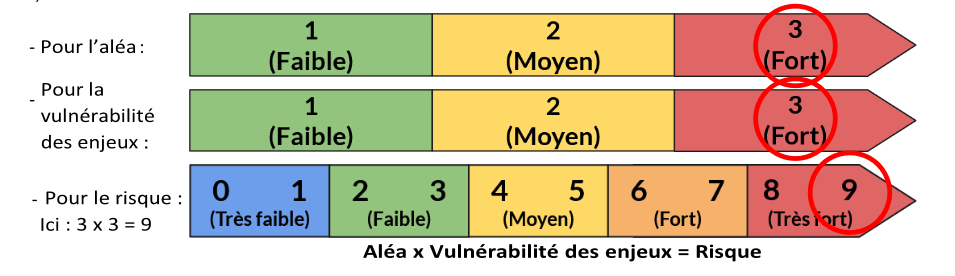
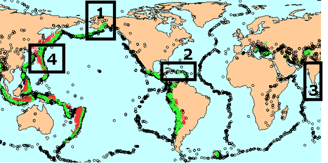

# Activité : Gestion d'un risque sismique

!!! note "Compétences"

    - Trouver et utiliser des informations 

!!! warning "Consignes"
    
    1. En utilisant les documents, compléter le tableau du document 4 pour caractériser le risque sismique pour les quatre zones étudiées (Alaska ; Haïti ; Inde ; Japon).
    2. Classer en 3 catégories (Prévision de l'aléa, mesures de protection et mesures de prévention) dans un tableau, les exemples de mesures proposés.
        Exemples de mesures : Évacuation d’une ville / Étude de la fréquence de survenue des séismes / Éducation des populations / Sensibilisation des populations des zones à risques / Étude de la composition des fumées s’échappant d’un volcan / Bâtiments aux normes parasismiques
    3. A partir de la vidéo du document 5, expliquer pourquoi y a-t-il eu beaucoup de victimes lors du séisme de Kobe, au Japon. (Votre réponse doit comporter au minimum 3 facteurs pouvant expliquer ce tragique évènement)

    
??? bug "Critères de réussite"

**Document 1 Prévision, protection et prévention d'un risque**

Le risque dépend de l'aléa et de la vulnérabilité des enjeux exposés

**(Risque) = (aléa) x (Vulnérabilité des enjeux)**

L’aléa est la probabilité qu’un phénomène de nature et d’intensité donnée survienne. 

La vulnérabilité des enjeux est les conséquences du phénomène sur les enjeux présents (ensemble des personnes, des biens). La vulnérabilité de l'enjeu dépend donc de ce qui est présent et de la fragilité de ces éléments.

Pour réduire le risque 3 approches sont possibles :

- La prévision est l’étude de l’aléa (nature, fréquence, localisation, intensité, date des événements majeurs) permettant une détermination plus précise du risque.

- La protection est l’ensemble des mesures prises pour diminuer l’impact potentiel d’un aléa sur un enjeu donné (population, construction…) et donc diminuer le risque en diminuant la vulnérabilité.

- La prévention d’un risque est l’ensemble des mesures visant à anticiper les aléas et leurs impacts par divers moyens (apprentissage de gestes ou consignes à suivre en cas de problème, mise en place et respect de règles ou protocoles d’action…) afin de diminuer le risque global.

**Document 2 la répartition des séismes sur Terre entre 1977 et 1992.**

Chaque cercle sur la carte correspond à un séisme de magnitude supérieure à 5,5
Localisation approximative des zones étudiées : 1 — Alaska ; 2 — Haïti ; 3 — Inde ; 4 — Japon

**Document 3 la construction parasismique**

La construction parasismique consiste à concevoir des bâtiments capables de résister aux séismes. Le Japon est incontestablement le pays le plus à la pointe sur la question de la construction parasismique. Lors du séisme du 11 mars 2011, le génie parasismique japonais fait ses preuves, aucun bâtiment ne s’est effondré alors même que la magnitude était de 9.
En revanche, dans les pays pauvres, comme Haïti, les constructions parasismiques sont très peu développées. Rappel, un indicateur de richesse des pays est le PIB (Produit Intérieur Brut)

**Document 4 Tableau des caractéristiques des quatre zones étudiées**

<table>
<thead>
  <tr>
    <th> Régions</th>
    <th> Nombre d’habitants 		</th>
    <th> Densité de population (habitants par km²) 		</th>
    <th> PIB par habitant 		</th>
    <th> Aléa  sismique  		</th>
    <th> Vulnérabilité  de l'enjeu 		</th>
    <th> Risque  sismique 		</th>
  </tr>
</thead>
<tbody>
  <tr>
    <td> Alaska 		</td>
    <td> 731 449 		</td>
    <td> 0,43 		</td>
    <td> 67 113 € 		</td>
    <td> 			  			 			 		</td>
    <td> 			 		</td>
    <td> 			 		</td>
  </tr>
  <tr>
    <td> Haïti 		</td>
    <td> 10 911 819 		</td>
    <td> 375 		</td>
    <td> 735 € 		</td>
    <td> 			  			 			 		</td>
    <td> 			 		</td>
    <td> 			 		</td>
  </tr>
  <tr>
    <td> Inde 		</td>
    <td> 1 251 695 584 		</td>
    <td> 380,7 		</td>
    <td> 1 741 € 		</td>
    <td> 			  			 			 		</td>
    <td> 			 		</td>
    <td> 			 		</td>
  </tr>
  <tr>
    <td> Japon 		</td>
    <td> 127 103 388 		</td>
    <td> 349 		</td>
    <td> 35 883 € 		</td>
    <td> 			  			 			 		</td>
    <td> 			 		</td>
    <td> 			 		</td>
  </tr>
</tbody>
</table>

**Document 5 Reportage sur le séisme de Kobe**

<iframe title="le tremblement de terre de kobe" width="560" height="315" src="https://tube-sciences-technologies.apps.education.fr/videos/embed/abc82eb8-114e-4f4d-ad34-58c75cf6883a" frameborder="0" allowfullscreen="" sandbox="allow-same-origin allow-scripts allow-popups allow-forms"></iframe>

