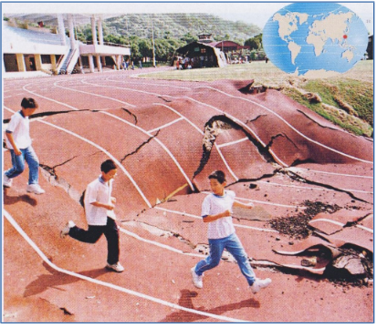
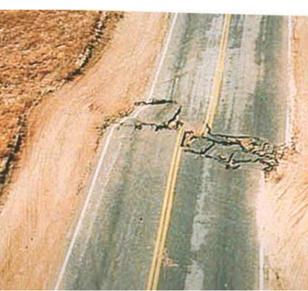
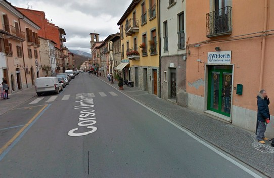
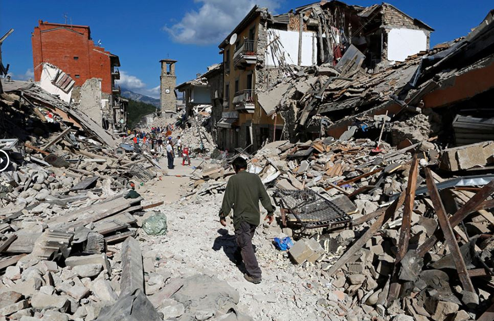
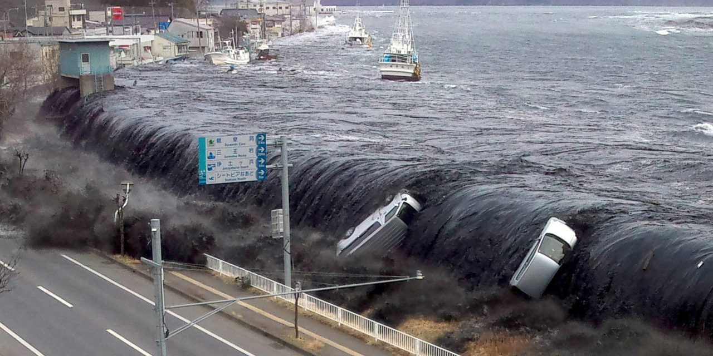

# Activité : Décrire un séisme

!!! note "Compétences"

    trouver et utiliser des informations 

!!! warning "Consignes"

    1. D'après les documents 1 à 4, quelles sont les conséquences d’un séisme ?
    2. En utilisant les documents 5 et 6 quels paramètres permettent de décrire les séismes ? Expliquer pourquoi les deux mesures sont complémentaires.
    3. D'après le document 7, combien y a-t-il eu de séismes en France depuis hier ? Quelle est la magnitude maximale enregistrée ?
    4. D'après le document 7, Combien y a-t-il eu de séismes dans le monde depuis hier ? Quelle est la magnitude maximale enregistrée ?

??? bug "Critères de réussite"
    - Avoir noté les conséquences d'un séisme (5 minimum)
    - Avoir noté les 2 paramètres décrivant un séisme
    - Expliquer la différence entre magnitude et intensité
  

**Document 1 Les séismes.**

Les séismes ou tremblements de terre sont des vibrations soudaines et fréquentes à la surface du globe, souvent imperceptibles pour des humains, il y a plus de 1000 secousses par jour, mais parfois intenses et dévastatrices (de 10 à 100 par an). Les vibrations du sol sont appelées ondes sismiques.

<iframe title="Tremblement de terre, tsunami et explosion nucléaire au Japon _ Archive INA" width="560" height="315" src="https://tube-sciences-technologies.apps.education.fr/videos/embed/ba209534-e17f-48a9-bb17-103028a4f7d8" frameborder="0" allowfullscreen="" sandbox="allow-same-origin allow-scripts allow-popups allow-forms"></iframe>

<iframe title="séismes en direct" width="560" height="315" src="https://tube-sciences-technologies.apps.education.fr/videos/embed/ea2c76b5-3284-46ac-a7dd-244485871796" frameborder="0" allowfullscreen="" sandbox="allow-same-origin allow-scripts allow-popups allow-forms"></iframe>

**Document 2 Effets des séismes observables sur le sol.**

{:style="width:400px; flex-shrink: 0; "}

{:style="width:400px; flex-shrink: 0; "}

**Document 3 Effets des séismes dans les villes**

{:style="width:400px; flex-shrink: 0;  " }
{:style="width:400px; flex-shrink: 0;  " }

Même rue de la ville d’Amatrice (Italie) avant et après le séisme d’août 2016. (Magnitude : 6,6)

**Document 4 Origine et conséquence d’un tsunami.**

{:style="width:1500px; flex-shrink: 0;  " }

Un tsunami est constitué d’une série de vagues qui se propage à la surface de l’eau. Un tsunami est souvent déclenché par des séismes sous-marins. Ces vagues peuvent devenir très grandes en arrivant sur les côtes. Le séisme du 11 mars 2011 (Magnitude : 8,5) qui s’est produit au large du Japon a produit un tsunami avec des vagues qui ont été jusqu’à 15 m de hauteur. La majorité des victimes du séisme du 11 mars sont dues au tsunami. C’est ce tsunami qui est à l’origine de l’accident nucléaire de la centrale nucléaire de Fukushima.

**Document 5 Paramètres d’un séisme**

Lorsque l’on décrit un séisme, on parle soit de magnitude, soit d’intensité.

- La magnitude est une mesure de la "force", de l’énergie libérée (en Mw (mégawatts)) lors d’un séisme. Elle va de 1 à 9.
- L’intensité sismique est une estimation des effets en surface du séisme. Elle est basée sur les dégâts observés. L'échelle de Mercalli classe ces dégâts de I à XII.

Sur le croquis ci-dessous, on voit qu’un séisme de forte magnitude (à gauche) peut commettre moins de dégâts qu’un séisme de magnitude plus faible (à droite).

{:style="width:1000px; flex-shrink: 0;  " }

**Document 6 Des séismes puissants**

|   |  Localisation |  Magnitude  (Mw)  | Intensité |  Coûts des dégats  ($)  | nombre de morts    |  Nombre de blessé |
|---|---|----|---|----|----|---|
| Séisme d'haiti en 2010  | le séisme a eu lieu à quelques km de la capitale | 7,0  |  IX |  14 milliards  |280000 | 300000| 
| Séisme de l'archipel Ogasawara (Japon) en 2015 | le séisme a eu lieu dans l'océan Pacifique à environ 200km des côtes | 7,8  | 0  | 0   | 0 |
| Séisme de Fidji en 2018 | le séisme a eu lieu dans l'océan Pacifique à environ 100km des côtes | 7,9  | V  |  moins de 1 million  | 0 | 0 |

**Document 7 Site national d’information sur la sismicité**

??? note-prof "correction"
    
    Consigne 1 :
    Un séisme peut causer des secousses du sol, des déformations du sol, des destructions, des blessés et des tsunamis. 
   
    Consigne 2 :
    Lors d’un séisme, on peut mesurer l’énergie du séisme, c’est-à-dire sa magnitude. Mais aussi les dégats qui sont dûs au séismes avec l'intensité.
    Les deux mesures sont compélmentaires car un séisme peut être fort, mais causer peu de dégats et à l'inverse un séisme de magnitude moyenne peut causer de gros dégats et donc avoir une grande intensité.

    Consigne 3 :
    Il ya eu des séismes la veille en france majorité sont de faible magnitude.

    Consigne 4 :
    Dans le monde, on voit qu'il y a aussi des séismes de magntiude plus forte régulièrement.
