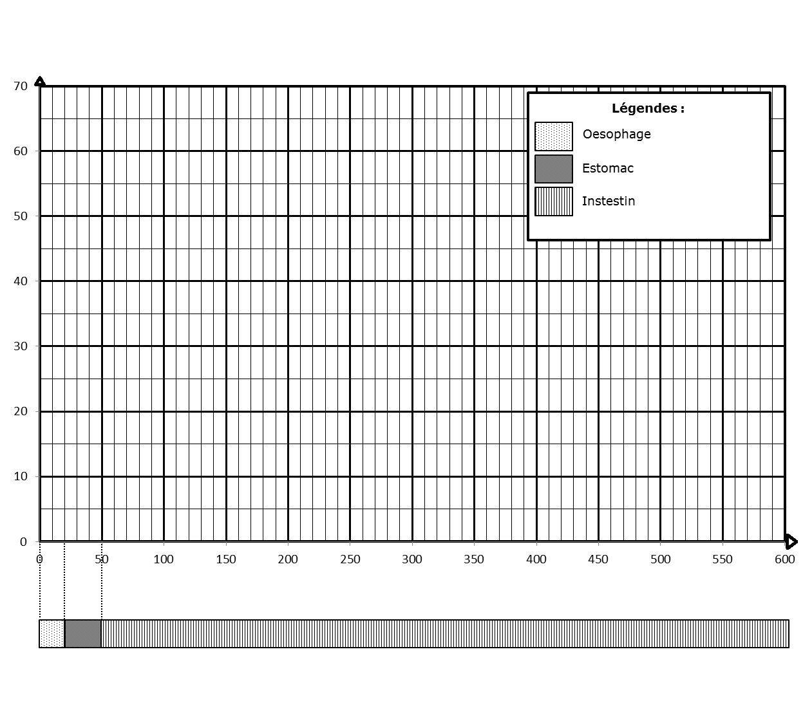
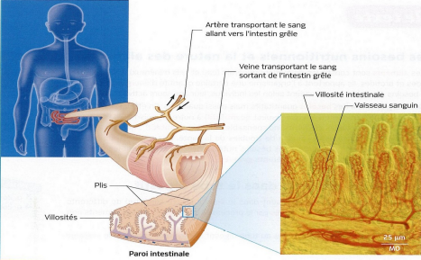

# Activité : Absorption intestinale

!!! note "Compétences"

    - Interpréter
    - Réaliser un graphique

!!! warning "Consignes"

    1. À partir du document 2, trace un graphique de la quantité de nutriments présents dans le tube digestif en fonction de la distance à la bouche.

    2. À partir des documents 1 et 3, indiquer ce que deviennent les nutriments présents dans le tube digestif, justifier votre réponse avec deux informations.

    3. Tracer un schéma  de la coupe d'un instestin grêle vue au microscope et un cercle du même diamètre à coté.

    4. Comparer les périmètres internes des deux. Que peut-on conclure sur la surface des deux.

    5. En utilisant les informations précédentes et le document 5, indiquer ce qui fait que l'intestin grêle est une bonne surface d'échange.

    
??? bug "Critères de réussite"
    - 

**Document 1**

**Document 2 Mesure de la quantité de nutriments dans le tube digestif.**

On donne à un individu un plat de pâtes à manger. Puis l’on suit la quantité de nutriments (glucose) tout au long de son tube digestif.	 

Résultats des mesures:

<table>
<thead>
  <tr>
    <th> Distance à la bouche (cm) </th>
    <td> 0 </td>
    <td> 20 </td>
    <td> 30 </td>
    <td> 50 </td>
    <td> 100 </td>
    <td> 200 </td>
    <td> 300 </td>
    <td> 400 </td>
    <td> 500 </td>
    <td> 600 </td>
  </tr>
</thead>
<tbody>
  <tr>
    <th> Quantité de nutriments présents dans le tube digestif (en UA : unité arbitraires) </th>
    <td> 0 </td>
    <td> 0 </td>
    <td> 60 </td>
    <td> 55 </td>
    <td> 40 </td>
    <td> 25 </td>
    <td> 12 </td>
    <td> 8 </td>
    <td> 5 </td>
    <td> 2 </td>
  </tr>
</tbody>
</table>

**Document 3 Mesure de la quantité de nutriments dans le sang au du tube digestif (en g par litre de sang)**

| Quantité de nutriments dans le  sang arrivant | Quantité denutriments dans le  sang sortant |
|---|---|
| 1,2 | 3,7 |

**Document 4 L’intestin grêle**

L'intestin grêle est un organe très long, plusieurs mêtres chez l'humain.
Des replis sont présents sur la surface internes, ce sont des villosités intestinales.
A l'intérieur de ces villosités, des vaiseaux sanguins sont présents.

{: style="width:600px;"}

**Document 5 Les échanges**

Les échanges entre un organe et le sang se font plus facilement si  différentes conditions sont réunis :

- la surface doit être grande
- la distance entre le sang et l'organe doit être faible (épaisseur)

Rappel la surface d'un tube dépend de sa longueur et de son périmètre interne.

??? note-prof "doc"
    Les villosités intestinales sont des structures de la paroi intestinale dont la surface est estimée à 250m². Elles multiplient par 20 la surface de contact entre le contenu de l'intestin grêle et le sang.
    

    
    

