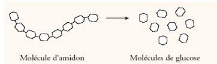

# Activité : La digestion chimique des aliments

!!! note Compétences

    Interpréter 

!!! warning Consignes

    À partir des informations du document 1, formuler une hypothèse pour savoir quelle substance présente dans les sucs digestifs peut digérer les aliments. Puis réaliser une expérience pour vérifier la validité de l'hypothèse.
    
??? bug Critères de réussite
    - avoir fait l'analyse d'expérience
        - hypothèse
        - protocole
        - résultats attendus
        - résultats observés
        - conclusion

**Document 1 Composition des sucs digestifs**

| Glandes digestives |   Suc digestif   |                        Composition du suc                        |
|:------------------:|:----------------:|:----------------------------------------------------------------:|
| Glandes salivaires |      Salive      | Eau (98%) + Ions + Enzymes + Produits antibactériens + Protéines |
|       Estomac      |   Suc gastrique  |                  Eau + Enzymes + Acide chlorhydrique             |
|      Pancréas      | Suc pancréatique |                       Eau + Ions + Enzymes                       |
|      Intestin      |  Suc intestinal  |                       Eau + mucus + Enzymes                      |

**Document 2 Composition des pâtes**

Les pâtes sont composées d’amidon. Il est considéré comme un sucre complexe, car il est composé d’une série de glucoses reliés les uns aux autres. 

Lors de la digestion, l’amidon est découpé en glucose.

**Document 3 Matériels à disposition**

- Des pâtes
- Des bandelettes (changer de couleur quand du glucose (= nutriment) est détecté)
- Deux tubes en verre
- De l’amylase (enzyme présente dans la salive)
- Un bain-marie à 37 °C
- De l’eau.
