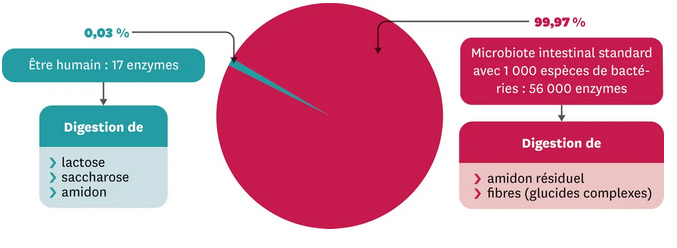

# Le microbiote intestinal

!!! note "Compétences"

    Interpréter 

!!! note "Consigne"

	1. À partir des documents 1,2 et 3, explique le rôle du microbiote dans notre corps. Et explique si c'est un allié pour l'organisme qui l'héberge.
	2. A partir du document 4, montre que le microbiote peut causer des problèmes de santé

!!! bug "Critères de réussite"
  
	- je peux identifier plusieurs rôles du microbiote dans la fonction digestive.
	- je peux argumenter les rôles du microbiote à partir de faits expérimentaux.
	- je peux identifier la (les) preuve(s) de différences d'un microbiote à un autre.

	
**Document 1 Les micro-organismes présents dans le tube digestif**

Les micro-organismes sont présents dans la majorité des organes de notre tube digestif. La masse de ces microbes est d'environ 2 kg. 
Les intestins comportent 10 fois plus de microbes que notre corps a de cellules. Il y a plus de 1000 milliards de microbes dans les intestins.

On nomme ces micro-organismes vivants dans les intestins le microbiote intestinal.

**Document 2 Rôle du microbiote intestinal**

Nos propres enzymes ne permettent pas la digestion de la totalité des protides et glucides que nous ingérons. 

Les bactéries transforment une grande partie de la nourriture que nous ingérons, protides, glucides, lipides.
Cela leur permet d'obtenir de l'énergie pour leur croissance et cela libère des nutriments dans notre intestin.

 

**Document 3 Expériences sur le microbiote**

**Document 4 Les observations chez des animaux d'élevage qui n'ont pas de microbiote**
Extrait du livre "Le charme discret de l'intestin" (Giulia Enders, éditions Acte Sud, avril 2015)

"Ces souris stériles [ici, cela veut dire sans microbiote] sont un peu bizarres (...). Par rapport à leurs congénères "habitées", elles mangent plus [environ 30% de plus] et mettent plus de temps à digérer. Elles ont des appendices énormes, des intestins rabougris, sans villosités (...). En leur injectant un cocktail de bactéries provenant d'autres souris, on peut observer des effets étonnants. Quand on leur administre des bactéries de sujets diabétiques (de type 2), les souris de laboratoire développent rapidement les premiers problèmes de métabolisation des sucres. Quand on leur administre les bactéries intestinales de sujets en surpoids, leur tendance à l'embonpoint augmente aussi".

