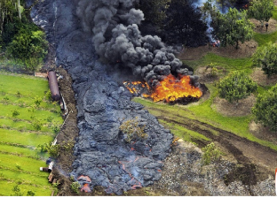
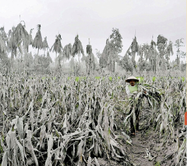
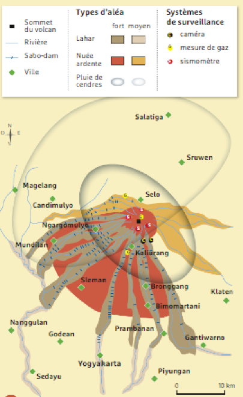
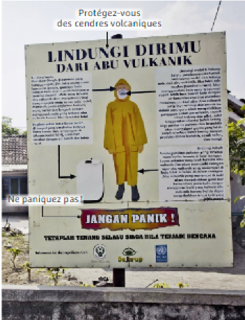

# Activité : Le risque volcanique

!!! note "Compétences"

    Construire un tableau 

!!! warning "Consignes"

    1. Comparer les enjeux et les aléas pour le Kilauea et le Merapi. En déduire la différence de niveau de risque entre  les deux volcans. (doc 1 et 2)
    2. Expliquer ce qui peut pousser les humains à habiter près des volcans. (doc 2)
    3. Lister les mesures de prévention, de protection et d'atténuation qui ont été mises en place dans la région du Merapi. (doc 3 à 5) 
    
??? bug "Critères de réussite"
    - 

**Document 1 Coulée de lave du Kilauea (Hawaï) en 1983**

 

 
    
- **Historique** : 70 éruptions depuis 1650, dont une seule meutrière en 1790 (100 personnes tuées).
- **Fréquence d'éruptions** : une éruption tous les 2-3 ans environ depuis 1900 et en éruption continue depuis 1983.

<table><thead>
  <tr>
    <th colspan="2">Population aux alentour du volcan</th>
  </tr></thead>
<tbody>
  <tr>
    <td>à 5 km</td>
    <td>3122 habitants</td>
  </tr>
  <tr>
    <td>à 10 km</td>
    <td>3122 habitants</td>
  </tr>
  <tr>
    <td>à 30 km</td>
    <td>8495 habitants</td>
  </tr>
  <tr>
    <td>à 100 km</td>
    <td>169550 habitants</td>
  </tr>
</tbody>
</table>

 

**Document 2 Récolte de maïs détruite lors de la dernière éruption du Merapi (Indonésie)**

 

- **Historique** : 64 éruptions depuis 1672, dont 16 meutrières.
- **Fréquence d'éruptions** : une éruption tous les 4 ans environ.
- **Dernière éruption meutrière** : octobre-novembre 2010 (322 morts, 500 millions d'euros de dégâts).
Les cultures sont nombreuses aux abords du Merapi: les terres y sont peu chères à cause du danger, et fertiles, grâce aux cendres volcaniques qui s'y déposent

<table><thead>
  <tr>
    <th colspan="2">Population aux alentour du volcan</th>
  </tr></thead>
<tbody>
  <tr>
    <td>à 5 km</td>
    <td>49205 habitants</td>
  </tr>
  <tr>
    <td>à 10 km</td>
    <td>185849 habitants</td>
  </tr>
  <tr>
    <td>à 30 km</td>
    <td>4348473 habitants</td>
  </tr>
  <tr>
    <td>à 100 km</td>
    <td>24728414 habitants</td>
  </tr>
</tbody>
</table>

 

 

**Document 3 Carte des aléas volcaniques et des systèmes de surveillances et de protection autour du Merapi**

Les sabodams sont des barrages qui permettent d'atténuer l'effet d'éventuelles coulées de boues (lahars)
Les systèmes de surveillance permettent de prévoir les éruptions quelques jours avant leur déclenchement.

{: style="weight: 350px;"}

 

**Document 5 Conseils aux habitants de Yogyakarta en cas d'éruption**

{: style="weight: 350px;"}

**Document 4 La gestion du risque au Merapi**

| Avant la crise : prévention | Pendant la crise : adaptation | Après la crise |
|--|--|--|
| Surveillance du volcan | Organisation des déplacements | Réparation / entretien des infrastructures|
| Mise au point de plans d'évacuation | Organisation des camps de déplacés | |
| Éducation aux risques | | |

