# Activité : Collecter, trier et analyser des données

!!! note Compétences

    Argumenter 

!!! warning Consignes

    1. Hachurer la zone qui pourra accueillir le meuble sur le plan du document 2.
    2. Quelle est la fonction principale du meuble ? 
    3. Quel matériau ne conviendrait pas pour le meuble de la salle de bain ?
    4. Choisir un meuble. Argumenter votre choix en donnant au moins 5 arguments.

    
??? bug Critères de réussite
    - 

**Document 1 Besoin d'un nouvel objet**

On souhaite installer dans une salle de bain, un meuble pour machine à laver permettant d’avoir de l’espace de rangement supplémentaire. Dans notre recherche, nous nous sommes imposés des contraintes. L’OST doit s’installer aisément, résister à l’humidité de la salle de bain, avec des matériaux renouvelables et durables et dont le prix reste abordable.

**Document 2 Plan de la salle de bain (en cm).**

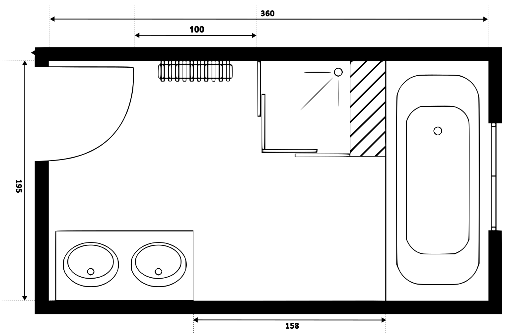

**Document 3 Extrait du site LeroyMerlin.fr.**

<table markdown >
<tbody markdown >
<tr markdown >
<th>Photo</th>
<td markdown >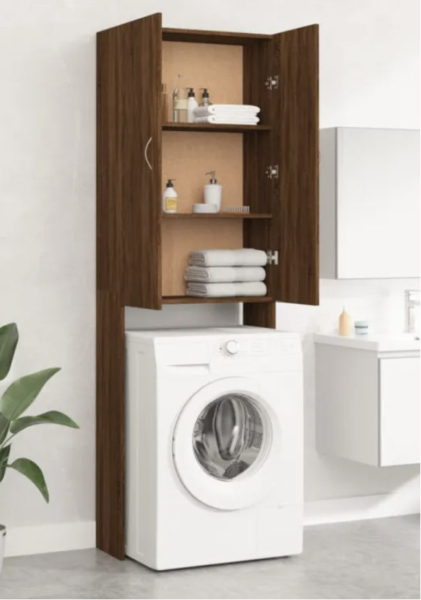{:style="max-width:300px; max-height:150px; "}</td>
<td markdown >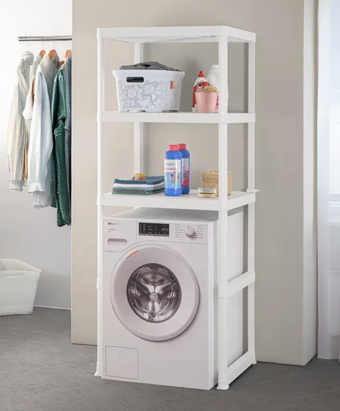{:style="max-width:300px; max-height:150px; "}</td>
<td markdown >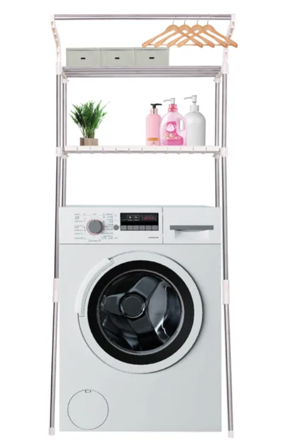{:style="max-width:300px; max-height:150px; "}</td>
<td markdown >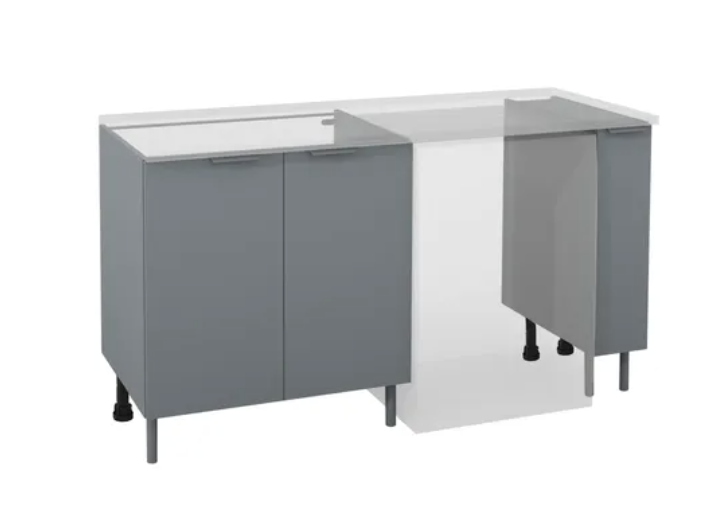{:style="max-width:300px; max-height:150px; "}</td>
<td markdown >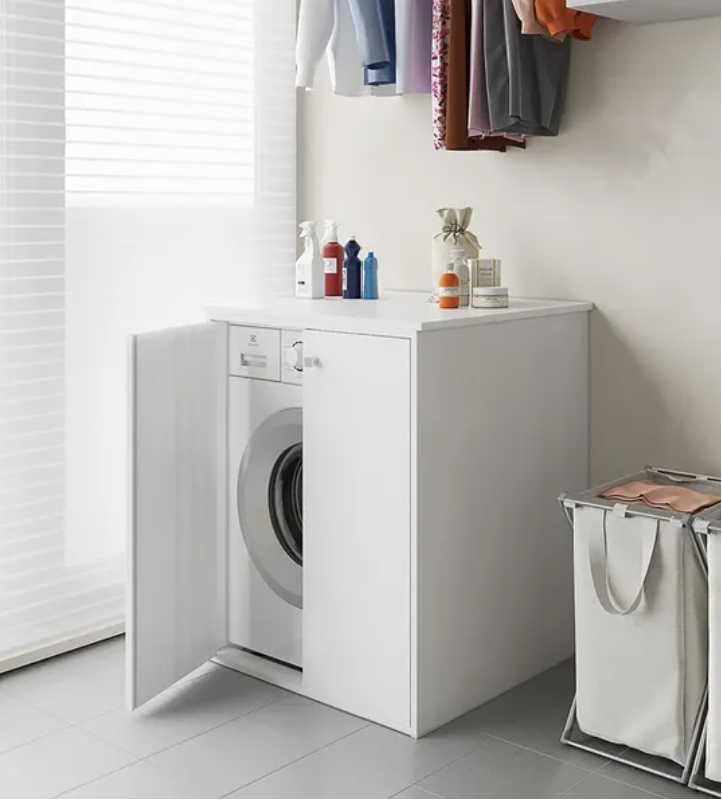{:style="max-width:300px; max-height:150px; "}</td>
</tr>

<tr>
<th>Matière</th>
<td>Bois</td>
<td>Acier</td>
<td>Aluminium</td>
<td>PVC</td>
<td>PVC</td>
</tr>

<tr>
<th>Largeur</th>
<td>71</td>
<td>71</td>
<td>66</td>
<td>162</td>
<td>71</td>
</tr>

<tr>
<th>Profondeur</th>

<td>72</td>
<td>72</td>
<td>71,5</td>
<td>72</td>
<td>71</td>
</tr>

<tr>
<th>Prix</th>
<td>70</td>
<td>132,50</td>
<td>45,99</td>
<td>180</td>
<td>99</td>
</tr>
</tbody>
</table>

**Document 4 Quelques caractéristiques de matériaux**

<table  markdown  style="border-collapse:collapse;border-spacing:0;table-layout: fixed; width: 100%" class="tg"><colgroup><col style="width: 20%"><col style="width: 20%"><col style="width: 20%"><col style="width: 20%"><col style="width: 20%"></colgroup>
<thead>
<tr><th style="border-color:inherit;border-style:solid;border-width:1px;overflow:hidden;padding:10px 5px;text-align:left;vertical-align:top;word-break:normal">  &nbsp;&nbsp;				 			</th><th style="border-color:inherit;border-style:solid;border-width:1px;font-weight:normal;overflow:hidden;padding:10px 5px;text-align:left;vertical-align:top;word-break:normal"> PVC 			</th><th style="border-color:inherit;border-style:solid;border-width:1px;font-weight:normal;overflow:hidden;padding:10px 5px;text-align:left;vertical-align:top;word-break:normal"> Aluminium 			</th>
<th style="border-color:inherit;border-style:solid;border-width:1px;font-weight:normal;overflow:hidden;padding:10px 5px;text-align:left;vertical-align:top;word-break:normal"> Bois 			</th><th style="border-color:inherit;border-style:solid;border-width:1px;font-weight:normal;overflow:hidden;padding:10px 5px;text-align:left;vertical-align:top;word-break:normal"> Acier 			</th></tr>
</thead>
<tbody  markdown >
<tr  markdown ><td style="background-color:#A9D18E;border-color:inherit;border-style:solid;border-width:1px;overflow:hidden;padding:10px 5px;text-align:left;vertical-align:top;word-break:normal"> 			   			 		point fort</td>
<td markdown style="border-color:inherit;border-style:solid;border-width:1px;overflow:hidden;padding:10px 5px;text-align:left;vertical-align:top;word-break:normal" rowspan="3"> </td>
<td  markdown  style="border-color:inherit;border-style:solid;border-width:1px;overflow:hidden;padding:10px 5px;text-align:left;vertical-align:top;word-break:normal" rowspan="3"> 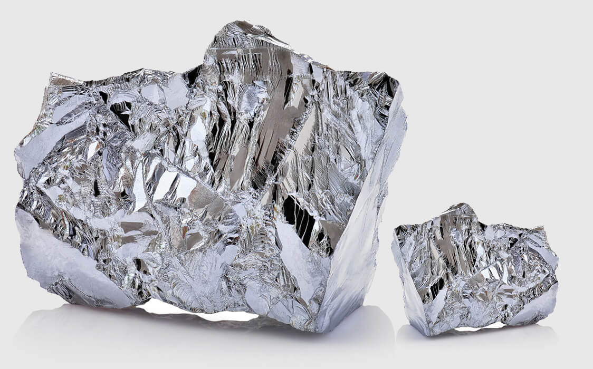</td>
<td markdown  style="border-color:inherit;border-style:solid;border-width:1px;overflow:hidden;padding:10px 5px;text-align:left;vertical-align:top;word-break:normal" rowspan="3"> 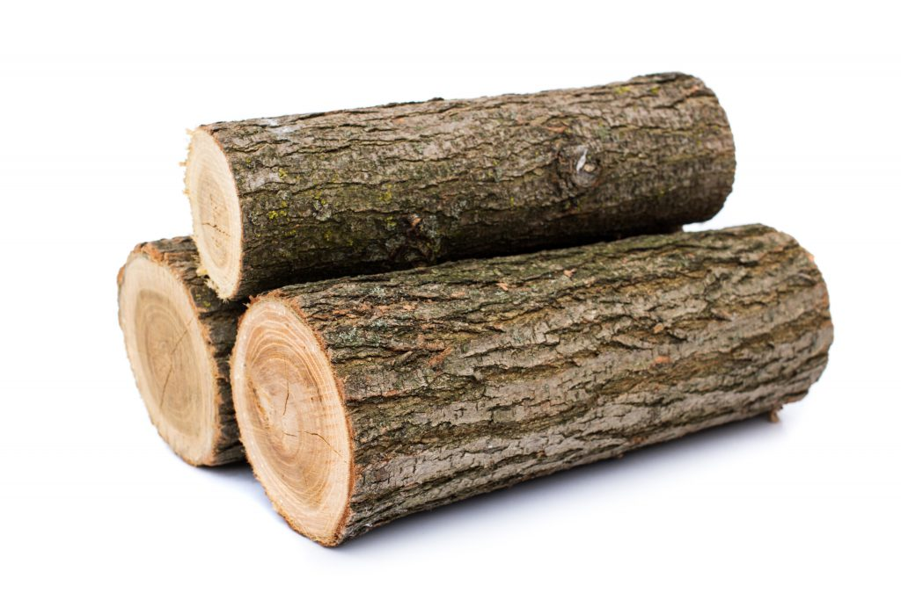</td>
<td markdown  style="border-color:inherit;border-style:solid;border-width:1px;overflow:hidden;padding:10px 5px;text-align:left;vertical-align:top;word-break:normal" rowspan="3"> 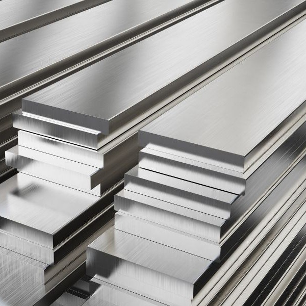</td>
</tr>
<tr><td style="background-color:#FFE699;border-color:inherit;border-style:solid;border-width:1px;overflow:hidden;padding:10px 5px;text-align:left;vertical-align:top;word-break:normal"> 			   			 		intermédiaire</td></tr><tr><td style="background-color:#F4B183;border-color:inherit;border-style:solid;border-width:1px;overflow:hidden;padding:10px 5px;text-align:left;vertical-align:top;word-break:normal"> 			   			 		point 			faible</td></tr>
<tr><td style="border-color:inherit;border-style:solid;border-width:1px;overflow:hidden;padding:10px 5px;text-align:left;vertical-align:top;word-break:normal"> Prix 			</td><td style="background-color:#C5E0B4;border-color:inherit;border-style:solid;border-width:1px;overflow:hidden;padding:10px 5px;text-align:left;vertical-align:top;word-break:normal"> + 			</td><td style="background-color:#C5E0B4;border-color:inherit;border-style:solid;border-width:1px;overflow:hidden;padding:10px 5px;text-align:left;vertical-align:top;word-break:normal"> +++ 			</td>
<td style="background-color:#C5E0B4;border-color:inherit;border-style:solid;border-width:1px;overflow:hidden;padding:10px 5px;text-align:left;vertical-align:top;word-break:normal"> ++ 			</td><td style="background-color:#F8CBAD;border-color:inherit;border-style:solid;border-width:1px;overflow:hidden;padding:10px 5px;text-align:left;vertical-align:top;word-break:normal"> ++++ 			</td></tr>
<tr><td style="border-color:inherit;border-style:solid;border-width:1px;overflow:hidden;padding:10px 5px;text-align:left;vertical-align:top;word-break:normal"> Densité 			</td><td style="background-color:#C5E0B4;border-color:inherit;border-style:solid;border-width:1px;overflow:hidden;padding:10px 5px;text-align:left;vertical-align:top;word-break:normal"> + 			</td><td style="background-color:#FFE699;border-color:inherit;border-style:solid;border-width:1px;overflow:hidden;padding:10px 5px;text-align:left;vertical-align:top;word-break:normal"> +++ 			</td>
<td style="background-color:#C5E0B4;border-color:inherit;border-style:solid;border-width:1px;overflow:hidden;padding:10px 5px;text-align:left;vertical-align:top;word-break:normal"> ++ 			</td><td style="background-color:#F8CBAD;border-color:inherit;border-style:solid;border-width:1px;overflow:hidden;padding:10px 5px;text-align:left;vertical-align:top;word-break:normal"> ++++++++ 			</td></tr>
<tr><td style="border-color:inherit;border-style:solid;border-width:1px;overflow:hidden;padding:10px 5px;text-align:left;vertical-align:top;word-break:normal"> Résistance à l’humidité 			</td><td style="background-color:#C5E0B4;border-color:inherit;border-style:solid;border-width:1px;overflow:hidden;padding:10px 5px;text-align:left;vertical-align:top;word-break:normal"> Ne s’ oxyde pas 			</td><td style="background-color:#C5E0B4;border-color:inherit;border-style:solid;border-width:1px;overflow:hidden;padding:10px 5px;text-align:left;vertical-align:top;word-break:normal"> Son oxydation le protège de l’humidité 			</td>
<td style="background-color:#FFE699;border-color:inherit;border-style:solid;border-width:1px;overflow:hidden;padding:10px 5px;text-align:left;vertical-align:top;word-break:normal"> Peut se déformer ou se fissurer 			</td><td style="background-color:#C5E0B4;border-color:inherit;border-style:solid;border-width:1px;overflow:hidden;padding:10px 5px;text-align:left;vertical-align:top;word-break:normal"> Inoxydable 			</td></tr>
<tr><td style="border-color:inherit;border-style:solid;border-width:1px;overflow:hidden;padding:10px 5px;text-align:left;vertical-align:top;word-break:normal"> Matière première/ production 			</td><td style="background-color:#F8CBAD;border-color:inherit;border-style:solid;border-width:1px;overflow:hidden;padding:10px 5px;text-align:left;vertical-align:top;word-break:normal"> Dérivé du pétrole 			</td><td style="background-color:#F8CBAD;border-color:inherit;border-style:solid;border-width:1px;overflow:hidden;padding:10px 5px;text-align:left;vertical-align:top;word-break:normal"> Demande beaucoup d’énergie 			</td>
<td style="background-color:#C5E0B4;border-color:inherit;border-style:solid;border-width:1px;overflow:hidden;padding:10px 5px;text-align:left;vertical-align:top;word-break:normal"> Bois issu de forêt gérées durablement 			</td><td style="background-color:#F8CBAD;border-color:inherit;border-style:solid;border-width:1px;overflow:hidden;padding:10px 5px;text-align:left;vertical-align:top;word-break:normal"> Demande beaucoup d’énergie à produire 			</td></tr>
<tr><td style="border-color:inherit;border-style:solid;border-width:1px;overflow:hidden;padding:10px 5px;text-align:left;vertical-align:top;word-break:normal"> Recyclage 			</td><td style="background-color:#F8CBAD;border-color:inherit;border-style:solid;border-width:1px;overflow:hidden;padding:10px 5px;text-align:left;vertical-align:top;word-break:normal"> Difficile 			</td><td style="background-color:#C5E0B4;border-color:inherit;border-style:solid;border-width:1px;overflow:hidden;padding:10px 5px;text-align:left;vertical-align:top;word-break:normal"> Oui 			</td>
<td style="background-color:#C5E0B4;border-color:inherit;border-style:solid;border-width:1px;overflow:hidden;padding:10px 5px;text-align:left;vertical-align:top;word-break:normal"> Oui 			</td><td style="background-color:#C5E0B4;border-color:inherit;border-style:solid;border-width:1px;overflow:hidden;padding:10px 5px;text-align:left;vertical-align:top;word-break:normal"> Recyclable à l’infini 			</td></tr>
</tbody></table>

**Document 5 Impact environnemental des matériaux**

Si les forêts dont le bois est issu sont locales et si les arbres sont remplacés par d’autres, alors l’impact de son extraction est limité. 
**40 kg CO2 eq par tonne de bois utilisé.**

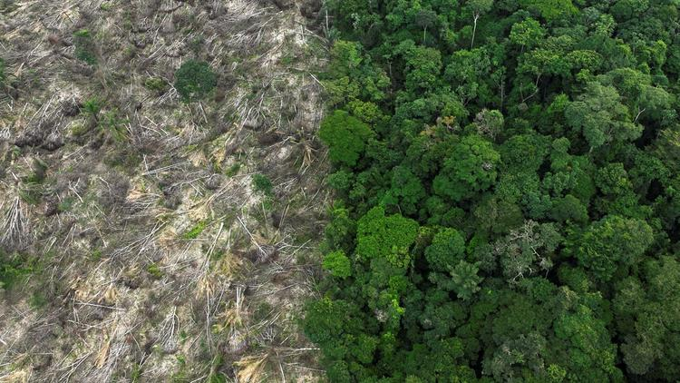{:style="max-width:300px; max-height:150px; "}

L’acier est un alliage de fer et de carbone, il nécessite beaucoup d’énergie à produire. 
**2,2 tonnes de C02 eq par tonne d’acier produit**

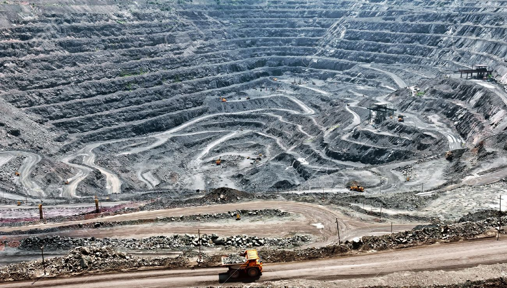{:style="max-width:300px; max-height:150px; "}

Le PVC comme beaucoup de plastique sont issus du pétrole. 
**2 tonnes de CO2 eq par tonne de PVC produit**

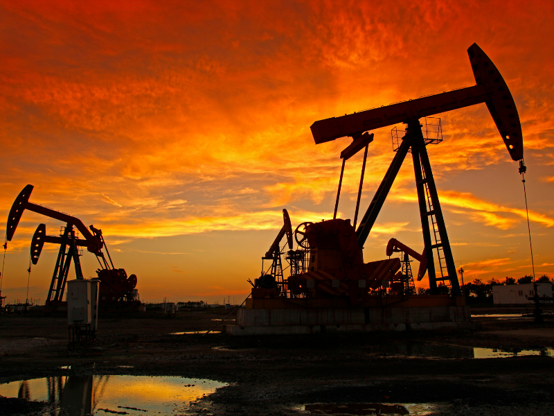{:style="max-width:300px; max-height:150px; "}

L’aluminium est produit à partir d’une roche, la bauxite. Il faut 4 à 5 tonnes de bauxite pour obtenir une tonne d’aluminium. 
**8 tonnes de CO2 eq par tonne d’aluminium produit**

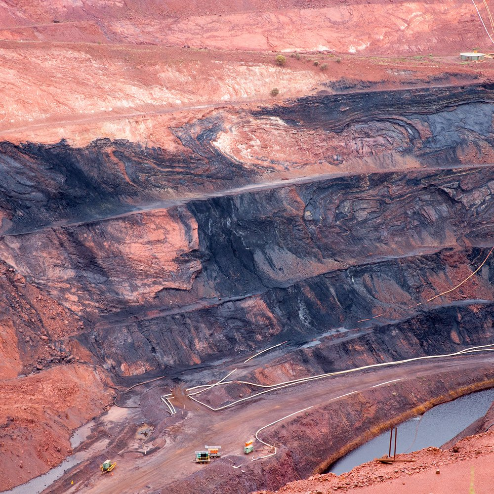{:style="max-width:300px; max-height:150px; "}

