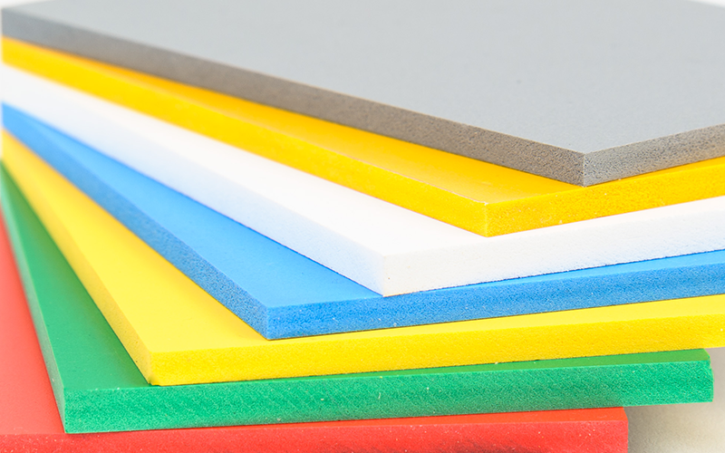

# Activité : Collecter, trier et analyser des données

!!! note "Compétences"

    Argumenter 

!!! warning "Consignes"

    1. Hachurer la zone qui pourra accueillir le meuble sur le plan du Doc. 1.
    2. Quelles est la fonction principale du meuble ? 
    3. Quel matériau ne conviendrait pas pour le meuble de la salle de bain ?
    4. Choisir un meuble. Argumenter votre choix en donnant au moins 5 arguments.

    
??? bug "Critères de réussite"
    - 

**Document 1 Plan de la salle de bain (en cm).**

**Document 2 Extrait du site LeroyMerlin.fr.**

|  Photo | Matière   |  Largeur   |  Profondeur   |  Prix    | 
|   | Bois   |  71   |  72   |  70    | 
|   | Acier   |  71   |  72   |  132,50    | 
|   | Aluminium   |  66   |  71,5   |  45,99    | 
| | PVC   |  162   |  72   |  180    | 
|   | PVC   |  71   |  71   |  99    | 

**Document 3 Quelques caractéristiques de matériaux**

<table  markdown  style="border-collapse:collapse;border-spacing:0;table-layout: fixed; width: 969px" class="tg"><colgroup><col style="width: 313px"><col style="width: 168px"><col style="width: 132px"><col style="width: 169px"><col style="width: 187px"></colgroup>
<thead>
<tr><th style="border-color:inherit;border-style:solid;border-width:1px;font-family:Arial, sans-serif;font-size:14px;font-weight:normal;overflow:hidden;padding:10px 5px;text-align:left;vertical-align:top;word-break:normal"> 				 &nbsp;&nbsp;				 			</th><th style="border-color:inherit;border-style:solid;border-width:1px;font-family:Arial, sans-serif;font-size:14px;font-weight:normal;overflow:hidden;padding:10px 5px;text-align:left;vertical-align:top;word-break:normal"> 				PVC 			</th><th style="border-color:inherit;border-style:solid;border-width:1px;font-family:Arial, sans-serif;font-size:14px;font-weight:normal;overflow:hidden;padding:10px 5px;text-align:left;vertical-align:top;word-break:normal"> 				Aluminium 			</th>
<th style="border-color:inherit;border-style:solid;border-width:1px;font-family:Arial, sans-serif;font-size:14px;font-weight:normal;overflow:hidden;padding:10px 5px;text-align:left;vertical-align:top;word-break:normal"> 				Bois 			</th><th style="border-color:inherit;border-style:solid;border-width:1px;font-family:Arial, sans-serif;font-size:14px;font-weight:normal;overflow:hidden;padding:10px 5px;text-align:left;vertical-align:top;word-break:normal"> 				Acier 			</th></tr>
</thead>
<tbody  markdown >
<tr  markdown ><td style="background-color:#A9D18E;border-color:inherit;border-style:solid;border-width:1px;font-family:Arial, sans-serif;font-size:14px;overflow:hidden;padding:10px 5px;text-align:left;vertical-align:top;word-break:normal"> 							   							 						point 							fort</td>
<td markdown style="border-color:inherit;border-style:solid;border-width:1px;font-family:Arial, sans-serif;font-size:14px;overflow:hidden;padding:10px 5px;text-align:left;vertical-align:top;word-break:normal" rowspan="3"> </td>
<td  markdown  style="border-color:inherit;border-style:solid;border-width:1px;font-family:Arial, sans-serif;font-size:14px;overflow:hidden;padding:10px 5px;text-align:left;vertical-align:top;word-break:normal" rowspan="3"> </td>
<td markdown  style="border-color:inherit;border-style:solid;border-width:1px;font-family:Arial, sans-serif;font-size:14px;overflow:hidden;padding:10px 5px;text-align:left;vertical-align:top;word-break:normal" rowspan="3"> </td>
<td markdown  style="border-color:inherit;border-style:solid;border-width:1px;font-family:Arial, sans-serif;font-size:14px;overflow:hidden;padding:10px 5px;text-align:left;vertical-align:top;word-break:normal" rowspan="3"> </td>
</tr>
<tr><td style="background-color:#FFE699;border-color:inherit;border-style:solid;border-width:1px;font-family:Arial, sans-serif;font-size:14px;overflow:hidden;padding:10px 5px;text-align:left;vertical-align:top;word-break:normal"> 							   							 						intermédiaire</td></tr><tr><td style="background-color:#F4B183;border-color:inherit;border-style:solid;border-width:1px;font-family:Arial, sans-serif;font-size:14px;overflow:hidden;padding:10px 5px;text-align:left;vertical-align:top;word-break:normal"> 							   							 						point 							faible</td></tr>
<tr><td style="border-color:inherit;border-style:solid;border-width:1px;font-family:Arial, sans-serif;font-size:14px;overflow:hidden;padding:10px 5px;text-align:left;vertical-align:top;word-break:normal"> 				Prix 			</td><td style="background-color:#C5E0B4;border-color:inherit;border-style:solid;border-width:1px;font-family:Arial, sans-serif;font-size:14px;overflow:hidden;padding:10px 5px;text-align:left;vertical-align:top;word-break:normal"> 				+ 			</td><td style="background-color:#C5E0B4;border-color:inherit;border-style:solid;border-width:1px;font-family:Arial, sans-serif;font-size:14px;overflow:hidden;padding:10px 5px;text-align:left;vertical-align:top;word-break:normal"> 				+++ 			</td>
<td style="background-color:#C5E0B4;border-color:inherit;border-style:solid;border-width:1px;font-family:Arial, sans-serif;font-size:14px;overflow:hidden;padding:10px 5px;text-align:left;vertical-align:top;word-break:normal"> 				++ 			</td><td style="background-color:#F8CBAD;border-color:inherit;border-style:solid;border-width:1px;font-family:Arial, sans-serif;font-size:14px;overflow:hidden;padding:10px 5px;text-align:left;vertical-align:top;word-break:normal"> 				++++ 			</td></tr>
<tr><td style="border-color:inherit;border-style:solid;border-width:1px;font-family:Arial, sans-serif;font-size:14px;overflow:hidden;padding:10px 5px;text-align:left;vertical-align:top;word-break:normal"> 				Densité 			</td><td style="background-color:#C5E0B4;border-color:inherit;border-style:solid;border-width:1px;font-family:Arial, sans-serif;font-size:14px;overflow:hidden;padding:10px 5px;text-align:left;vertical-align:top;word-break:normal"> 				+ 			</td><td style="background-color:#FFE699;border-color:inherit;border-style:solid;border-width:1px;font-family:Arial, sans-serif;font-size:14px;overflow:hidden;padding:10px 5px;text-align:left;vertical-align:top;word-break:normal"> 				+++ 			</td>
<td style="background-color:#C5E0B4;border-color:inherit;border-style:solid;border-width:1px;font-family:Arial, sans-serif;font-size:14px;overflow:hidden;padding:10px 5px;text-align:left;vertical-align:top;word-break:normal"> 				++ 			</td><td style="background-color:#F8CBAD;border-color:inherit;border-style:solid;border-width:1px;font-family:Arial, sans-serif;font-size:14px;overflow:hidden;padding:10px 5px;text-align:left;vertical-align:top;word-break:normal"> 				++++++++ 			</td></tr>
<tr><td style="border-color:inherit;border-style:solid;border-width:1px;font-family:Arial, sans-serif;font-size:14px;overflow:hidden;padding:10px 5px;text-align:left;vertical-align:top;word-break:normal"> 				Résistance 				à l’humidité 			</td><td style="background-color:#C5E0B4;border-color:inherit;border-style:solid;border-width:1px;font-family:Arial, sans-serif;font-size:14px;overflow:hidden;padding:10px 5px;text-align:left;vertical-align:top;word-break:normal"> 				Ne 				s’ oxyde pas 			</td><td style="background-color:#C5E0B4;border-color:inherit;border-style:solid;border-width:1px;font-family:Arial, sans-serif;font-size:14px;overflow:hidden;padding:10px 5px;text-align:left;vertical-align:top;word-break:normal"> 				Son 				oxydation le protège de l’humidité 			</td>
<td style="background-color:#FFE699;border-color:inherit;border-style:solid;border-width:1px;font-family:Arial, sans-serif;font-size:14px;overflow:hidden;padding:10px 5px;text-align:left;vertical-align:top;word-break:normal"> 				Peut 				se déformer ou se fissurer 			</td><td style="background-color:#C5E0B4;border-color:inherit;border-style:solid;border-width:1px;font-family:Arial, sans-serif;font-size:14px;overflow:hidden;padding:10px 5px;text-align:left;vertical-align:top;word-break:normal"> 				Inoxydable 			</td></tr>
<tr><td style="border-color:inherit;border-style:solid;border-width:1px;font-family:Arial, sans-serif;font-size:14px;overflow:hidden;padding:10px 5px;text-align:left;vertical-align:top;word-break:normal"> 				Matière 				première/ production 			</td><td style="background-color:#F8CBAD;border-color:inherit;border-style:solid;border-width:1px;font-family:Arial, sans-serif;font-size:14px;overflow:hidden;padding:10px 5px;text-align:left;vertical-align:top;word-break:normal"> 				Dérivé 				du pétrole 			</td><td style="background-color:#F8CBAD;border-color:inherit;border-style:solid;border-width:1px;font-family:Arial, sans-serif;font-size:14px;overflow:hidden;padding:10px 5px;text-align:left;vertical-align:top;word-break:normal"> 				Demande 				beaucoup d’énergie 			</td>
<td style="background-color:#C5E0B4;border-color:inherit;border-style:solid;border-width:1px;font-family:Arial, sans-serif;font-size:14px;overflow:hidden;padding:10px 5px;text-align:left;vertical-align:top;word-break:normal"> 				Bois 				issu de forêt gérées durablement 			</td><td style="background-color:#F8CBAD;border-color:inherit;border-style:solid;border-width:1px;font-family:Arial, sans-serif;font-size:14px;overflow:hidden;padding:10px 5px;text-align:left;vertical-align:top;word-break:normal"> 				Demande 				beaucoup d’énergie à produire 			</td></tr>
<tr><td style="border-color:inherit;border-style:solid;border-width:1px;font-family:Arial, sans-serif;font-size:14px;overflow:hidden;padding:10px 5px;text-align:left;vertical-align:top;word-break:normal"> 				Recyclage 			</td><td style="background-color:#F8CBAD;border-color:inherit;border-style:solid;border-width:1px;font-family:Arial, sans-serif;font-size:14px;overflow:hidden;padding:10px 5px;text-align:left;vertical-align:top;word-break:normal"> 				Difficile 			</td><td style="background-color:#C5E0B4;border-color:inherit;border-style:solid;border-width:1px;font-family:Arial, sans-serif;font-size:14px;overflow:hidden;padding:10px 5px;text-align:left;vertical-align:top;word-break:normal"> 				Oui 			</td>
<td style="background-color:#C5E0B4;border-color:inherit;border-style:solid;border-width:1px;font-family:Arial, sans-serif;font-size:14px;overflow:hidden;padding:10px 5px;text-align:left;vertical-align:top;word-break:normal"> 				Oui 			</td><td style="background-color:#C5E0B4;border-color:inherit;border-style:solid;border-width:1px;font-family:Arial, sans-serif;font-size:14px;overflow:hidden;padding:10px 5px;text-align:left;vertical-align:top;word-break:normal"> 				Recyclable 				à l’infini 			</td></tr>
</tbody></table>
**Document 4 Impact environnemental des matériaux**
