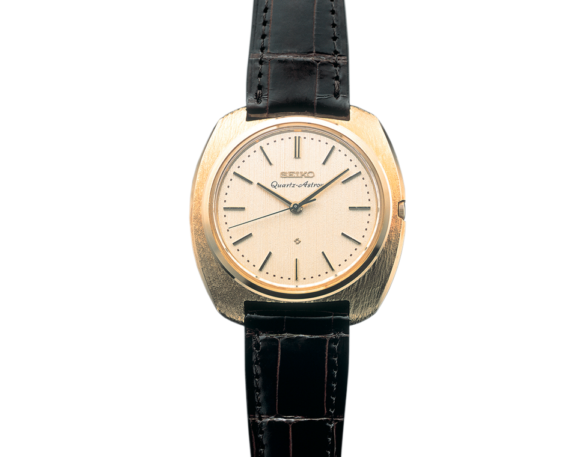
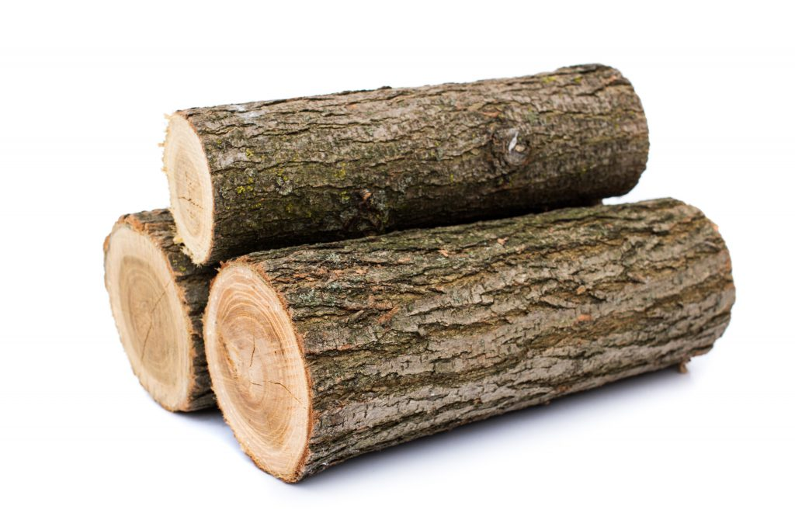

# Activité : Evolution des OST

!!! note "Compétences"

    extraire et mettre en relation
    argumenter 

!!! warning "Consignes"

    1. Identifier le principe technique pour chaque voiture.
    2. Classer en 3 catégories les exemples de voitures proposées (mettre les numéros de chaque photo dans une catégorie) dans un ordre chronologique et un nom à la lignée.
    3. Expliquer en quelques phrases, le principe technique de chaque lignée, à partir des schémas suivants.
    4. Expliquer l’intérêt de passer d’une lignée d’OST à une autre.
    
??? bug "Critères de réussite"
    - 

**Document 1 Différentes voitures**

 

{:style="height:200px; "}

{:style="height:200px; "}

{:style="height:200px; "}

 

{:style="height:200px; "}

{:style="height:200px; "}

{:style="height:200px; "}

 

{:style="height:200px; "}

{:style="height:200px; "}

{:style="height:200px; "}

**Document 2 3 lignées de voitures.**

**Document 3 Principe de fonctionnement des différentes voitures**

 

