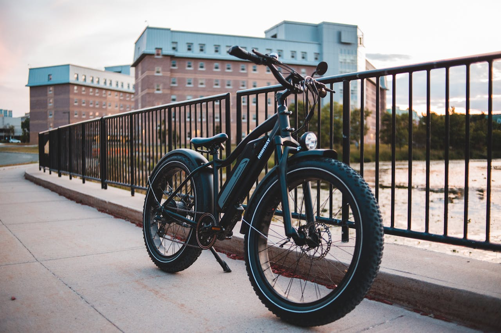
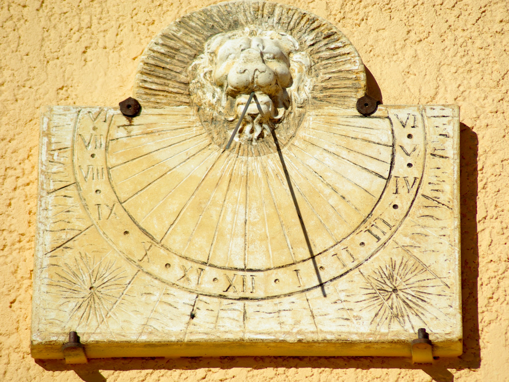
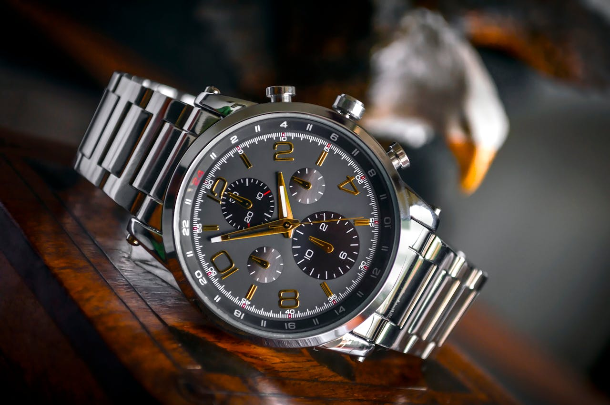
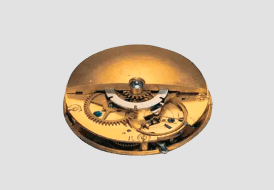

# Activité : Exercice d’application

# Exercice 1 Les fonctions d'un OST

!!! note "Compétences"

    Extraire et utiliser des informations 

!!! warning "Consignes"

    1. Compléter le tableau du document 1, en présentant pour les différents objets la fonction d'usage, les fonctions techniques et les principes techniques associés
    
??? bug "Critères de réussite"
    - 

**Document 1 Tableau récapitulatif**
<table><thead>
  <tr>
    <th>Objet technique</th>
    <th>Fonction d'usage</th>
    <th>Principe technique</th>
    <th>Fonctions techniques</th>
    <th>Solutions techniques</th>
  </tr></thead>
<tbody>
  <tr>
    <td rowspan="3">Vélo à freins à patins</td>
    <td rowspan="3"></td>
    <td rowspan="3"></td>
    <td>avancer</td>
    <td></td>
  </tr>
  <tr>
    <td>tourner</td>
    <td></td>
  </tr>
  <tr>
    <td>freiner</td>
    <td></td>
  </tr>
  <tr>
    <td rowspan="3">Vélo électrique à freins à disques</td>
    <td rowspan="3"></td>
    <td rowspan="3"></td>
    <td>avancer</td>
    <td></td>
  </tr>
  <tr>
    <td>tourner</td>
    <td></td>
  </tr>
  <tr>
    <td>freiner</td>
    <td></td>
  </tr>
  <tr>
    <td>Portemine</td>
    <td></td>
    <td>dépot de graphite sur la feuille</td>
    <td>Avoir une mine fine</td>
    <td></td>
  </tr>
  <tr>
    <td>Crayon à papier</td>
    <td></td>
    <td>dépot de graphite sur la feuille</td>
    <td>Avoir une mine fine</td>
    <td></td>
  </tr>
  <tr>
    <td>cadran solaire</td>
    <td></td>
    <td></td>
    <td></td>
    <td></td>
  </tr>
  <tr>
    <td>montre</td>
    <td></td>
    <td></td>
    <td></td>
    <td></td>
  </tr>
</tbody>
</table>

**Document 2 Différents objets techniques.**

 

{: style="width:300px"}
{: style="width:300px"}

 

{: style="width:300px"}
{: style="width:300px"}

 

{: style="width:300px"}
{: style="width:300px"}

## Exercice 2 Lignée d'objets 

!!! note "Compétences"

    Trouver et utiliser des informations 

!!! warning "Consignes"

    1. A quelle famille appartiennent ces objets ? 
    2. Placer tous les objets sur la frise chronologique.
    3. Indiquer avec deux couleurs différentes les deux lignées sur la frise chronologique et indiquer la rupture technologique.
    4. Sur quel principe de fonctionnement fonctionne la première lignée ?

??? note-prof
    5. Expliquer en quoi les ampoules à incandescence peuvent être qualifiées d’invention. 
    6. Expliquer en quoi les ampoules LED sont une innovation qui répond à un besoin de développement durable.
    7. Expliquer en quoi les ampoules LED ont tout de même un impact écologique  et comment le limiter

    
??? bug "Critères de réussite"
    - 

**Document 1 Chandelle.**

La chandelle de graisse animale ou suif éclaire les campagnes tandis que la bougie faite de cire d’abeille est plus coûteuse. Les premières traces de chandelles ont 5000 ans.

**Document 2 Lampe à pétrole.**

À partir de 1853, la lampe à pétrole est constituée d’un réservoir de pétrole qui monte vers le bec grâce à une mèche.

**Document 3 lampe fluocompacte**

Par son tube miniaturisé et replié sur lui-même, dès 1970, cette lampe appelée aussi fluocompacte apparaît bien plus écologique et économique que ses concurrentes. Ce type d’ampoule consomme 15W pour un éclairement de 750 lumens et a une durée de vie de 10 ans.

**Document 4 Lampes à graisse**

Les lampes à graisses utilisent toutes sortes de graisses d'abord animales, puis des huiles végétales, plus fines et plus liquides, mais également plus rares. Les premières traces de lampes à graisse ont 27 000 ans environ.
Les lampes à huile sont utilisées de l’Antiquité au Moyen Âge. 

**Document 5 Ampoule à incandescence**

En 1879, Edison invente la lampe à incandescence à filament de carbone chauffé dans du vide : l’ampoule électrique. Ce type d’ampoule consomme 60W pour un éclairement de 750 lumens et a une durée de vie de 6 mois.

**Document 6 Lampes à DEL**

Les lampes à diodes électroluminescentes (DEL) équipent plus souvent les nouvelles habitations du fait de leur consommation réduite et de leur durée de vie plus longue. Ce type d’ampoule consomme 2W pour un éclairement de 750 lumens et a une durée de vie de 20 ans.

**Document 7 frise chronologique**

## Exercice 3 : Fonction principale

!!! note "Compétences"

    Trouver et utiliser des informations 

!!! warning "Consignes"

    1. Compléter le tableau suivant.  

   
??? bug "Critères de réussite"
    - 

| Nom de l’objet  | Fonction principale (ou besoin)  |
| Une lampe de poche  |   |
|  |  Se protéger de la pluie |
| Un réfrigérateur |  |
| Un vélo  |    |
|  |  Afficher l’heure |

## Exercice 4 : Familles d’objet 

!!! note "Compétences"

    Trouver et utiliser des informations 

!!! warning "Consignes"

    1. Donner 4 objets appartenant aux familles suivantes :  
    • Objets répondant au besoin : conserver des aliments.
    • Objets répondant au besoin : se protéger du Soleil.  
    • Objets répondant au besoin : écrire. 

## Exercice 5 : Lignées d’objets

!!! note "Compétences"

    Trouver et utiliser des informations 

!!! warning "Consignes"
    1. Identifier la fonction principale de la famille d’objet.
    2. Classer ces objets en deux lignées d’objets.
    3. Recherche ce qui différencie ces deux lignées d’objets.
    4. Représenter, par une frise chronologique, l’évolution de ces lignées d’objets.
   
<tabl markdown>
<tbod markdown>
<tr>
<td>La première montre mécanique est apparue vers 1530 en Suisse.</td>
<td>En 1777, l’horloger suisse Abraham Louis Perrelet invente la montre à remontage mécanique.</td>
<td>Le groupe japonais Seiko dévoile sa première montre électronique « Astron-35SQ », le 25 décembre 1969 après 10 ans de recherche et développement.</td>
<td>En 1990, la Seiko Receptor est la première montre connectée à recevoir des textos (SMS).</td>
</tr>
<tr markdown>
<td markdown>{: style="width:300px"}</td>
<td markdown>{: style="width:300px"}</td>
<td markdown>{: style="width:300px"}</td>
<td markdown>{: style="width:300px"}</td>
</tr>
</tbod>
</tabl>

    
