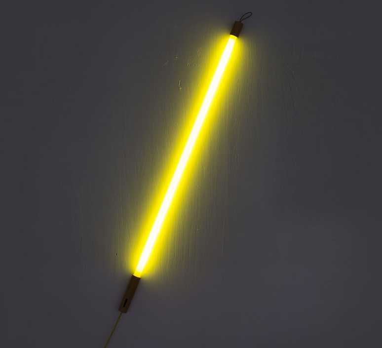

# Activité : Les familles d’objets

!!! note Compétences

    Trouver et utiliser des informations 

!!! warning Consignes

    1. Indiquer pour chaque objet la fonction principale à laquelle il répond.
    2. Classer les OST en trois familles.
    3. Proposer 2 OST qui appartiendraient aux familles d'OST identifiées précédemment.
    
??? bug Critères de réussite
    - Avoir compris ce qu'est une famille
    - Avoir classer correctement les objets

**Document 1 Définitions**

- Fonction principale: Fonction de l'objet, on l'exprime généralement par un verbe à l'infinitif. On parle parfois de fonction d'usage.
- Une famille d’objets regroupe les objets techniques qui remplissent la même fonction principale (on parle parfois de fonction d’usage).

**Document 2 Exemples d'objets techniques**

 

{:style="width:300px; "}

{:style="width:300px; "}	

 {:style="width:300px; "}

 

{:style="width:300px; "}	 
{:style="width:300px; "}		
{:style="width:300px; "}		

 
{:style="width:300px; "}	

{:style="width:300px; "}	

{:style="width:300px; "}	

 

{:style="width:300px; "}	
{:style="width:300px;  "}	
{:style="width:300px; "}		

