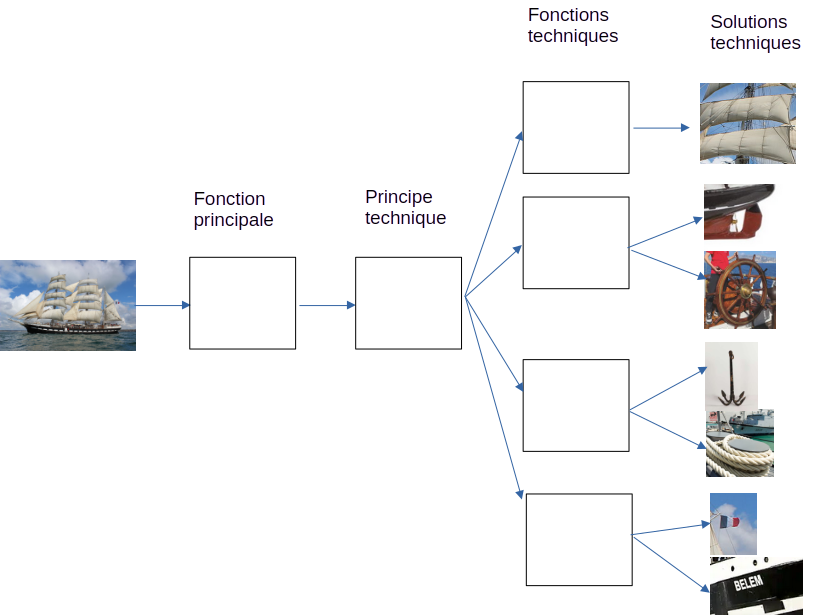

# Activité : Les fonctions d'un OST

!!! note "Compétences"

    Extraire et utiliser des informations 

!!! warning "Consignes"

    1. Compléter le document 3, en présentant, pour le Belem,  les différentes fonctions assurées.
    
??? bug "Critères de réussite"
    - 

**Document 1 Le Belem**

 

Le Belem (1896) est le dernier trois-mâts barque français à coque en acier, un des plus anciens trois-mâts en Europe en état de naviguer et le plus grand voilier français. Il a porté ce nom jusqu’en 1921, a changé de nom et s’appelle de nouveau Belem depuis 1979. Le Belem fait l’objet d’un classement au titre des monuments historiques depuis le 27 février 1984. 

**Document 2 Définitions.**

- Fonction principale: Fonction de l'objet, on l'exprime généralement par un verbe à l'infinitif. On parle parfois de fonction d'usage.
- Principe technique : Principe général expliquant le fonctionnement d'un objet, il repose sur des connaissances scientifiques et technologiques.
- Fonction technique : rôle d'un ou plusieurs composants de l'objet permettant d'assurer la fonction d'usage, on l'exprime habituellement par un verbe à l'infinitif.
- Solution technique : Composants de l'objet permettant d'assurer une fonction technique.

**Document 3 Description des fonctions du Belem**

