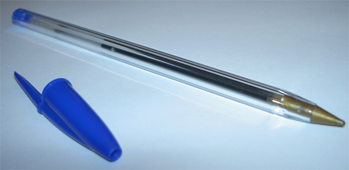
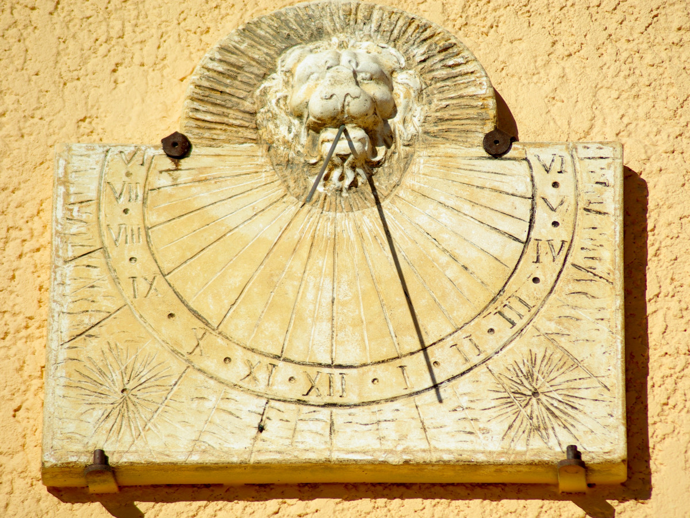
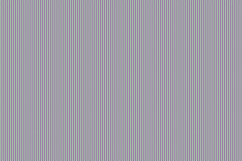

# Activité : Les fonctions d'un OST

!!! note "Compétences"

    Extraire et utiliser des informations 

!!! warning "Consignes"

    1. Compléter le tableau du document 2, en présentant pour les différents objets la fonction d'usage, 2 fonctions techniques et les principes techniques associés
    
??? bug "Critères de réussite"
    - 

**Document 1 Définitions.**

Fonction d'usage : Fonction principale de l'objet
Fonction technique : 
Principe technique : Principe général qui régit le fonctionnement d'un objet, il repose sur des lois, règles et connaissances scientifiques et technologique

**Document 2 Tableau récapitulatif**

| objet technique | Fonction d'usage | fonctions techniques | Principes techniques | Solution technique |
|---------------------|-----------------------|-------------------------------|------------------------------|-
| 
|

**Document 3 Différents objets techniques.**

 

{: style="width:300px"}
{: style="width:300px"}

 

{: style="width:300px"}
{: style="width:300px"}

 

{: style="width:300px"}
{: style="width:300px"}

