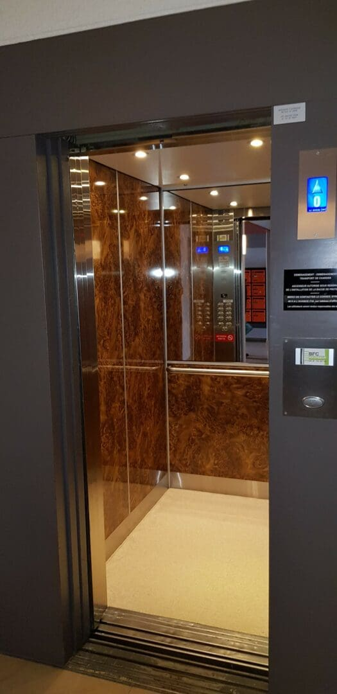
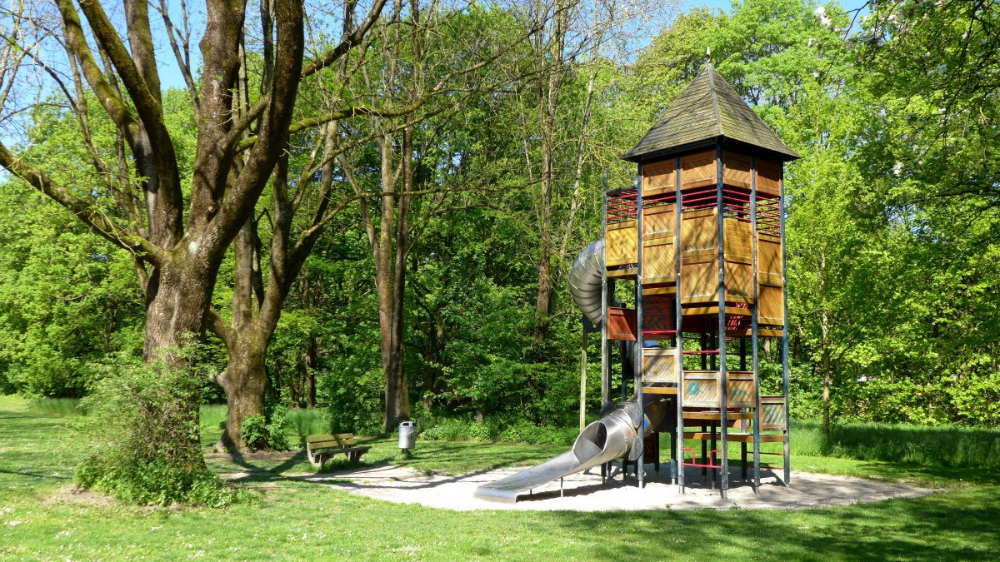

# Séquence : L’OST dans son environnement

!!! note-prof
    si besoin d’infos

Pour choisir ou construire un OST.
Il faut bien définir les besoins et les contraintes d’utilisation.

Pour construire un objet ou système technologique de nombreux points de vigilance sont à prendre en compte
- Interacteurs
- Contraintes

!!! question "Problématique"

    Comment évaluer les contraintes à prendre en compte lors de la réalistaion d'un OST ?

 peut être pluttot prendre une montre connectée poiur nager

## Séance 1 : Les interacteurs extérieurs et les contraintes

!!! question "Problématique"

    Quels sont les impacts des éléments extérieurs qui interagissent avec notre OST ?

[Activité les interacteurs extérieurs](../systInformation)

Connaissances : Faire la liste des interacteurs extérieurs d’un OST (interacteurs extérieurs : élément de l'environnement qui ont un impact sur la conception)

??? abstract "Bilan"

    <a markdown id="bilan1">

    Lorsque l'on imagine un nouvel objet technique, il faut prendre en compte les éléments de son environnement avec lequel il est en interaction:

    - les usagers: ce sont les personnes qui utilisent l'objet ou le système.

    - les objets avec lesquels il sera en contact : : ce sont les autres objets techniques avec lesquels l'objet ou le système est en contact.

    - les autres éléments de son environnement: ce sont les éléments naturels ou artificiels qui entourent l'objet ou le système.

    - les données : ce sont les informations que l'objet ou le système utilise pour fonctionner. Elles peuvent être stockées dans l'objet lui-même ou provenir de l'extérieur.

    Ces éléments s'appellent des interacteurs extérieurs.

    Pour expliquer les interactions entre un OST et son environnement, il faut être capable :
    
    - d’identifier les différents types d'interacteurs extérieurs.
    - de décrire les interactions entre l'OST et chaque type d'interacteur.
    - d’analyser l'influence des interactions sur le fonctionnement de l'OST.

    Ils créent des contraintes qui sont à respecter au moment de la conception de l'objet technique.

    </a>

## Séance 2 : Concevoir un objet répondant aux différentes contraintes

!!! question "Problématique"

    Quels sont les éléments extérieurs qui interagissent avec notre OST ?

[Activité les interacteurs extérieurs](../systInformation)

Connaissances : Repérer et expliquer les choix de conception dans les domaines de l’ergonomie et de la sécurité ou en lien avec des objectifs de développement durable

??? abstract "Bilan"

    <a markdown id="bilan2">

    D'autres contraintes sont à prendre en compte  pour concevior un objet technique.

    L'ergonomie d'un objet est liée à ce que le rend pratique et agréable à l'utiliser (ses formes, son fonctionnement...)

    Les contraintes liées à la sécurité protégent les utilisateurs et les autres personnes.

    Des règles appelées normes fixent des obligations à respecter en matière de sécurité et de respects de l'environnement. 

    La contraitne esthétique consiste à plaire aux utilisateurs.

    Le cahier des charges est un document qui liste les fonctions et les contraintes à prendre en cmpte au moment de la conception d'un objet technique.

    </a>

Cahier des charges plan de salles de classe

Séance n°8 : Repérer et expliquer les choix de conception dans les domaines de l’ergonomie et de la sécurité ou en lien avec des objectifs de développement durable (1H)
Ressources : MAGNARD p21

# L’OST dans son environnement

## Repères de progressivité

## Connaissances

- Les interacteurs extérieurs : usagers, données, autres objets, éléments de l’environnement ; les modes de représentation : croquis, schéma, graphique, algorithme, modélisation ;
- Les contraintes : prise en compte des exigences issues des normes ou d’un cahier des charges, labels et certifications ; l’ergonomie liée à l’usage.

## Bilan

#### Les interacteurs extérieurs d'un objet technique

#### Les contraintes liées à la sécurité et à l'ergonomie

