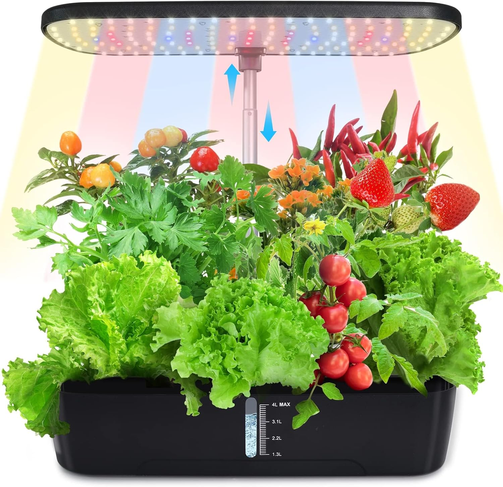

# Activité : Les interacteurs extérieurs des OST

1. Faire la liste des éléments qui vont interagir avec l'objet des OST
   1. utilisateur
   2. données
   3. objets
   4. environnement
retrover des contraintes de fabrication
    - esthétisme
    - sécurité
    - utilisation
    - enviropnnement
faire diagramme interacteurs

Comaprer 2 objets différencier ergonomie
    - prise en compte handicap

Comaprer 2 objets prise en compte sécurité
jpuet pour enfant 

!!! note "Compétences"

    Trouver et exploiter des informations  

!!! warning "Consignes"

1. Faire la liste des éléments qui vont interagir avec notre potager connecté.
2. Faire un diagramme des cas d'utilisation
3. À Quoi l'OST devra résister
4. 
    
    
??? bug "Critères de réussite"
    - 

**Document 1 Interacteurs extérieurs**

Ce sont l'ensemble des éléments qui peuvent interagir avec l'OST pour le faire fonctionner, le modifier ou l'utiliser d'une façon ou d'une autre.
Les différents interacteurs vont déterminer les fonctions techniques de notre OST, mais aussi les contraintes liées à cet objet.

Ces fonctions techniques et ces contraintes détermineront notre cahier des charges.

Les contraintes spécifient ce que doit respecter un produit, elles correspondent à l'adaptation du produit à un élément de son environnement extérieur.

**Document 2 Créer un diagramme des cas d'utilisation**

Pour représenter les différents services rendus sur un système, on peut lister les cas d'utilisation, qui permettent de savoir à quoi va servir le système et avec quoi ou avec qui va interagir le système:

- le système est délimité par un cadre
- les cas d'utilisations énoncés dans des ellipses 
- les acteurs interagissent avec le système
