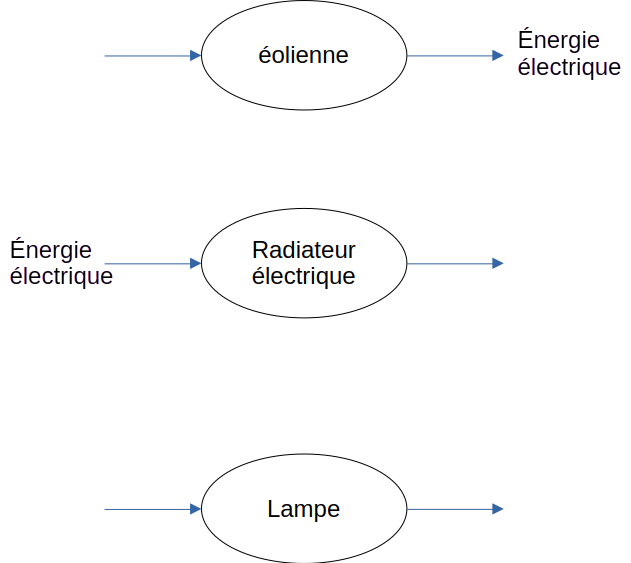
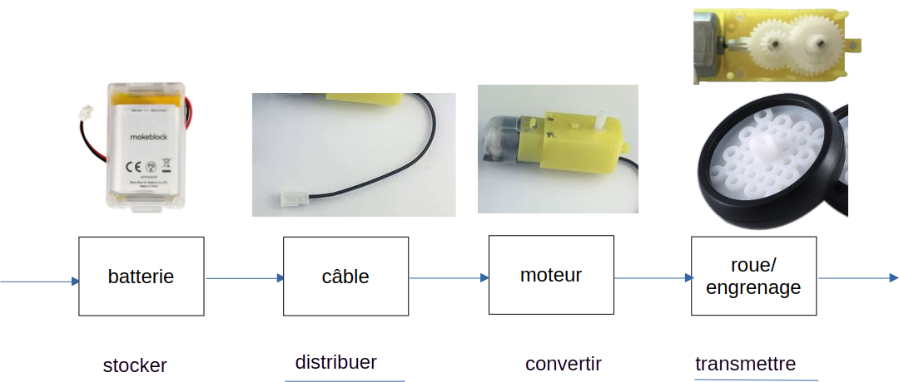
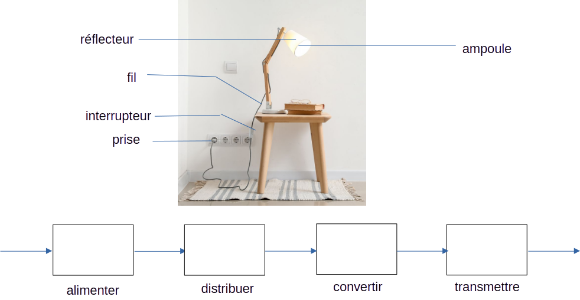
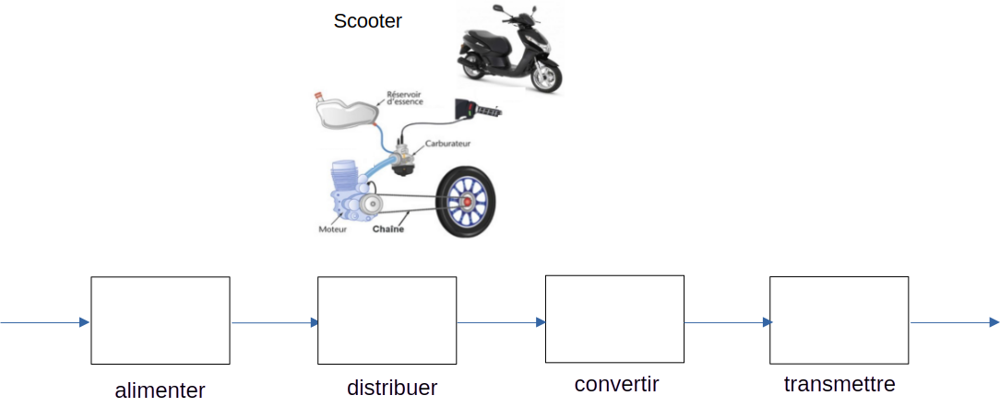

# Activité : La chaine d'énergie

!!! note "Compétences"

    Passer d'un langage à un autre
    

!!! warning "Consignes"

    1. Dans le document 1, relier chaque OST au type d'énergie utilisée.
    2. Compléter le document 2 en indiquant pour chaque objet le type d'énergie manquant
    3. Compléter les deux chaines d'énergie.
    
??? bug "Critères de réussite"
    - 

**Document 1 Différentes sources d'énergie**

<table>
<thead>
<tr>
<th colspan="2"> OST </th>
<th colspan="2"> Source d'énergie </th>
</tr>
</thead>
    <tbody>
      <tr>
        <td> bateau à voile </td>
        <td> 			 	O			 			 		</td>
        <td> 			 	O			 			 		</td>
        <td> énergie électrique </td>
      </tr>
      <tr>
        <td> voiture à essence </td>
        <td> 			 	O			 			 		</td>
        <td> 			 	O			 			 		</td>
        <td> énergie cinétique (énergie liée au mouvement)	</td>
      </tr>
      <tr>
        <td> Téléphone </td>
        <td> 			 	O			 			 		</td>
        <td> 			 	O			 			 		</td>
        <td> énergie thermique </td>
      </tr>
      <tr>
        <td> barrage hydroélectrique 		</td>
        <td> 			 	O			 			 		</td>
        <td> 			 	O			 			 		</td>
        <td> énergie lumineuse </td>
      </tr>
      <tr>
        <td> caméra à panneau solaire	</td>
        <td> 			 	O			 			 		</td>
        <td> 			 	O			 			 		</td>
        <td> énergie potentielle (liée à la déformation, à la hauteur et à la masse) 		</td>
      </tr>
      <tr>
        <td> 	centrale nucléaire		</td>
        <td> 			 	O			 			 		</td>
        <td> 			 	O			 			 		</td>
        <td> énergie chimique </td>
      </tr>
      <tr>
        <td> patins à roulettes </td>
        <td> 			 	O			 			 		</td>
        <td> 			 	O			 			 		</td>
        <td> énergie nucléaire	</td>
      </tr>
    </tbody>
</table>

**Document 2 Des convertisseurs d'énergie**

Certains composants ou OST servent à convertir une énergie d'une forme à une autre.

{:style="width:500px;"} 

**Document 3 Chaîne d'énergie**

Dans une chaine d'énergie, il y a différents éléments qui servent à:

- alimenter,
- distribuer,
- convertir et
- transmettre

**Document 4 Chaine d'énergie d'une lampe**

**Document 5 Chaine d'énergie d'un scooter**

