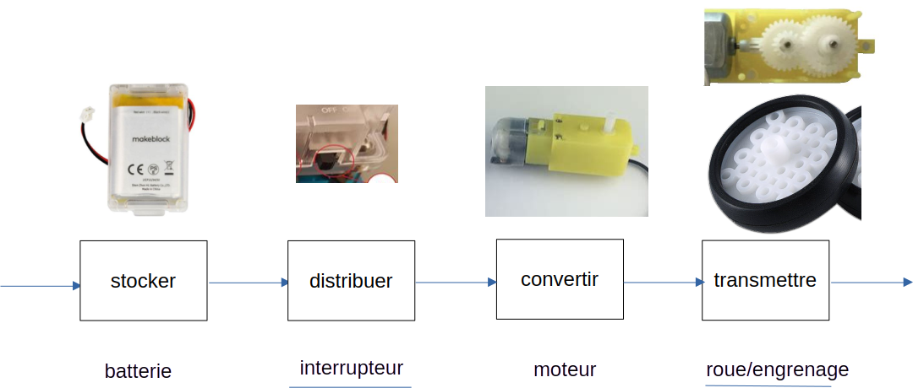
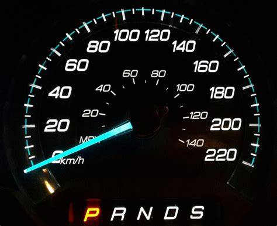
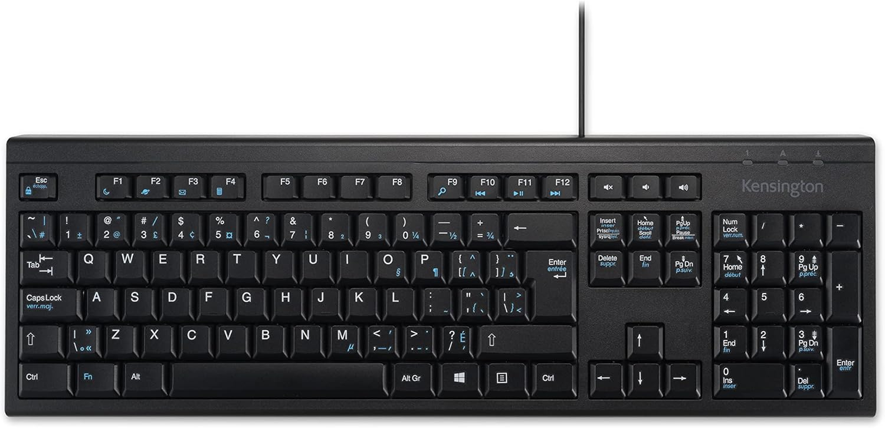
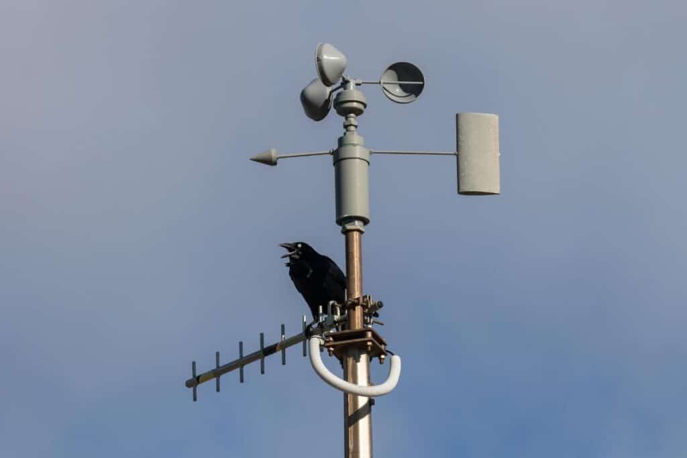
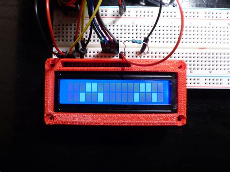
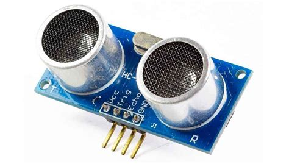
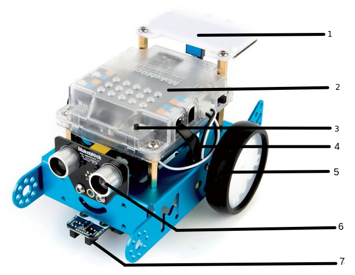
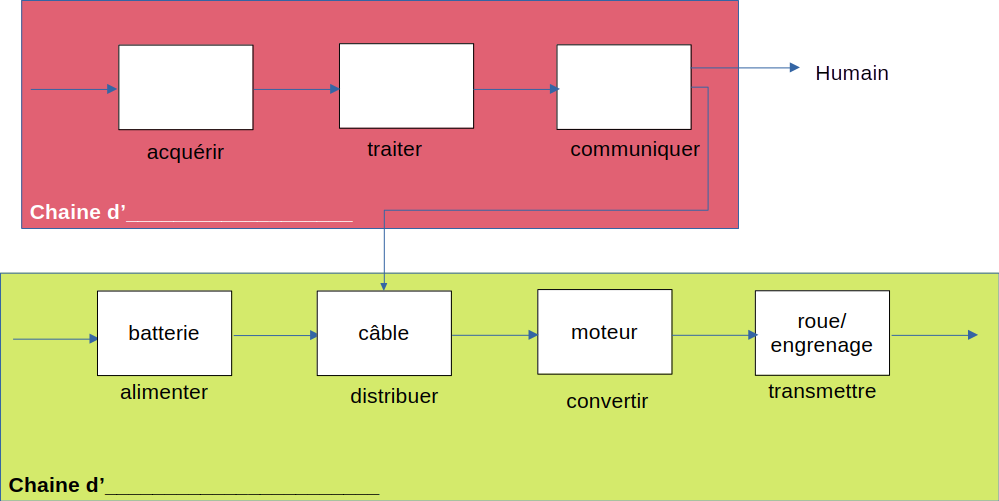
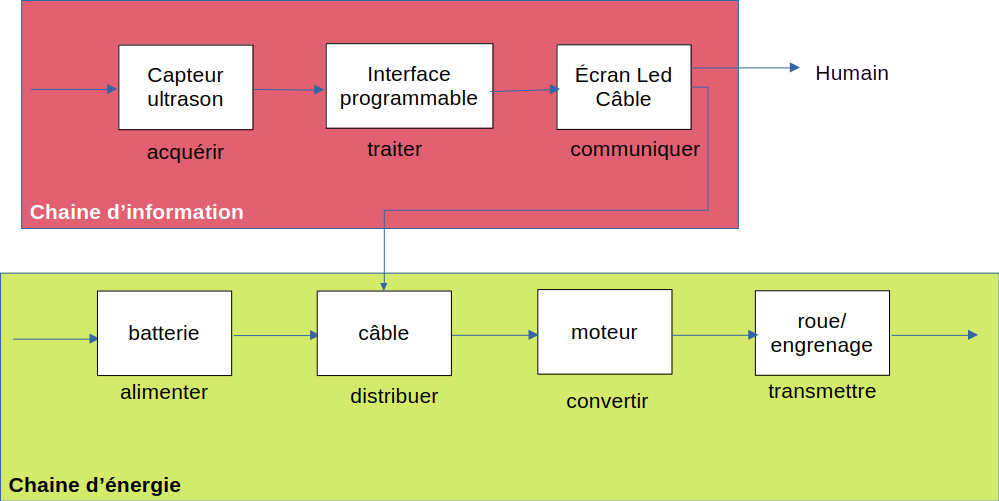

# Activité : La chaine d'information

!!! note "Compétences"

    Passer d'un langage à un autre
    

!!! warning "Consignes"

    1. Pour chaque composant du document 2, indiquer s'il permet de réaliser la fonction de communiquer ou acquérir
    2. En vous aidant du document 3, compléter le document 4, en indiquant dans la chaine d'information les composants du mBot
    
??? bug "Critères de réussite"
    - 

**Document 1 Chaîne d'information**

Dans une chaine d'information, il y a différents éléments qui servent à:

- Acquérir (fonction de prélèvement des informations), 
- Traiter (fonction de calcul) et
- Communiquer (fonction transmettant des informations à la chaine d'énergie ou à l'utilisateur)

**Document 2 Différents composants**

{:style="width:150px;"} 

{:style="width:150px;"} 

{:style="width:150px;"} 

{:style="width:150px;"} 

{:style="width:150px;"} 

{:style="width:150px;"} 

{:style="width:150px;"} 

**Document 3 Les éléments présents sur le mBot**

1. Écran LED
2. interface programmable
3. Bouton 
4. Câbles
5. Moteur et Roues
6. Capteur ultrasons pour évaluer les distances devant le robot
7. Module suiveur de ligne qui détecte les couleurs
-  Batterie

{: style="width:600px;"}

**Document 4 Chaines d'information et d'énergie du mBot**

??? note-prof "correction"

    Consigne 1 :

    Interrupteur Acquérir
    Compteur de vitesse Communiquer
    Sirène Communiquer
    Clavier Acquérir
    Station météo Acquérir
    Ecran LED Communiquer
    capteur ultrason Acquérir

    Consigne 2 :
    

