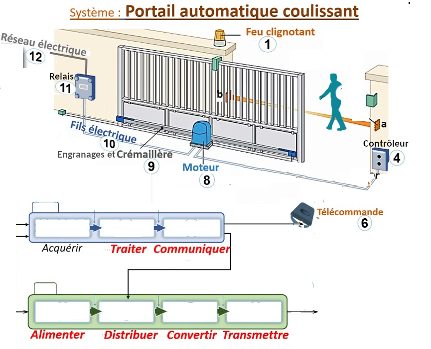

# Activité : Exercices sur les chaines d'énergie et d'information

## Exercice 1

!!! note "Compétences"

    Trouver et utiliser des informations 

!!! warning "Consignes"

    1. Pour chacun des objets suivants, indiquer la forme d'énergie utilisée. Cerf-volant, four solaire, Console de jeu, 
    2. Pour chacun des objets suivants, indiquer la forme d'énergie entrante et la forme d'énergie sortante. Congélateur, ventilateur, grille-pain

## Exercice 2

!!! note "Compétences"

    Trouver et utiliser des informations 

!!! warning "Consignes"
    Chaque élément du tableau ci-dessous répond à une fonction technique de l'une des deux chaines. Quelle est, pour chaque élément cette fonction ?

<table><thead><tr><th rowspan="2">Elément</th><th colspan="3">Chaine d'information</th><th colspan="4">Chaine d'énergie</th></tr><tr><th>Acquérir</th><th>Traiter</th><th>Communiquer</th><th>Alimenter</th><th>Distribuer</th><th>Convertir</th><th>Transmettre</th></tr></thead><tbody><tr><td>Détecteur de fumée</td><td></td><td></td><td></td><td></td><td></td><td></td><td></td></tr><tr><td>Buzzer</td><td></td><td></td><td></td><td></td><td></td><td></td><td></td></tr><tr><td>Capteur à ultrasons</td><td></td><td></td><td></td><td></td><td></td><td></td><td></td></tr><tr><td>batterie</td><td></td><td></td><td></td><td></td><td></td><td></td><td></td></tr><tr><td>Signal Wifi</td><td></td><td></td><td></td><td></td><td></td><td></td><td></td></tr><tr><td>Microprocesseur</td><td></td><td></td><td></td><td></td><td></td><td></td><td></td></tr><tr><td>relais</td><td></td><td></td><td></td><td></td><td></td><td></td><td></td></tr>
<tr><td>Courroie</td><td></td><td></td><td></td><td></td><td></td><td></td><td></td></tr><tr><td>Vérin</td><td></td><td></td><td></td><td></td><td></td><td></td><td></td></tr></tbody></table>

## Exercice 3

!!! warning "Consignes"
    1. Nommer les deux chaines.
    2. Compléter les deux chaines en indiquant les numéros de chaque composant.

**Document 1 Un portail automatisé**

Une installation électrique branchée sur le 220V permet d'alimenter un portail.

Un relais qui autorise le passage du courant est branché à un moteur. 

Ce moteur est relié à des engrenages et une crémaillère pour entrainer l'ouverture de la porte

