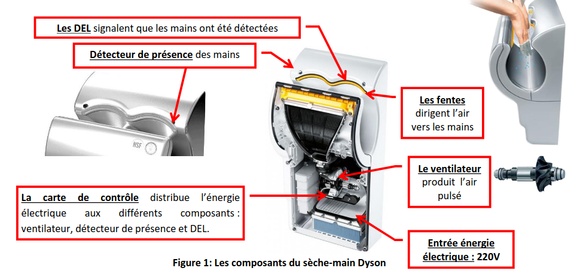
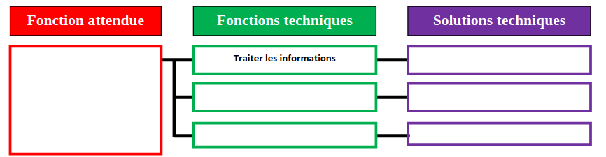

# Activité : Exercice

!!! note Compétences
    - Trouver et utiliser des informations

## Exercice 1 : Fonctionnement du sèche-main

!!! warning Consignes
    1. Recopier le schéma et le compléter en utilisant les éléments du sèche-main.
   

**Document 1 : Éléments d'un sèche-main**

